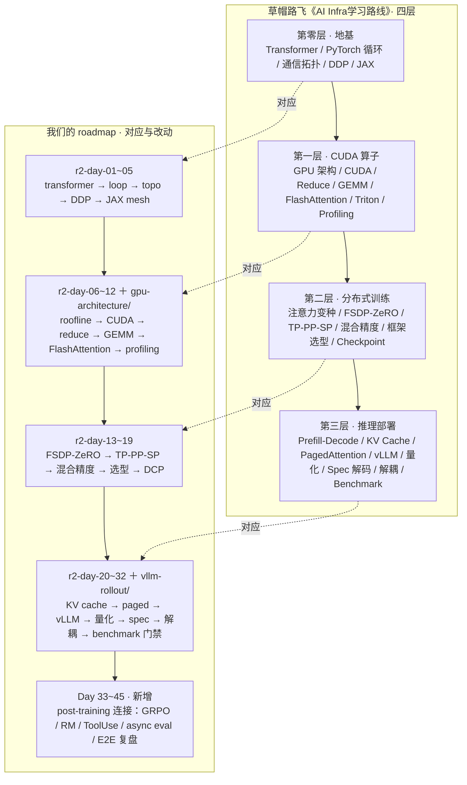

# Post-training Systems & Data

A public, implementation-oriented knowledge base for post-training: objectives, data, distributed systems, rollout serving, evaluation, agent runtimes, and the GPU mechanisms underneath them.

The repository favors a consistent progression:

1. write down the objective and assumptions;
2. derive the relevant compute, communication, or memory cost;
3. connect the derivation to a system design;
4. run a small executable model or harness;
5. test semantic invariants, not only syntax.

## Start here

| Track | Primary question | Suggested entry point |
|---|---|---|
| [AI infrastructure](ai-infra/README.md) | How do training and inference systems trade compute, communication, and memory? | Current second-pass labs, then the 45-day map |
| [GPU architecture](gpu-architecture/README.md) | Which hardware and kernel mechanisms create those costs? | SIMT → memory → GEMM → collectives → profiling |
| [PPO vs. GRPO](grpo-vs-ppo/README.md) | How do the objectives and training-system requirements differ? | Objective derivations before infra trade-offs |
| [Post-training frameworks](post-training-framework/README.md) | How do rollout, reward, buffers, learners, placement, and policy versions form one correct system? | Unified dataflow → sync/async → framework selection |
| [vLLM rollout](vllm-rollout/README.md) | How should rollout serving be measured and stress-tested? | TTFT/TPOT metrics → configuration → failures |
| [Model-aware data curation](model-aware-data-curation/README.md) | Which examples move the current model toward a target while preserving coverage and safety? | Attribution → gradient coverage → closed-loop selection |
| [AI data reading track](ai-data/README.md) | What do the major data-selection, synthesis, and filtering papers contribute? | Paper index and reading log |
| [In-context learning](ICL/README.md) | How can learning-like behavior arise from context without weight updates? | Bayesian, gradient-descent, and circuit views |
| [Harness engineering](harness-engineering/README.md) | How should a frozen model's context, workflow, tools, memory, and release gates be engineered? | Runtime loop → state/memory → evaluation/security |
| [Evaluation: context compression](eval-context-compression/README.md) | Does compressed context preserve task-relevant behavior? | Evaluation design and probe harness |
| [Evaluation: benchmark efficiency](eval-bench-efficiency/README.md) | Can a smaller benchmark preserve ranking and decision quality? | IRT/mRMR methods and practical checks |
| [Evaluation index](eval/README.md) | Where are the evaluation subtracks? | Navigation only |

## Knowledge map: 草帽路飞路线 vs. 我们的 roadmap

`ai-infra` 的 45 天路线以草帽路飞《[AI Infra学习路线](https://zhuanlan.zhihu.com/p/2021970155182326008)》为骨架
（转述见 [ai-infra/ROADMAP_45D.md](ai-infra/ROADMAP_45D.md)）。贯穿两者的组织问题是同一个：
**计算 / 通信 / 显存**的不可能三角，每项技术都问：牺牲什么、换取什么、何时不赚。

> 说明：知乎本次拒绝了直接抓取，左侧"文章"一栏依据 ROADMAP_45D.md 中对原文四层结构的转述整理；
> 若与原文有出入请指出，我来修正。



| 文章的层 | 文章覆盖（据 ROADMAP 转述） | 我们的对应 | 差异 |
|---|---|---|---|
| 第零层 · 地基 | Transformer 白板、PyTorch 循环、通信拓扑、DDP、JAX 声明式 | r2-day-01~05 | 基本对齐：够用即可 |
| 第一层 · CUDA 算子 | GPU 架构、CUDA、Reduce、GEMM Tiling、FlashAttention、Triton、Profiling | r2-day-06~12 ＋ `gpu-architecture/` 独立 track | 硬件与 kernel 深挖拆成独立 track，`ai-infra` 只保留系统视角的成本模型 |
| 第二层 · 分布式训练 | 注意力变种、FSDP/ZeRO、TP/PP/SP、混合精度/重计算、框架选型、Checkpoint | r2-day-13~19 | 对齐；`day-15-megatron-3d` 等旧实验保留为历史 |
| 第三层 · 推理部署 | Prefill/Decode、KV Cache、PagedAttention、vLLM、量化、Spec 解码、解耦、Benchmark | r2-day-20~32 ＋ `vllm-rollout/` | 对齐；我们加了回归门禁（eval/reliability） |
| （文章无） | — | Day 33~45 post-training 连接层 | **新增**：GRPO vs PPO、RM 校准、ToolUse、vLLM 联动、async eval、coding flywheel、E2E |
| （文章无） | — | side tracks：`day-11-paper2-mech-load`、`day-14-pue-cost` | **降级**：设施/热/负载预测标为非核心；文章主干本来就不含这类主题 |

三处改动一句话：文章止于推理部署，我们向后接了 post-training；硬件深挖独立成 track；设施主题明确出界。

## Topic boundaries

- **`ai-infra/** is the training/inference systems spine: DDP, FSDP, sharding, collectives, checkpointing, rollout serving, and performance models.
- **`gpu-architecture/** goes one layer lower: SIMT execution, memory hierarchy, Tensor Cores, CUDA, interconnects, virtual memory, and profiling. It does not duplicate end-to-end distributed-training labs.
- **`post-training-framework/** owns the end-to-end RL dataflow, framework control plane, policy-version contract, placement, and selection; it links to algorithm and serving topics rather than duplicating them.
- **`vllm-rollout/** specializes in serving and rollout behavior; `ai-infra/ links to it rather than maintaining a second canonical copy.
- **`ai-data/** is a paper-reading corpus. **`model-aware-data-curation/** is a cross-paper synthesis and runnable model-in-the-loop selection system.
- **`ICL/** studies behavior induced by context. **`harness-engineering/** studies the executable system that constructs context, calls tools, manages state, and promotes changes.
- **`grpo-vs-ppo/** owns optimization-objective comparisons; infrastructure tracks discuss only their systems consequences.
- **`eval-*** tracks own measurement methodology and should not be treated as training or serving implementations.

## Repository status

This is a learning repository, not a benchmark leaderboard or a production framework.

- CPU analytical models and simulations are labeled as such.
- Hardware throughput, latency, memory, and scaling numbers are not considered measured unless the corresponding command, configuration, and environment are recorded.
- Recent papers and preprints are separated from mature mechanisms where the distinction matters.
- Primary papers and official documentation are preferred for technical claims.
- GitHub display math uses one-line `$$...$$ blocks.

## Quick checks

The topic directories with runnable suites can be checked independently:

```bash
# Whole-repository links, GitHub math, control characters, and Python parsing.
python3 tools/check_repo.py

# Topic-level semantic suites.
python3 -m unittest discover -s ICL/tests -v
(cd grpo-vs-ppo/05_code && python3 -m unittest -v test_rl_objectives.py test_docs.py)
python3 -m unittest discover -s vllm-rollout/tests -v
python3 -m unittest discover -s post-training-framework/tests -v
python3 -m unittest discover -s model-aware-data-curation/tests -v
python3 -m unittest discover -s harness-engineering/tests -v
python3 -m unittest discover -s gpu-architecture/tests -v
python3 -m unittest discover -s ai-infra/day-07-h100-beyond-7b -p 'test_*.py' -v
python3 -m unittest discover -s ai-infra/r2-day-03-topo-nccl -p 'test_*.py' -v
python3 -m unittest discover -s ai-infra/r2-day-04-ddp -p 'test_*.py' -v
python3 -m unittest discover -s ai-infra/r2-day-06-gpu-architecture -p 'test_*.py' -v
python3 -m unittest discover -s ai-infra/r2-day-07-cuda-programming-model -p 'test_*.py' -v
```

Some labs additionally require PyTorch, JAX, CUDA, NCCL, or a multi-GPU host. A successful CPU model is evidence for its formulas and control flow only; it is not evidence of accelerator performance.
