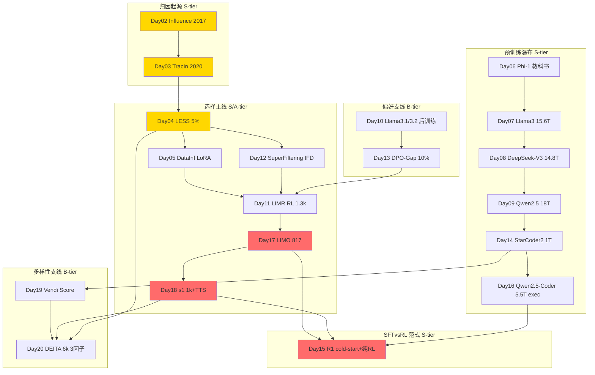

# ai-data — Data-centric AI Papers

> 专门读 **data** 相关的 AI paper 的沉淀区。服务于从 ML for Infra → Post-training / Agentic RL Infra 转型，重点是 **coding data / SFT / RL data / data curation / quality / flywheel**。
> **Scope：只谈数据，不谈算法。** 算法（GRPO/PPO/RLHF、optimizer、TTS解码策略）归 `rl-infra/`、`grpo-vs-ppo/` 轨道。这里只关心：数据怎么来、怎么洗、怎么选、怎么评、怎么量多样性/复杂度。
> 命名已全量对齐 `rl-infra/day-01-xxx`，`ai-data/day-01-xxx` ~ `day-20-xxx`，便于 Day N 直连。

## 结构

```
ai-data/
├── README.md                # 本路线图
├── PAPER_TEMPLATE.md
├── reading-log.csv          # 快速索引
└── day-01-xxx/              # 每篇一个文件夹
    ├── NOTES.md             # 必须含「和之前工作的关系」
    └── assets/
```

## 发展路线图 (20篇)

### 图谱总览 (Mermaid)



### 主线 vs 支线 判定

| Tier | 判定 | Days | 说明 |
|------|------|------|------|
| **S-tier 必读** | 范式定义 | 02,03,04,06,07,08,09,14,15,16,17,18 | Influence→TracIn→LESS奠定选择；Phi-1/Llama3/DeepSeek/Qwen/StarCoder2/QwenCoder奠定洗数据；R1/LIMO/s1奠定现在少即是多 |
| **A-tier 重要** | 你的coding冷启动直接可用 | 05,11 | DataInf LoRA扫脏快1000倍；LIMR RL少即是多1.3k |
| **B-tier 技巧** | 单点改进，可替换 | 10,12,13,19,20 | 10 Llama3.1后训练工程化；12 SuperFiltering弱到强IFD；13 DPO-gap难对；19 Vendi多样性度量；20 DEITA三因子工程配方 |
| **示例** | 入门 | 01 | Day01 example_starcoder2 仅作curation入门示例 |

### 三条子脉络

**1. 选择线 (Influence → Selection)：** Day02(2017 Influence) → Day03(TracIn无Hessian) → Day04(LESS 5%梯度) → Day05(DataInf闭式) → Day12(弱IFD) → Day11(RL轨迹) → Day17(817模板) → Day18(1k+TTS) → Day20(DEITA自动)

> 支线：DataInf只限LoRA，SuperFiltering只证SFT，收束到LIMO/s1才证SFT少即是多

**2. 预训练/合成线 (Quality → Scale)：** Day06(Phi-1质量>数量) → Day07(Llama3 5级瀑布) → Day08(DeepSeek-V3 30%code+FIM) → Day09(Qwen2.5 18T flywheel) → Day14(StarCoder2 600规则) → Day16(Qwen2.5-Coder exec三级) → Day17/18精选

> 支线：StarCoder2去重规则 vs Vendi熵，执行验证是gold

**3. SFT vs RL 范式线：** Day04/12(SFT选好使) → Day11(RL选得换LIM) → Day15(R1冷启动<10k+纯RL) → Day17/18(纯SFT也能OOD)

> 核心结论：SFT memorizes, RL generalizes，但精心SFT 817也能泛化40%+，区别是阈值看预训练完备性

### Day N 映射表 (纯 Data 视角)

| Day | Folder | Data贡献 (非算法) | Tier |
|-----|--------|-------------------|------|
| 01 | day-01-example-starcoder2 | 入门：600规则扫curation | 示例 |
| 02 | day-02-2017-influence-functions | 数据归因：定义train→test影响 | S |
| 03 | day-03-2020-tracin | 归因工程化：ckpt点积无Hessian，可算self-influence扫脏 | S |
| 04 | day-04-2024-less | 选SFT：梯度相似挑5%目标任务数据 | S |
| 05 | day-05-2024-datainf | 选LoRA：闭式1秒一条，扫脏 | A |
| 06 | day-06-2023-phi-1 | 合成数据：教科书1B+精筛6B | S |
| 07 | day-07-2024-llama3 | 预训练瀑布：15.6T 5级过滤+去重+配比 | S |
| 08 | day-08-2024-deepseek-v3 | MoE数据配比：14.8T 30%code+FIM | S |
| 09 | day-09-2024-qwen2.5 | 飞轮数据：18T→1M SFT→多阶段RL数据门禁 | S |
| 10 | day-10-2024-llama3.1-3.2 | 后训练数据切分：多轮RS/DPO数据来源 | B |
| 11 | day-11-2025-limr | RL数据：LIM轨迹选1389难例 | A |
| 12 | day-12-2024-superfiltering | SFT数据：125M弱模型IFD选7B | B |
| 13 | day-13-2025-dpo-reward-gap | 偏好数据：gap小难对留10% | B |
| 14 | day-14-2024-starcoder2 | Code数据：600+语言1T清洗+PII | S |
| 15 | day-15-2025-deepseek-r1 | RL数据：<10k冷启动合成+可验证奖励数据 | S |
| 16 | day-16-2024-qwen2.5-coder | Code执行数据：parser+exec三级洗5.5T | S |
| 17 | day-17-2025-limo | SFT数据极点：817条认知模板 | S |
| 18 | day-18-2025-s1 | SFT+TTS数据：1k长链+难度/去重 | S |
| 19 | day-19-2023-vendi-score | 数据多样性度量：kernel熵公理 | B |
| 20 | day-20-2023-deita | 数据质量配方：复杂度×质量×多样6k | B |

> 算法细节(RL用GRPO还是PPO、TTS用Wait截断还是budget forcing)不在此表，NOTES里只记数据构造部分。

### 缺口 (下一步 Day21+ 建议)

当前偏重 少即是多，对你coding冷启动最直接，但缺：**Self-Instruct / Evol-Instruct / D4 / FineWeb 去重 / Pile** 这几块经典。建议 Day21起补 Self-Instruct → WizardLM → D4 → FineWeb，按原日更节奏套 `day-21-xxx` 前缀，保持本图更新。

---
关联：
- infra轨道：`rl-infra/day-01-ddp-basics/` ~ `day-12-reward-model`
- 讨论：在 Hatch `ai data` thread
- GitHub树：https://github.com/Papa-Panda/post-training/tree/master/ai-data
- Sheet：`ai data` tab 日更
