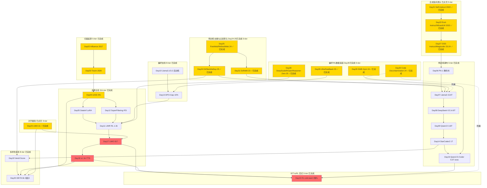

# ai-data — Data-centric AI Papers

> 专门读 **data** 相关的 AI paper 的沉淀区。服务于从 ML for Infra → Post-training / Agentic RL Infra 转型，重点是 **coding data / SFT / RL data / data curation / quality / flywheel**。
> **Scope：只谈数据，不谈算法。** 算法（GRPO/PPO/RLHF、optimizer、TTS解码策略）归 `rl-infra/`、`grpo-vs-ppo/` 轨道。这里只关心：数据怎么来、怎么洗、怎么选、怎么评、怎么量多样性/复杂度。
> 命名已全量对齐 `rl-infra/day-01-xxx`；30篇主干闭环后继续以 `day-31-xxx` 起做主题延伸，便于 Day N 直连。

## 第二轮深度复习（8/30）

> 复习期：2026-09-01 → 2026-09-30；固定按 Day 01 → Day 30，一天一篇，只更新已有 NOTES，不新增论文。

| Review | Date | Day | Paper | Status |
|---:|---|---:|---|---|
| 01/30 | 2026-09-01 | 01 | StarCoder2 / The Stack v2 数据策展入门 | ✅ 完成 |
| 02/30 | 2026-09-02 | 02 | Understanding Black-box Predictions via Influence Functions | ✅ 完成 |
| 03/30 | 2026-09-03 | 03 | Estimating Training Data Influence by Tracing Gradient Descent (TracIn) | ✅ 完成 |
| 04/30 | 2026-09-04 | 04 | LESS: Selecting Influential Data for Targeted Instruction Tuning | ✅ 完成 |
| 05/30 | 2026-09-05 | 05 | DataInf: Efficiently Estimating Data Influence in LoRA-tuned LLMs and Diffusion Models | ✅ 完成 |
| 06/30 | 2026-09-06 | 06 | Textbooks Are All You Need (Phi-1) | ✅ 完成 |
| 07/30 | 2026-09-07 | 07 | The Llama 3 Herd of Models / 15.6T 预训练数据瀑布 | ✅ 完成 |
| 08/30 | 2026-09-08 | 08 | DeepSeek-V3 Technical Report / 14.8T MoE 数据配方 | ✅ 完成 |
| 09/30 | 2026-09-09 | 09 | Qwen2.5 Technical Report / 18T→1M SFT→多阶段RL 飞轮 | ✅ 完成 |
| 10/30 | 2026-09-10 | 10 | Llama 3.1 / 3.2 后训练数据引擎 / 多轮RS+DPO / 1B-3B蒸馏 | ✅ 完成 |

## 结构

```
ai-data/
├── README.md                # 本路线图（30篇主干已闭环；Day31起主题延伸）
├── PAPER_TEMPLATE.md
├── reading-log.csv          # 快速索引
└── day-01-xxx/              # 每篇一个文件夹
    ├── NOTES.md             # 必须含「和之前工作的关系」
    └── assets/
```

## 发展路线图（30/30 主干闭环完成；主题延伸至 Day 31）

> **30篇主干** 已闭环：归因→选择→预训练瀑布→少即是多→合成指令→复杂度演化→对齐极简→语义去重、多样化剪枝→大规模网页过滤→AI反馈偏好数据底座→开源代码锚定合成→可验证RL数据→代码 benchmark 防污染。Day 31 起只补图谱中仍有明确缺口的主题；今日补上跨域数据配比。

### 图谱总览（30篇主干 + 主题延伸）



### 主线 vs 支线 判定（30篇主干已完成；Day31起主题延伸）

| Tier | 判定 | Days | 说明 |
|------|------|------|------|
| **S-tier 必读** | 范式定义 | 02,03,04,06,07,08,09,14,15,16,17,18,21,22,23,24,25,26,27,28,31 | Influence→TracIn→LESS奠定选择；Phi-1/Llama3/DeepSeek/Qwen/StarCoder2/QwenCoder奠定洗数据；R1/LIMO/s1奠定少即是多；Self-Instruct→Evol-Instruct奠定合成指令与复杂度演化；LIMA奠定对齐极简；D4奠定语义去重与多样化剪枝；FineWeb/RefinedWeb奠定可复现大规模网页过滤与消融；UltraFeedback奠定可追溯AI反馈偏好池；OSS-Instruct奠定真实开源代码锚定的合成指令路线；Open-Reasoner-Zero / DeepScaleR 奠定可验证RL题池与困难尾部；DoReMi 奠定跨域数据配比 |
| **A-tier 重要** | 你的coding冷启动直接可用 | 05,11,29,30 | DataInf LoRA扫脏；LIMR RL少即是多；SWE-Gym repo级可验证任务；代码 benchmark surface+semantic 防污染 |
| **B-tier 技巧** | 单点改进，可替换 | 10,12,13,19,20 | 10 Llama3.1后训练工程化；12 SuperFiltering弱到强IFD；13 DPO-gap难对；19 Vendi多样性度量；20 DEITA三因子工程配方 |
| **示例** | 入门 | 01 | Day01 example_starcoder2 仅作curation入门示例 |

### Day21-30 闭环计划（已完成10/10）

> Day21-30 已完成；30篇 data 主线现已闭环。

| Day | 拟定 Folder | 标题 | 为什么是主干 (Data视角) | Tier |
|-----|-------------|------|------------------------|------|
| 21 | day-21-2022-self-instruct | Self-Instruct ✅已完成 2026-08-21 | 合成SFT起点，175种子→52k，bootstrap范式，后面所有合成都抄它 | S |
| 22 | day-22-2023-evol-instruct | WizardLM / Evol-Instruct ✅已完成 2026-08-22 | 复杂度演化 In-depth/Breadth 约70k，解决 Self-Instruct 自举数据偏简单 | S |
| 23 | day-23-2023-lima | LIMA: Less Is More for Alignment ✅已完成 2026-08-23 | 1k高质量打赢全量，LIMO/s1前身，证质量>数量 | S |
| 24 | day-24-2023-semdedup-d4 | D4 / SemDeDup ✅已完成 2026-08-24 | 语义近重复去除+原型式多样化剪枝，Vendi的工程版，Llama3去重对照 | S |
| 25 | day-25-2023-fineweb-refinedweb | FineWeb / RefinedWeb ✅已完成 2026-08-25 | 15T过滤管线：heuristics+MinHash+C4规则，预训练高质数据标杆 | S |
| 26 | day-26-2023-ultrafeedback | UltraFeedback ✅已完成 2026-08-26 | 64k prompts×4多模型回答+GPT-4细粒度反馈，偏好数据底座，给DPO-gap提供上游池 | S |
| 27 | day-27-2023-oss-instruct | OSS-Instruct / Magicoder ✅已完成 2026-08-27 | 开源代码片段锚定合成约75k code指令，补Self-Instruct少种子与Evol固定规则的来源偏置 | S |
| 28 | day-28-2025-deepscaler-openreasoner | DeepScaleR / OpenReasoner-Zero Data ✅已完成 2026-08-28 | v2 57k可验证题池；v1 129k全量RL→13k困难尾部继续RL，是ProRL长程RL路线的先行证据 | S |
| 29 | day-29-2024-swe-gym | SWE-Gym ✅已完成 2026-08-29 | 2,438个真实issue任务+可执行环境+单元测试，形成repo级可验证轨迹数据，接Qwen2.5-Coder exec | A |
| 30 | day-30-2024-decontamination | Quantifying Code Contamination ✅已完成 2026-08-30 | surface-level + semantic-level code matching 检漏，防 coding SFT/RL 数据泄漏 HumanEval/MBPP，质量门最后一道 | A |

> 这10篇已跑完，**合成→过滤→去重→多样性→质量→偏好→RL可验证→防漏** 全链条贯通。

### 五条子脉络（30篇主干 + Day31延伸）

**1. 选择线 (Influence → Selection)：** Day02 → Day03 → Day04(LESS 5%) → Day05(DataInf) → Day12(IFD) → Day11(RL轨迹) → Day17(817) → Day18(1k) → Day20(DEITA)。外部方法补充：[RICo](../model-aware-data-curation/10_rico_icl_valuation.md) 用受控 ICL 干预提供 gradient-free、assessment-set-conditioned valuation；它不计入 Day 01–30，也不新增重复 NOTES。
**2. 预训练/合成线 (Quality → Scale)：** Day21(Self-Instruct) → Day22(Evol) → Day27(OSS-Instruct) → Day06(Phi-1) → Day24(D4/SemDeDup) → Day25(FineWeb/RefinedWeb) → Day07(Llama3) → Day08(DeepSeek-V3) → Day09(Qwen2.5) → Day14(StarCoder2) → Day16(Qwen-Coder) → Day29(SWE-Gym)
**3. SFT vs RL / 偏好数据线：** Day23(LIMA 1k) → Day04/12(SFT选) → Day26(UltraFeedback造偏好池) → Day13(DPO-Gap选难对) → Day11(RL要换LIM) → Day28(ORZ可验证数据+困难尾部挖掘) → Day15(R1冷启动+纯RL) → Day17/18(精心SFT也能OOD)
**4. 防污染质量门：** Day24(D4训练集内去重) → Day27(OSS-Instruct benchmark decontamination) → Day29(SWE-Gym repo/时间切分问题) → Day30(code surface+semantic train–eval 检漏)
**5. 数据配比层：** Day25(FineWeb域内过滤) → Day31(DoReMi跨域配比) → Day07/08/09(大模型预训练 mixture)

**长程RL延伸：** Day28 ORZ（约1,200步，证明大规模多样可验证数据可继续支撑RL）→ ProRL（2,000+步，并用动态采样、KL控制与reference-policy reset系统化 prolonged RL）。

### Day N 映射表（31已完成，纯 Data 视角）

| Day | Folder | Data贡献 (非算法) | Tier |
|-----|--------|-------------------|------|
| 01 | day-01-example-starcoder2 | 入门：600规则扫curation | 示例 |
| 02 | day-02-2017-influence-functions | 数据归因：定义train→test影响 | S |
| 03 | day-03-2020-tracin | 归因工程化：ckpt点积无Hessian，可算self-influence扫脏 | S |
| 04 | day-04-2024-less | 选SFT：梯度相似挑5%目标任务数据 | S |
| 05 | day-05-2024-datainf | 选LoRA：闭式1秒一条，扫脏 | A |
| 06 | day-06-2023-phi-1 | 合成数据：教科书1B+精筛6B | S |
| 07 | day-07-2024-llama3 | 预训练瀑布：15.6T 5级过滤+去重+配比 | S |
| 08 | day-08-2024-deepseek-v3 | MoE数据配比：14.8T 30%code+FIM | S |
| 09 | day-09-2024-qwen2.5 | 飞轮数据：18T→1M SFT→多阶段RL数据门禁 | S |
| 10 | day-10-2024-llama3.1-3.2 | 后训练数据切分：多轮RS/DPO数据来源 | B |
| 11 | day-11-2025-limr | RL数据：LIM轨迹选1389难例 | A |
| 12 | day-12-2024-superfiltering | SFT数据：125M弱模型IFD选7B | B |
| 13 | day-13-2025-dpo-reward-gap | 偏好数据：gap小难对留10% | B |
| 14 | day-14-2024-starcoder2 | Code数据：600+语言1T清洗+PII | S |
| 15 | day-15-2025-deepseek-r1 | RL数据：<10k冷启动合成+可验证奖励数据 | S |
| 16 | day-16-2024-qwen2.5-coder | Code执行数据：parser+exec三级洗5.5T | S |
| 17 | day-17-2025-limo | SFT数据极点：817条认知模板 | S |
| 18 | day-18-2025-s1 | SFT+TTS数据：1k长链+难度/去重 | S |
| 19 | day-19-2023-vendi-score | 数据多样性度量：kernel熵公理 | B |
| 20 | day-20-2023-deita | 数据质量配方：复杂度×质量×多样6k | B |
| 21 | day-21-2022-self-instruct | 合成指令源头：175 种子→52k bootstrap，无外部依赖自举 SFT，合成范式起点 | S |
| 22 | day-22-2023-evol-instruct | 指令复杂度演化：In-depth/Breadth 将简单任务递归改写为约70k复杂多样 SFT 数据 | S |
| 23 | day-23-2023-lima | 对齐极简：1k 条经来源、风格与多样性策展的高质 SFT，验证质量与覆盖优先于规模 | S |
| 24 | day-24-2023-semdedup-d4 | 预训练去重：语义近重复删除+原型式多样化剪枝，压缩冗余同时保留长尾覆盖 | S |
| 25 | day-25-2023-fineweb-refinedweb | 网页过滤工厂：15T-token逐级过滤、去重与训练消融，把规则清单升级为可复现可审计数据配方 | S |
| 26 | day-26-2023-ultrafeedback | 偏好数据底座：64k prompts×4多模型回答，经GPT-4细粒度评价与打分形成可追溯AI反馈池 | S |
| 27 | day-27-2023-oss-instruct | Code合成：80K开源代码片段锚定生成，经去重和benchmark防污染得到约75K条现实、多样、可控的coding SFT数据 | S |
| 28 | day-28-2025-deepscaler-openreasoner | 可验证RL数据：v2使用57k题池；v1先在129k上RL 1,100步，再挖出约13k困难尾部继续100步；承接LIMR并为ProRL长程RL提供先行证据 | S |
| 29 | day-29-2024-swe-gym | 可执行code环境：2,438个真实issue任务封装repo、依赖、单元测试与agent轨迹，把静态样本升级为仓库级可验证交互数据 | A |
| 30 | day-30-2024-decontamination | 代码防污染：surface-level + semantic-level 双重匹配 train–eval 近重复，保护 HumanEval/MBPP 等 benchmark 的可信度 | A |
| 31 | day-31-2023-doremi | 数据配比：用小 reference/proxy 的跨域 excess loss 学习 domain weights，再重采样给大模型训练，补齐域内过滤之外的 token 预算层 | S |

> 算法细节(RL用GRPO还是PPO、TTS用Wait截断还是budget forcing)不在此表，NOTES里只记数据构造部分。

### Day21-30 如何接每日Job（Day21-30 已完成）

- 命名继续 `day-{21..30}-{year}-{slug}` 两位数，顺序递增，对齐 rl-infra
- 每日Job自动：建骨架 → 更新 reading-log → push commit `feat(ai-data): Day N` → 同步Sheet `ai data` tab → 更新本README映射表新增一行（若为S-tier，同步mermaid点亮从蓝色→金/红）
- Scope约束：每日NOTES只记数据，不谈GRPO/PPO细节

---
关联：
- infra轨道：`rl-infra/day-01-ddp-basics/` ~ `day-12-reward-model`
- 讨论：在 Hatch `ai data` thread
- GitHub树：https://github.com/Papa-Panda/post-training/tree/master/ai-data
- Sheet：`ai data` tab 日更

## 问答记录

> 来自 `ai data` side chat 的用户主动问答归档：跨多篇或不归属单篇的问答记在这里；可归属单篇 Day 的记在对应 `NOTES.md` 末尾的"问答补充"小节。问答原文精简整理，保留关键公式、推导链条与结论；原有内容只追加、不改动。

### 2026-09-09 — 评估器三臂实验与"自我参照"RM 的系统性跑偏（跨 Day07 / Day09 / Day04）

**问题（用户，10:32 PDT）**：Llama 3：评估器=下游分数（外部锚点）；Qwen2.5：评估器=模型自己的偏好（自我参照）；LESS：评估器=目标梯度（任务参照）。这个实验很好设计啊——用评估器筛选数据然后跑训练、看 eval 提升多少。在什么条件下"自我参照"的 RM 会系统性跑偏？validation eval dataset 完全正交、评估器太弱、gradient 用的模型太弱，都有可能系统性跑偏。

**核心答案**：三臂共享同一个候选池、同一个 50k 预算，各自用评估器做分配决策，然后在同一个小 proxy 上训、同一套 held-out 评测上看 delta。但"好设计"的魔鬼在：**ground truth 的定义会不会让某条臂不战而胜**。裁判用 proxy 训完看 HumanEval 涨多少 → Llama 3 那条臂（annealing 本来就是直接测 HumanEval delta）带答案进考场；裁判用人工偏好 → RM 臂天然占优。公平设计必须声明：裁判和三条臂的参照系都不重合——比如裁判是"全新任务簇上的 few-shot 泛化"，三臂只在旧任务上做决策；比的是"便宜信号的外推能力"而非"谁离裁判更近"。另有关键约束：验证用的训练必须是 **proxy 级**（小模型、少 token），否则为验证"便宜评估器"付了"昂贵训练"的全款，实验本身失去意义。

跑偏情形（记真实目标为 $R^*$ ，不可直接观测；RM 为 $R_\theta$ ；RM 训练数据为 $D_{RM}$ ）：

1. **eval 与训练目标正交**： $R_\theta$ 只在 $D_{RM}$ 的支撑集 $\mathrm{supp}(D_{RM})$ 上被训练去逼近 $R^*$ ；正交的 eval 维度落在支撑集之外，RM 打分是纯外推——跑偏是数学上**预期内**的。纠正方向不是"换更强的 RM"，而是把正交维度的数据补进 $D_{RM}$ ，扩大支撑集。
2. **评估器太弱**：逼近误差里的 bias 项，不是 variance。弱 RM 表达能力不够，学不会真正的 $R^*$ （比如 1B 的 RM 验证不了数学推理链），于是锁死在**伪相关特征**上：长度、格式、语气的自信程度。这就是 Goodhart 在这里的形态——"当一个有偏的度量变成目标，偏差会被系统性放大"。与情形一的区别：情形一是"没见过"，情形二是"见过但学不会，只好学歪的"。
3. **梯度来自太弱的模型（LESS 那条臂的版本）**：LESS 的 score 本质是 $\cos(\Gamma(z), \bar{\Gamma}_{tgt})$ ，其中 $\Gamma$ 是 Adam 感知的投影梯度特征。influence 理论的一阶近似只在 $\theta$ 的局部成立——弱模型的梯度是在**错误的切空间**里算的影响力：弱模型还没学会的特征方向，在它的梯度里根本不存在，所以它选出的数据是对"弱模型有用"的数据，不是对最终强模型有用的数据。形式化地说： $\nabla_\theta \ell$ 在 $\theta_{weak}$ 和 $\theta_{strong}$ 处指向不同的函数空间方向，cosine 相似度量的参照系整个错了。
4. **闭环迭代放大**（Qwen 飞轮里最危险的）：RM 选数据 → 新模型在 RM 高分区里采样 → 下一轮 RM 的训练数据分布向高分区收缩 → RM 的支撑集越来越窄 → 打分越来越自信、越来越偏。这和 model collapse 是同一数学结构（在自己输出上迭代训练），只是发生在"偏好"维度而非"文本"维度。

**刹车条件（可执行，不用"人工抽检"糊弄）**：每轮记录 $\Delta R_\theta$ （RM 自评分数变化）和 $\Delta A$ （Llama 3 式外部锚点指标变化，RM 永远见不到、也永远不参与选择）。触发条件：**连续两轮 $\mathrm{sign}(\Delta R_\theta) \neq \mathrm{sign}(\Delta A)$ ** ，或在 fresh 样本上 $\mathrm{corr}(R_\theta, A)$ 跌破阈值（比如 0.3）。触发后不停训，而是取"RM 打分高但锚点指标差"的分歧 slice——这是信息量最大的 slice，主动学习里最值得标注的部分——重新人工标注，刷新 $D_{RM}$ ，再开下一轮。这正是 Qwen §4.2 把"白盒信号能评的"切去 offline 的深层原因：**白盒信号就是给自举飞轮配的外部锚点**。

**关联**：Day 07 Llama 3（annealing 下游分数评估）、Day 09 Qwen2.5（§4.2 白盒/黑盒分诊、多轮 RS+DPO 飞轮）、Day 04 LESS（目标梯度选择）。

### 2026-09-09 — SFT-vs-RL 的数据量之争：范畴错误（跨 Day09 / Day15）

**问题（用户，11:21 PDT）**：SFT-vs-RL 的数据量之争有啥好争的？共识应该是 SFT 的训练数据量小很多而且多了也没用；两者的训练目标完全不是一回事：大 SFT + RM 管 instruction following、safety、小冷启动；纯 RL 管推理性质强的 coding + math。

**核心答案**：(b) 与其说是"量之争"，不如说是个范畴错误——问题本身问错了维度。两条机制钉死：

**第一条：SFT 对推理不是"没用"，是和 RL 互斥。** SFT 的信号是 dense-but-capped：cross-entropy 把策略分布压到 demonstration 的几个 mode 上，输出熵坍缩；而 RL 恰恰需要熵来做探索——策略得先"敢"输出不同的推理链，verifiable reward 才能从中挑出好的。所以 SFT 在推理管线里的正确剂量是"刚好把格式固定"（把策略搬进正确的 basin），再多就是给 RL 挖坑：熵被杀死了，RL 无处探索。R1 的 <10k 冷启动就是这个最小剂量的实验测定值。而 Qwen 的 1M 根本不是用来教推理的——它是 dense 信号去覆盖九轴行为空间（长文本、结构化、多语、system prompt），行为覆盖本来就需要量。两边说的"量"不是同一个东西。

**第二条：分家的真正变量是 reward 可验证性，不是任务名字。** 推理类任务有白盒 verifier（单测、答案匹配）→ 信号稀疏但**无上界**（RL 可以超越 demonstrator，这就是 "SFT memorizes, RL generalizes" 的机制）；instruction following / safety / style 没有便宜 verifier → 只能靠 dense 演示（SFT）或学出来的 RM（而 RM 本身又是贵的人类偏好数据训出来的）。所以"数据量问题"是"评估器可靠性问题"的下游——这和 Qwen §4.2 的 offline / online 切分是同一条线，只是换了个说法。

**可证伪的预测**（"中间路线两头不靠"的形式化）：固定 RL 预算，扫 SFT 量，最终效果应该是**倒 U 型**——太少，格式没固定，RL 把样本浪费在学格式上；太多，熵坍缩，RL 探索不动；sweet spot 就是 R1 的冷启动点。100k SFT 恰好落在"够杀死熵、不够覆盖行为"的死亡谷里。

**历史注脚**："共识"是 R1 之后才有的共识。Qwen2.5 是 2024-12，R1 是 2025-01——在 R1 之前没人知道纯 RL 能把推理 elic 出来，默认答案就是堆 SFT。所以 (b) 真正值得问的不是"选哪边"，而是"为什么是 R1 而不是更早"：答案是可验证奖励的规模化 + GRPO 把 RL 的样本效率推过了实用线，数据路线的分叉点从来都是 infra / 信号成本决定的。

**关联**：Day 09 Qwen2.5（1M+ SFT → offline DPO → online GRPO）、Day 15 DeepSeek-R1（小冷启动 + 纯 RL）。

### 2026-09-09 — 仓库级 agent：Qwen 式还是 R1 式？（跨 Day09 / Day15 / Day29）

**问题（用户，11:23 PDT）**：对自己的 coding 数据工作：如果目标是"仓库级 agent 能力"（SWE-bench 类），选 Qwen 式还是 R1 式？啥叫仓库级 agent？如果是说出厂就有推理能力，当然是 R1。

**核心答案**：

**定义**：仓库级 agent 和 HumanEval 那种"给函数签名、补全函数体"完全不是一个物种。仓库级 = 以**整个代码仓库为环境**的任务：输入是一个真实的 GitHub issue（"点击 X 按钮报 500 错误"），agent 要自己读仓库结构、定位相关文件、写复现脚本、改多处代码、跑测试套件、根据报错迭代——几十到上百步的工具调用（读文件、跑 shell、跑测试），最后用仓库自带的测试集判定：FAIL_TO_PASS 测例变绿且 PASS_TO_PASS 没变红。SWE-bench 就是这个范式的标准考场。

**拆解**：仓库级 agent = **推理引擎 + 长程行为**，而这两半要的数据不一样。

- **推理那半，确实选 R1 式。** 仓库级任务有白盒 outcome reward（测试集通过/不通过），这是 R1 范式的直接平移：outcome 可验证 → 小冷启动 + RL，SFT 只给最小剂量固定格式。
- **但行为那半，纯 R1 走不动，原因叫 credit assignment。** 数学题的 trajectory 是几百 token，batch 里总有一定比例做对，reward 不至于全零；仓库级任务的 trajectory 是 50~100 步工具调用，cold policy 的成功率接近零——RL 拿到的全是零信号，学不动。所以必须先有一步 Qwen 式的 dense 信号：**在 expert agent trajectories 上做小量 SFT（behavior cloning）**，教工具调用格式、ReAct 循环、"先复现再修"的仓库导航规范。这正是 SFT 把策略"搬进 basin"——只不过这里的 basin 是"能跑出非零成功率的 agent 行为空间"。

**三段管线**（正好对应 Qwen §4.2 的分诊哲学）：

1. **SFT（小，约 10k 条 expert trajectory）**：只教格式——工具调用语法、多轮观察-行动循环、长上下文里不丢 issue 描述（这是 Qwen SFT 九轴里 long-gen 那条轴的活）。
2. **RL（主干，R1 式）**：容器化仓库环境里 rollout，outcome reward = 测试集翻转，GRPO 每 issue 采多条 trajectory。
3. **把稀疏 reward 变稠（仓库级特有的）**：中间可验证里程碑当 process reward——复现脚本跑通、单个 FAIL_TO_PASS 翻绿，都给分。这是"白盒信号能评的走白盒"那句话在长程任务上的实例化。

一句话：选 R1 式当主干，但"仓库级"这个定语强制你在 R1 前面加一段 Qwen 式的前置——不是因为推理需要 SFT，而是因为 **100 步的稀疏奖励下，RL 需要 SFT 先把它送进 reward 非零的区域**。

**关联**：Day 09 Qwen2.5（§4.2 分诊、SFT 九轴）、Day 15 DeepSeek-R1（纯 RL）、Day 29 SWE-Gym（仓库级可执行环境与 agent 轨迹数据）。

### 2026-09-10 — 思考题 (b)：tool use vs 数学推理的路线分野 + 仓库级 agent 三路分诊（跨 Day10 / Day13 / Day15 / Day29）

**问题（用户，11:20 PDT）**：b1/ tool use 不需要强推理，匹配比较多；b2/ 三路分诊不知道，你讲讲。

**核心答案**：

**b1 的机制翻译**：GRPO 的组相对优势 $\hat A_i = \frac{r_i - \text{mean}(\mathbf r)}{\text{std}(\mathbf r)}$ 能提供学习信号，当且仅当 $\text{std}(\mathbf r)$ 显著大于 0——组内得有方差。全对/全错则 $\hat A_i = 0/0$ ，无梯度方向（这就是 R1 系按难度过滤 prompt、只留"将信将疑"中间地带的原因）。tool use 的行为空间小（意图→API 签名映射 + slot filling）， $K\in[10,30]$ 的 offline 采样基本枚举完候选，execution 一跑对错立分，方差天然存在——**它的学习信号不需要在线探索来制造**，所以 Llama 纯 offline 成立。数学推理链长，正确 trajectory 在当前策略下是稀有事件，offline 采 $G$ 条大概率全错 → $\text{std}(\mathbf r)\approx 0$ → GRPO 断粮；online RL 的作用是让策略在训练中自己动起来，把 group 分布推回可学习区。§4.3.1 "405B 自举失效"是同一机制的 offline 版证据：采样分布锁死在生成器能力内、无外部信息注入；打破它需要外部真值（tool use 的 execution）或让 reward 在线带策略发现超典型采样更好的 trajectory（数学）。

**b2 三路分诊**（每路只写准入/退出，不写固定配比）：

- **Route A 纯 offline（SFT+RS+DPO）**：准入 = 短程行为 + 候选空间小到 offline $K$ 采样可覆盖 + 信号可白盒验证（tool-call JSON 格式、单函数生成、复现脚本模板）。退出 = 连续两轮边际增益 < 1pt 或 RS 良品率 > 90%。
- **Route B offline DPO → online GRPO**：准入 = 中程任务（5–20 步）+ 可验证 outcome + pilot 显示已进 basin（非零成功率）但 offline 增益见顶（debug 小循环；reward 按测试翻转数，中间里程碑稠密化）。退出 = 组内 $\text{std}(\mathbf r)\to 0$ 或边际增益 < 阈值；成功率长期为 0 则**退回** Route A 补 SFT。
- **Route C 极小冷启动 + 纯 RL**：准入 = 长程（50+ 步）+ 稀疏 outcome reward + 需超越示范分布的探索（完整 SWE-bench 任务）；冷启动只给格式（约 10k trajectories），不给"怎么做对"的示范。退出 = 同 Route B 的方差/边际准则；连续 $N$ 轮零增长先查 reward 稀疏度（加白盒里程碑），不加 SFT。
- **为什么"固定量 SFT + 一轮 RL"两头不靠**：对 Route A 的任务 RL 纯属加戏；对 Route C 的任务固定量 SFT（如 100k）最可能落入"够杀死熵、不够覆盖行为"的死亡谷假说区间（熵被压低锁死探索），一轮 RL 又不够推出 frontier。根本错误是把 SFT/RL 当可加配料，而它们是有依赖的阶段（同 (a)② 的依赖图）；真正的控制变量是 basin 距离，即 (a)③ 的控制器（ $p_{\text{SFT}}$ 、 $q_{\text{DPO}}$ 、pilot 成功率）。

**关联**：Day 10（§4.3.1 自举失效）、Day 13（DPO-Gap）、Day 15（R1 纯 RL）、Day 29（SWE-Gym 仓库级环境）。

### 2026-09-10 — LIMR vs LIMA："少即是多"在 SFT 与 RL 阶段的两副面孔（跨 Day11 / Day23）

**问题（用户，11:55 PDT）**：讲讲 limr lima 两个在干嘛。

**核心答案**：

- **LIMA（Day 23，Zhou et al.，arXiv 2305.11206）**：对齐阶段极简主义。命题 = Superficial Alignment Hypothesis：预训练学完能力，对齐只教"助手口吻 + 指令格式"（低维风格问题）。做法：StackExchange/wikiHow/Reddit 人工精选 1,000 条，三标准——来源质量、回答风格统一、任务多样性 + 去重；LLaMA-65B 纯 SFT，人类评估与大几个量级的 RLHF 模型有来有回。边界：证明"对齐可以很薄"，不是"学习可以很薄"；"Superficial"修饰的是对齐，不是能力。
- **LIMR（Day 11，Li et al.，arXiv 2502.11886，"Less is More for RL Scaling"）**：RL 阶段极简主义。动机：SFT 的少即是多（LIMO/s1）在 7B RL 上拉胯，精选标准不能跨阶段照搬。三步：① 不蒸馏、直接从 base 起 RL（避 teacher 天花板，R1 式冷启动哲学）；② 全量 8,523 题跑 RL，记录每题学习轨迹；③ LIM 按"轨迹对齐度"留 1,389 道重训。结果：AIME24 +16.7%，MATH500 超 LIMO 13% / 超 s1 22.2%。LIM 重构（NOTES 原文未记公式，属重构）：记 $R_t$ 为第 $t$ 步全局平均 reward， $r_i(t)$ 为第 $i$ 题同期 reward， $\text{LIM}_i = \text{corr}_t(r_i(t), R_t)$ ——留"自身进步曲线与全局变强共振"的题，而非"最难的题"。
- **分野**：LIMA 的评估器是人工策展（信人的判断，选输入质量）；LIMR 的评估器是 rollout 轨迹（不信主观难度，只信测出的 impact，选对学习过程的贡献）。一个是 curation，一个是 valuation。"少即是多"成立的条件从来不是"数据少"，而是**选择标准与学习阶段对齐**。
- **边界**：LIMR 是先付全款再精选（跑完 8,523 题 RL 才知道留哪 1,389），是第二轮提纯法；且战场是数学，搬到 coding/SWE-bench 前需验证轨迹对齐在长程稀疏 reward 下是否仍灵。

**关联**：Day 11（LIMR）、Day 23（LIMA）、Day 17（LIMO）、Day 18（s1）、Day 20（DEITA 三因子）。
