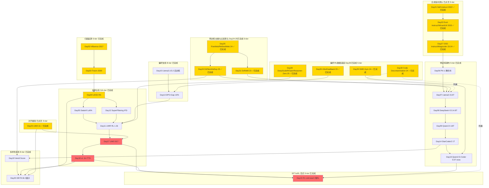

# ai-data — Data-centric AI Papers

> 专门读 **data** 相关的 AI paper 的沉淀区。服务于从 ML for Infra → Post-training / Agentic RL Infra 转型，重点是 **coding data / SFT / RL data / data curation / quality / flywheel**。
> **Scope：只谈数据，不谈算法。** 算法（GRPO/PPO/RLHF、optimizer、TTS解码策略）归 `rl-infra/`、`grpo-vs-ppo/` 轨道。这里只关心：数据怎么来、怎么洗、怎么选、怎么评、怎么量多样性/复杂度。
> 命名已全量对齐 `rl-infra/day-01-xxx`；30篇主干闭环后继续以 `day-31-xxx` 起做主题延伸，便于 Day N 直连。

## 第二轮深度复习（5/30）

> 复习期：2026-09-01 → 2026-09-30；固定按 Day 01 → Day 30，一天一篇，只更新已有 NOTES，不新增论文。

| Review | Date | Day | Paper | Status |
|---:|---|---:|---|---|
| 01/30 | 2026-09-01 | 01 | StarCoder2 / The Stack v2 数据策展入门 | ✅ 完成 |
| 02/30 | 2026-09-02 | 02 | Understanding Black-box Predictions via Influence Functions | ✅ 完成 |
| 03/30 | 2026-09-03 | 03 | Estimating Training Data Influence by Tracing Gradient Descent (TracIn) | ✅ 完成 |
| 04/30 | 2026-09-04 | 04 | LESS: Selecting Influential Data for Targeted Instruction Tuning | ✅ 完成 |
| 05/30 | 2026-09-05 | 05 | DataInf: Efficiently Estimating Data Influence in LoRA-tuned LLMs and Diffusion Models | ✅ 完成 |

## 结构

```
ai-data/
├── README.md                # 本路线图（30篇主干已闭环；Day31起主题延伸）
├── PAPER_TEMPLATE.md
├── reading-log.csv          # 快速索引
└── day-01-xxx/              # 每篇一个文件夹
    ├── NOTES.md             # 必须含「和之前工作的关系」
    └── assets/
```

## 发展路线图（30/30 主干闭环完成；主题延伸至 Day 31）

> **30篇主干** 已闭环：归因→选择→预训练瀑布→少即是多→合成指令→复杂度演化→对齐极简→语义去重、多样化剪枝→大规模网页过滤→AI反馈偏好数据底座→开源代码锚定合成→可验证RL数据→代码 benchmark 防污染。Day 31 起只补图谱中仍有明确缺口的主题；今日补上跨域数据配比。

### 图谱总览（30篇主干 + 主题延伸）



### 主线 vs 支线 判定（30篇主干已完成；Day31起主题延伸）

| Tier | 判定 | Days | 说明 |
|------|------|------|------|
| **S-tier 必读** | 范式定义 | 02,03,04,06,07,08,09,14,15,16,17,18,21,22,23,24,25,26,27,28,31 | Influence→TracIn→LESS奠定选择；Phi-1/Llama3/DeepSeek/Qwen/StarCoder2/QwenCoder奠定洗数据；R1/LIMO/s1奠定少即是多；Self-Instruct→Evol-Instruct奠定合成指令与复杂度演化；LIMA奠定对齐极简；D4奠定语义去重与多样化剪枝；FineWeb/RefinedWeb奠定可复现大规模网页过滤与消融；UltraFeedback奠定可追溯AI反馈偏好池；OSS-Instruct奠定真实开源代码锚定的合成指令路线；Open-Reasoner-Zero / DeepScaleR 奠定可验证RL题池与困难尾部；DoReMi 奠定跨域数据配比 |
| **A-tier 重要** | 你的coding冷启动直接可用 | 05,11,29,30 | DataInf LoRA扫脏；LIMR RL少即是多；SWE-Gym repo级可验证任务；代码 benchmark surface+semantic 防污染 |
| **B-tier 技巧** | 单点改进，可替换 | 10,12,13,19,20 | 10 Llama3.1后训练工程化；12 SuperFiltering弱到强IFD；13 DPO-gap难对；19 Vendi多样性度量；20 DEITA三因子工程配方 |
| **示例** | 入门 | 01 | Day01 example_starcoder2 仅作curation入门示例 |

### Day21-30 闭环计划（已完成10/10）

> Day21-30 已完成；30篇 data 主线现已闭环。

| Day | 拟定 Folder | 标题 | 为什么是主干 (Data视角) | Tier |
|-----|-------------|------|------------------------|------|
| 21 | day-21-2022-self-instruct | Self-Instruct ✅已完成 2026-08-21 | 合成SFT起点，175种子→52k，bootstrap范式，后面所有合成都抄它 | S |
| 22 | day-22-2023-evol-instruct | WizardLM / Evol-Instruct ✅已完成 2026-08-22 | 复杂度演化 In-depth/Breadth 约70k，解决 Self-Instruct 自举数据偏简单 | S |
| 23 | day-23-2023-lima | LIMA: Less Is More for Alignment ✅已完成 2026-08-23 | 1k高质量打赢全量，LIMO/s1前身，证质量>数量 | S |
| 24 | day-24-2023-semdedup-d4 | D4 / SemDeDup ✅已完成 2026-08-24 | 语义近重复去除+原型式多样化剪枝，Vendi的工程版，Llama3去重对照 | S |
| 25 | day-25-2023-fineweb-refinedweb | FineWeb / RefinedWeb ✅已完成 2026-08-25 | 15T过滤管线：heuristics+MinHash+C4规则，预训练高质数据标杆 | S |
| 26 | day-26-2023-ultrafeedback | UltraFeedback ✅已完成 2026-08-26 | 64k prompts×4多模型回答+GPT-4细粒度反馈，偏好数据底座，给DPO-gap提供上游池 | S |
| 27 | day-27-2023-oss-instruct | OSS-Instruct / Magicoder ✅已完成 2026-08-27 | 开源代码片段锚定合成约75k code指令，补Self-Instruct少种子与Evol固定规则的来源偏置 | S |
| 28 | day-28-2025-deepscaler-openreasoner | DeepScaleR / OpenReasoner-Zero Data ✅已完成 2026-08-28 | v2 57k可验证题池；v1 129k全量RL→13k困难尾部继续RL，是ProRL长程RL路线的先行证据 | S |
| 29 | day-29-2024-swe-gym | SWE-Gym ✅已完成 2026-08-29 | 2,438个真实issue任务+可执行环境+单元测试，形成repo级可验证轨迹数据，接Qwen2.5-Coder exec | A |
| 30 | day-30-2024-decontamination | Quantifying Code Contamination ✅已完成 2026-08-30 | surface-level + semantic-level code matching 检漏，防 coding SFT/RL 数据泄漏 HumanEval/MBPP，质量门最后一道 | A |

> 这10篇已跑完，**合成→过滤→去重→多样性→质量→偏好→RL可验证→防漏** 全链条贯通。

### 五条子脉络（30篇主干 + Day31延伸）

**1. 选择线 (Influence → Selection)：** Day02 → Day03 → Day04(LESS 5%) → Day05(DataInf) → Day12(IFD) → Day11(RL轨迹) → Day17(817) → Day18(1k) → Day20(DEITA)。外部方法补充：[RICo](../model-aware-data-curation/10_rico_icl_valuation.md) 用受控 ICL 干预提供 gradient-free、assessment-set-conditioned valuation；它不计入 Day 01–30，也不新增重复 NOTES。
**2. 预训练/合成线 (Quality → Scale)：** Day21(Self-Instruct) → Day22(Evol) → Day27(OSS-Instruct) → Day06(Phi-1) → Day24(D4/SemDeDup) → Day25(FineWeb/RefinedWeb) → Day07(Llama3) → Day08(DeepSeek-V3) → Day09(Qwen2.5) → Day14(StarCoder2) → Day16(Qwen-Coder) → Day29(SWE-Gym)
**3. SFT vs RL / 偏好数据线：** Day23(LIMA 1k) → Day04/12(SFT选) → Day26(UltraFeedback造偏好池) → Day13(DPO-Gap选难对) → Day11(RL要换LIM) → Day28(ORZ可验证数据+困难尾部挖掘) → Day15(R1冷启动+纯RL) → Day17/18(精心SFT也能OOD)
**4. 防污染质量门：** Day24(D4训练集内去重) → Day27(OSS-Instruct benchmark decontamination) → Day29(SWE-Gym repo/时间切分问题) → Day30(code surface+semantic train–eval 检漏)
**5. 数据配比层：** Day25(FineWeb域内过滤) → Day31(DoReMi跨域配比) → Day07/08/09(大模型预训练 mixture)

**长程RL延伸：** Day28 ORZ（约1,200步，证明大规模多样可验证数据可继续支撑RL）→ ProRL（2,000+步，并用动态采样、KL控制与reference-policy reset系统化 prolonged RL）。

### Day N 映射表（31已完成，纯 Data 视角）

| Day | Folder | Data贡献 (非算法) | Tier |
|-----|--------|-------------------|------|
| 01 | day-01-example-starcoder2 | 入门：600规则扫curation | 示例 |
| 02 | day-02-2017-influence-functions | 数据归因：定义train→test影响 | S |
| 03 | day-03-2020-tracin | 归因工程化：ckpt点积无Hessian，可算self-influence扫脏 | S |
| 04 | day-04-2024-less | 选SFT：梯度相似挑5%目标任务数据 | S |
| 05 | day-05-2024-datainf | 选LoRA：闭式1秒一条，扫脏 | A |
| 06 | day-06-2023-phi-1 | 合成数据：教科书1B+精筛6B | S |
| 07 | day-07-2024-llama3 | 预训练瀑布：15.6T 5级过滤+去重+配比 | S |
| 08 | day-08-2024-deepseek-v3 | MoE数据配比：14.8T 30%code+FIM | S |
| 09 | day-09-2024-qwen2.5 | 飞轮数据：18T→1M SFT→多阶段RL数据门禁 | S |
| 10 | day-10-2024-llama3.1-3.2 | 后训练数据切分：多轮RS/DPO数据来源 | B |
| 11 | day-11-2025-limr | RL数据：LIM轨迹选1389难例 | A |
| 12 | day-12-2024-superfiltering | SFT数据：125M弱模型IFD选7B | B |
| 13 | day-13-2025-dpo-reward-gap | 偏好数据：gap小难对留10% | B |
| 14 | day-14-2024-starcoder2 | Code数据：600+语言1T清洗+PII | S |
| 15 | day-15-2025-deepseek-r1 | RL数据：<10k冷启动合成+可验证奖励数据 | S |
| 16 | day-16-2024-qwen2.5-coder | Code执行数据：parser+exec三级洗5.5T | S |
| 17 | day-17-2025-limo | SFT数据极点：817条认知模板 | S |
| 18 | day-18-2025-s1 | SFT+TTS数据：1k长链+难度/去重 | S |
| 19 | day-19-2023-vendi-score | 数据多样性度量：kernel熵公理 | B |
| 20 | day-20-2023-deita | 数据质量配方：复杂度×质量×多样6k | B |
| 21 | day-21-2022-self-instruct | 合成指令源头：175 种子→52k bootstrap，无外部依赖自举 SFT，合成范式起点 | S |
| 22 | day-22-2023-evol-instruct | 指令复杂度演化：In-depth/Breadth 将简单任务递归改写为约70k复杂多样 SFT 数据 | S |
| 23 | day-23-2023-lima | 对齐极简：1k 条经来源、风格与多样性策展的高质 SFT，验证质量与覆盖优先于规模 | S |
| 24 | day-24-2023-semdedup-d4 | 预训练去重：语义近重复删除+原型式多样化剪枝，压缩冗余同时保留长尾覆盖 | S |
| 25 | day-25-2023-fineweb-refinedweb | 网页过滤工厂：15T-token逐级过滤、去重与训练消融，把规则清单升级为可复现可审计数据配方 | S |
| 26 | day-26-2023-ultrafeedback | 偏好数据底座：64k prompts×4多模型回答，经GPT-4细粒度评价与打分形成可追溯AI反馈池 | S |
| 27 | day-27-2023-oss-instruct | Code合成：80K开源代码片段锚定生成，经去重和benchmark防污染得到约75K条现实、多样、可控的coding SFT数据 | S |
| 28 | day-28-2025-deepscaler-openreasoner | 可验证RL数据：v2使用57k题池；v1先在129k上RL 1,100步，再挖出约13k困难尾部继续100步；承接LIMR并为ProRL长程RL提供先行证据 | S |
| 29 | day-29-2024-swe-gym | 可执行code环境：2,438个真实issue任务封装repo、依赖、单元测试与agent轨迹，把静态样本升级为仓库级可验证交互数据 | A |
| 30 | day-30-2024-decontamination | 代码防污染：surface-level + semantic-level 双重匹配 train–eval 近重复，保护 HumanEval/MBPP 等 benchmark 的可信度 | A |
| 31 | day-31-2023-doremi | 数据配比：用小 reference/proxy 的跨域 excess loss 学习 domain weights，再重采样给大模型训练，补齐域内过滤之外的 token 预算层 | S |

> 算法细节(RL用GRPO还是PPO、TTS用Wait截断还是budget forcing)不在此表，NOTES里只记数据构造部分。

### Day21-30 如何接每日Job（Day21-30 已完成）

- 命名继续 `day-{21..30}-{year}-{slug}` 两位数，顺序递增，对齐 rl-infra
- 每日Job自动：建骨架 → 更新 reading-log → push commit `feat(ai-data): Day N` → 同步Sheet `ai data` tab → 更新本README映射表新增一行（若为S-tier，同步mermaid点亮从蓝色→金/红）
- Scope约束：每日NOTES只记数据，不谈GRPO/PPO细节

---
关联：
- infra轨道：`rl-infra/day-01-ddp-basics/` ~ `day-12-reward-model`
- 讨论：在 Hatch `ai data` thread
- GitHub树：https://github.com/Papa-Panda/post-training/tree/master/ai-data
- Sheet：`ai data` tab 日更
