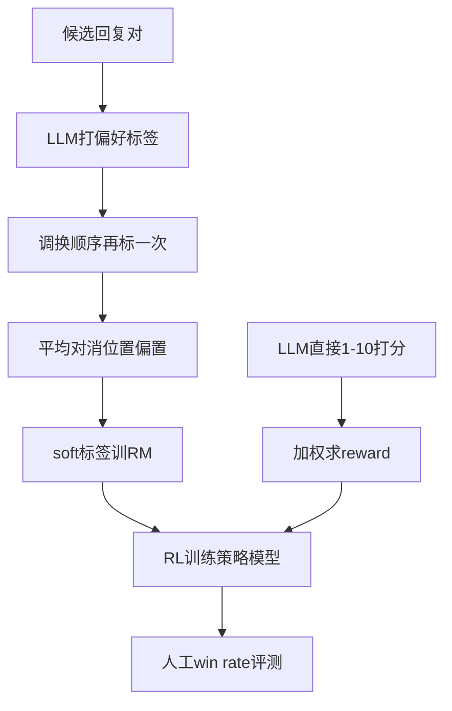

# Day36 RLAIF vs RLHF — NOTES

> 📖 阅读版：https://papa-panda.github.io/post-training/ai-data/day-36-2023-rlaif/

<!-- viz:stats: 摘要win rate RLAIF 71% | RLHF 73% | 头对头打平50% -->
<!-- viz:flow: 候选回复对 → LLM偏好标注 → 位置偏置对消 → soft标签训RM → RL训练 -->
<!-- viz:bars: 无害harmless率 RLAIF 88% | RLHF 76% | SFT 64% -->

## 元信息
- Title: "RLAIF vs. RLHF: Scaling Reinforcement Learning from Human Feedback with AI Feedback"
- Authors / Org: Lee et al. / Google DeepMind
- Link / arXiv: https://arxiv.org/abs/2309.00267
- Date read: 2026-09-28
- Tags: [rl-data, preference-data, rlaif, ai-feedback, reward-model, curation]

## 一句话总结
AI 反馈做偏好数据的完整 recipe：PaLM 2 L 当 AI 标注器、soft 标签蒸馏训 RM，RLAIF 与 RLHF 在三任务上打平（摘要 win rate $71\%$ vs $73\%$ ，差异不显著），无害对话 harmless rate $88\%$ 显著超过 RLHF 的 $76\%$ ；d-RLAIF 直接拿 LLM 1–10 打分当 reward、跳过 RM 训练，还 $60\%$ 胜过 canonical RLAIF。ICML 2024。

## 大纲
- 偏好标注 recipe：PaLM 2 L 做 off-the-shelf AI labeler；prompt = preamble + few-shot（可选）+ 待标样本 + Ending；取 "1"/"2" token log-prob 做 softmax 得 soft 标签
  - 位置偏置：每对候选调换顺序标两次，结果平均
  - CoT：先让 LLM 写 rationale，再拼回 prompt 打分；CoT 普适涨点，detailed preamble 只对摘要有效，few-shot 多数反效果
- 主实验：RLAIF 与 RLHF 在摘要 / 有助对话 / 无害对话三任务头对头；AI 标注器对齐度 $78.0\%$ ，逼近人工互评的 $73\%$ – $77\%$
- 自改进：同尺寸标注器（PaLM 2 XS）仍 $68\%$ 胜 SFT；helpful 上 d-RLAIF 用与初始策略同一 checkpoint 打分，构成严格自改进
- d-RLAIF：LLM 直接 1–10 打分、加权求 reward（归一化到 [-1, 1] ），跳过 RM 训练与 staleness；摘要 $74\%$ 胜同尺寸 RLAIF 的 $68\%$
- 成本与规模：AI 标注比人工便宜 10 倍以上；标注器尺寸与对齐度单调正相关（L $78.0\%$ / S $73.8\%$ / XS $62.7\%$ ）；canonical RLAIF 里 labeler 只跑一次

## 流程图

## 核心
1. **Motivation**: RLHF 对齐有效，但高质量人工偏好标签贵、难规模化；同时 LLM 已展现与人类判断高度一致（Gilardi/Ding 2023）。Bai et al. 2022b 首次提出 RLAIF（Day34 Constitutional AI 里的人+AI 混合），但从未做过"人 vs AI 反馈"的直接对比——AI 反馈能否成为 RLHF 的平替，这个缺口本篇来补。顺带回答两个更激进的问题：标注器可以小到什么程度（自改进）？能不能跳过 RM（d-RLAIF）？
2. **Data Pipeline**: AI 标注器 →（可选 RM 蒸馏）→ RL → 人工评测：
   - **标注器**：PaLM 2 L（instruction-tuned、未做过 RL），纯 off-the-shelf；策略与 RM 基座都是 PaLM 2 XS——大模型只做离线标注，小模型做训练与推理；
   - **prompt 结构**：Preamble（Base 版只问"哪个好"；Detailed 版模仿给人工标注员的详细评分指令）+ few-shot exemplars（可选）+ 待标样本 + Ending（如 "Preferred Response="）；取 token "1"/"2" 的 log-prob 做 softmax → **soft 标签**（如 [0.6, 0.4] ），信息量多于 one-hot；
   - **位置偏置对消**：每对候选调换顺序标两次、结果平均（小尺寸 labeler 偏置更严重，见附录 B）；
   - **CoT  elicitation**：两步推理——先让 LLM 写 rationale（"Consider the coherence, accuracy, coverage..."），再把 rationale 拼回 prompt 打分；
   - **标注实验规模**：为快速迭代，下采样到每任务 3–4k 例（取训练 split 的 $15\%$ / $10\%$ / $10\%$ ；摘要只留人工高置信例，confidence 1/2/8/9）；
   - **RM 训练**：soft 标签 + cross-entropy（RM 输出经 softmax 成分布再算 loss）；**RL 用带 baseline 的改进 REINFORCE**（作者认为比 PPO 简单但够用），policy/value 均从 SFT 初始化——算法一句带过；
   - **评测三件套**：AI Labeler Alignment（AI 偏好二值化后与人工偏好的一致率）、Win Rate（人工盲排）、Harmless Rate（无害任务每条独立判 harmless/harmful，不做相对排序）；
   - **d-RLAIF 分支**：LLM 对生成直接 1–10 打分，加权分数 $s(y|x)=\sum_{i=1}^{10}iP(i|y,x)$ ，归一化到 [-1, 1] 当 reward；省去"偏好标注 + RM 训练"两步，顺带解决 RM **staleness**（RM 训在初始策略分布上，策略越训越 OOD）。
3. **Key Tricks**:
   - **soft 标签蒸馏**：不 argmax 成硬标签，保留分布训 RM——本质是模型蒸馏，RM 只是 AI labeler 的压缩版；
   - **位置偏置对消**：调换顺序两次推理取平均，几乎零成本的去偏手段；
   - **CoT 先想后判**：两步 prompt（先 rationale 后打分）一致涨点；但**自洽性采样**（ $T>0$ 采样多条 rationale 平均）严格降点——别加；
   - **few-shot 反直觉**：只在 harmless 任务涨点；摘要/helpful 上 exemplars 越多对齐度越低（10 次随机 exemplar 试验，最高也只追平 Base 0-shot 的 $76.1\%$ ）——任务 labeler 本来就懂，exemplar 是干扰；
   - **标注器规模实验**：L $78.0\%$ → S $73.8\%$ → XS $62.7\%$ ，单调正相关；但 canonical RLAIF 里 labeler 只跑一次，所以"用更大的 labeler 做离线标注"并不贵——这是大小模型分工的理论依据。
4. **Results**:
   - 摘要 vs SFT：RLAIF $71\%$ ，RLHF $73\%$ （差异不显著）；helpful： $63\%$ vs $64\%$ ；头对头 RLAIF vs RLHF： $50\%$ / $52\%$ （与 $50\%$ 无显著差异）；
   - 无害对话：harmless rate RLAIF $88\%$ ＞ RLHF $76\%$ ＞ SFT $64\%$ （显著）；
   - RLAIF 还 $79\%$ 胜过人工参考摘要（RLHF $80\%$ ）；
   - 同尺寸 RLAIF（XS 标注器）： $68\%$ 胜 SFT（与 $71\%$ 的差异 p=0.07，不显著）；
   - d-RLAIF：摘要 $74\%$ 胜 SFT，头对头 $60\%$ 胜同尺寸 RLAIF（显著）；helpful $66\%$ 胜 SFT，且标注器 = 初始策略**同一 checkpoint**（严格自改进）；
   - prompt 涨点：最优 prompt 比 Base 0-shot 高 $+1.9\%$ / $+1.3\%$ / $+1.7\%$ （摘要/helpful/harmless）；AI labeler $78.0\%$ 对齐度已达人工互评水平（ $73\%$ – $77\%$ ）；
   - 成本：AI 标注比人工便宜 **10 倍以上**；
   - 失败记录同样有信息量：人+AI 混合反馈没超过纯人工；Stanford Human Preferences 数据集上校正长度偏置后 RLHF/RLAIF 都没涨——长度偏置是偏好评测的老坑，本文做了 post-hoc 校正；
   - 定性观察：RLHF 有时幻觉（"作者 20 岁"，原文没提），RLAIF 有时不流畅（run-on 句子、重复 "How do I get over this?"）；70 例盲评 accuracy/coverage/coherence 无显著差异。

## 可迁移
- 对你现在 coding data 工作的 1-2 个直接可试的点：(1) patch 偏好对（"哪个 patch 更好"）的 AI 标注：prompt 里先写 rationale 再打分 + 候选调换顺序对消位置偏置，这套 recipe 可直接搬；先用 3–4k 高置信人工偏好测 AI labeler 对齐度（天花板≈人工互评一致率），达标再大规模铺开。(2) d-RLAIF 式捷径：LLM 直接 1–10 打分当 reward，跳过"偏好对→RM 蒸馏"——coding verifier/PRM 训练前，可先用 LLM judge 直接打分做数据筛选，省一轮 RM 训练；注意 RM staleness：策略分布漂移后离线 RM 会过时，d-RLAIF 的"在线打分"正是解法之一。
- Infra 视角：大小模型分工——大模型（L）只做离线一次性标注，小模型（XS）做策略/RM 训练与在线推理；canonical RLAIF 里 labeler 不进 RL 循环，算力账好算；d-RLAIF 把大模型放进 RL 循环，在线打分成本要重估（但省了 RM 训练）。

## 疑问 / 下一步
- 位置偏置对消只是两次推理平均：coding 里长 patch 对的顺序效应可能更强，这招够用吗？要不要"打乱多次 + 一致性过滤"？
- AI labeler $78.0\%$ 对齐度已逼近人工互评上限 $73\%$ – $77\%$ ：这是偏好任务的天花板吗？Day34 的宪法原则式 critique 能不能把 harmless 的对齐度再往上推？
- d-RLAIF 的 1–10 打分 reward 在 coding verifier 上复用时，"打分标尺漂移"（不同 batch 严格度不一）怎么校准？

## 原文金句 (1-2句)
> Our results suggest that RLAIF can achieve performance on-par with using human feedback, offering a potential solution to the scalability limitations of RLHF.

> Since the AI labeler is only used to generate preference examples once and is not called during RL for canonical RLAIF, using an even larger AI labeler is not necessarily prohibitively expensive.

## 思考题
1. Day34 的 Constitutional AI 也是 AI feedback——它用"宪法原则→self-critique→revision"定义对错，RLAIF 直接用 LLM 当偏好标注器：两者在"谁定义对错"上有何本质区别？coding data 里哪种更适合"哪个 patch 更好"这类偏好？
2. Day35 的 PRM 花 800K 人工 step 标签换精度，RLAIF 证明 AI 标注可平替人工偏好：coding 的 code review 偏好数据，AI labeler 的对齐度天花板是人工互评一致率吗？CoT + 位置偏置对消这套 recipe 能直接搬吗？
