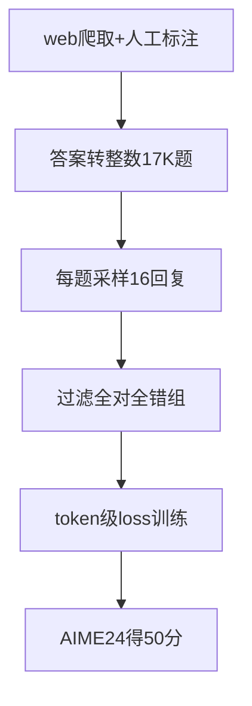

# Day37 DAPO — NOTES

> 📖 阅读版：https://papa-panda.github.io/post-training/ai-data/day-37-2025-dapo/

<!-- viz:stats: AIME24 avg@32 50分 | 训练步数仅50% | DeepSeek-R1-Zero-Qwen-32B 47分 -->
<!-- viz:flow: web爬取+人工标注 → 答案转整数 → 17K prompts → dynamic sampling → RL训练 -->
<!-- viz:bars: Naive GRPO 30 | +Overlong过滤 36 | +Clip-Higher 38 | +软惩罚 41 | +Token级loss 42 | DAPO 50 -->

## 元信息
- Title: "DAPO: An Open-Source LLM Reinforcement Learning System at Scale"
- Authors / Org: Qiying Yu et al. / ByteDance Seed, Tsinghua AIR, HKU
- Link / arXiv: https://arxiv.org/abs/2503.14476
- Project page: https://dapo-sia.github.io/
- Date read: 2026-09-29
- Tags: [rl-data, rl-training-data, dynamic-sampling, overlong-filtering, grpo, curation]

## 一句话总结
开源复现 R1 级长 CoT RL 的完整数据+工程 recipe：DAPO-Math-17K（17K 数学题、答案全部改写成整数以便规则奖励）配四个关键技术——dynamic sampling 过滤零梯度 prompt 组、overlong 软惩罚、token 级 policy gradient loss、Clip-Higher 解耦——Qwen2.5-32B 从近 $0\%$ 训到 AIME24 avg@32 50 分，超过 DeepSeek-R1-Zero-Qwen-32B 的 47 分，且只用了 $50\%$ 训练步数。

## 大纲
- 问题背景：o1/R1 之后社区复现不了大规模 RL——关键训练细节被藏起；DAPO 开源算法 + verl 训练代码 + 整理好的数据集，目标是可复现的 SOTA
- DAPO 四技术（名字即作用）：
  - Clip-Higher：把 PPO/GRPO 的对称 clip 解耦， $\varepsilon_{\text{low}}$ 保持 0.2 、 $\varepsilon_{\text{high}}$ 放到 0.28 ，给低概率"探索 token"留上涨空间，防熵崩塌
  - Dynamic Sampling：过滤掉组内全对/全错的 prompt（advantage 为零、纯浪费算力），动态采样直到有效 batch 填满
  - Token-Level Policy Gradient Loss：按全部 token 数归一化（ $1/\sum|o_i|$ ），而不是按样本数平均——长 CoT 下短回复会被系统性高估
  - Overlong Reward Shaping：截断样本不再一刀切罚到底； 16384 预期长度 + 4096 惩罚缓冲 = 20480 上限，区间内越长罚越重（线性软惩罚）
- 数据集 DAPO-Math-17K：web 爬取 + 竞赛官网 + 人工标注；数学答案格式太杂（表达式/公式/数字），用 LLM 把题目改写成"答案是整数"的形式（如 $a+b+c$ ），17K prompts 每个配一个整数答案——全部为了让 rule-based reward 解析不出错
- 训练配置：prompt batch 512 、每题采样 16 个回复；mini-batch 512 （每 rollout 步 16 次梯度更新）；lr $1\times 10^{-6}$ 、warmup 20 步；评测 AIME 重复 32 次取 avg@32（temp 1.0 、top-p 0.7 ）
- 消融（Table 1，AIME24 avg@32）：Naive GRPO 30 → +Overlong Filtering 36 → +Clip-Higher 38 → +Soft Overlong Punishment 41 → +Token-level Loss 42 → +Dynamic Sampling（DAPO） 50

## 流程图

## 核心
1. **Motivation**: o1 和 DeepSeek R1 证明了大规模 RL 能" elicits 复杂推理行为"（自我验证、迭代修正），但 o1 博客和 R1 技术报告都藏了关键训练细节，社区复现不了。DAPO 的立场是：把四个让大规模 LLM RL 成功的关键技术讲清楚，并把代码（基于 verl）+ 数据集全开源。scope 限定 ai data：这里的四个技术里，两个是纯数据工程（dynamic sampling = 数据过滤、overlong shaping = 奖励/数据处理），一个是数据集本身。
2. **Data Pipeline**: web/竞赛官网爬取 + 人工标注 → 答案整数化改写 → DAPO-Math-17K（17K prompts × 整数答案）→ RL 训练时 per-prompt 采样 16 个回复 → rule-based correctness reward（整数答案直接可比，parser 不出错）+ 长度软惩罚 → dynamic sampling 过滤 → token 级 loss 更新；评测 AIME24 avg@32。
   - **答案整数化的动机**：数学答案格式杂（表达式、公式、数字），规则解析器容易误判；借鉴 AIME"答案必为整数"的设计，用 LLM 把原题改写成答案为整数的形式（例：原答案 $\frac{a+\sqrt{b}}{c}$ 改成求 $a+b+c$ ）——用一次 LLM 改写换整个训练期的奖励信号零噪声。
   - **Dynamic Sampling 算法**：对每个 prompt 采样 $G$ 个输出算 reward，只保留"对错混杂"的组进 buffer（条件 $0<|\{o_i:\text{is\_equivalent}(a,o_i)\}|<G$ ），buffer 攒满 $N$ 才做梯度更新；全对/全错组 advantage 恒为零，训了也白训。
   - **Overlong 两步走**：先试 Overlong Filtering（截断样本直接 mask 掉 loss）——已显著稳定训练、涨 $30\to 36$ ；再上 Soft Overlong Punishment（公式 13，区间内线性惩罚、超限 -1 ）， $36\to 41$ 。
3. **Key Tricks**:
   - **答案整数化**：数据预处理的"一次投入、永久收益"——把奖励噪声在数据源头掐死，而不是在训练里修；
   - **Dynamic Sampling 的算力账**：过滤零梯度数据意味着要多采样，但论文实测总训练时间没明显增加，反而收敛更快（有效步数少了）——"采样贵、训练更贵"，过滤是划算的；
   - **Token 级 loss 的长 CoT 意义**：样本级平均会让短回复的每个 token 拿到更大权重；token 级归一化后"长度增长更健康"，训练更稳定（涨点不多但方差小）；
   - **Clip-Higher 的熵视角**： $\varepsilon_{\text{high}}$ 从 0.2 放到 0.28 后，策略熵上升、采样更多样——长 CoT RL 里探索空间大，对称 clip 会把低概率 token 的上涨空间压死；
   - **超长上限的工程数**： $16384+4096=20480$ ，KV cache 和显存规划按 20480 算。
4. **Results**:
   - AIME24 avg@32：DAPO 50 vs DeepSeek-R1-Zero-Qwen-32B 47 ，用 $50\%$ 训练步数；准确率从近 $0\%$ 涨到 $50\%$ ；
   - 消融链（每加一项都涨）： $30\to 36\to 38\to 41\to 42\to 50$ ，其中 dynamic sampling 单项贡献最大（ $42\to 50$ ， $+8$ ）；
   - Vanilla GRPO 只到 $30\%$ ——说明 R1 级结果不是"大力出奇迹"，是数据+工程细节堆出来的；
   - Token-level loss：涨点小（ $41\to 42$ ）但训练稳定性提升明确。

## 可迁移
- 对你现在 coding data 工作的 1-2 个直接可试的点：(1) "可验答案"类比：数学靠"答案转整数"拿到零噪声 rule-based reward；代码天然有编译通过/单测通过这种可验信号——code RL 的数据管线可以照抄 DAPO 的整套 recipe（dynamic sampling 滤零梯度组 + overlong 软惩罚 + token 级 loss），verifier 就是整数答案的角色。(2) Dynamic sampling 的过滤思想先行：RL 前先批量跑一遍当前策略，把"全对/全错"的 prompt 标出来——过滤掉的别进 RL（零梯度），难的全错样本回流给 SFT/蒸馏做课程学习；这比"采样时动态过滤"更省 rollout 算力。
- Infra 视角： $512\times 16=8192$ 条 rollout per step 的规模 + verl 框架；dynamic sampling 让每步实际采样量波动（buffer 填满才训），调度器要能处理动态 batch； 20480 token 的生成上限意味着 KV cache 按最长序列规划，overlong 样本是显存杀手——overlong shaping 不只是算法技巧，也是成本控制。

## 疑问 / 下一步
- 答案整数化改写题目时，LLM 改写会不会悄悄改变题目难度/分布？论文没给改写前后的难度对比——17K 里有多少是"为凑整数而变简单"的题？
- Dynamic sampling 过滤全对 prompt：SFT 阶段是不是也该干掉"模型已全对"的题？Day33 STaR 恰恰靠"答对题目的 rationalization"扩数据——两者矛盾吗，还是 RL 和 SFT 对"已学会样本"的价值判断本来就不同？
- Soft overlong punishment 的 4096 缓冲是拍脑袋的吗？不同任务的最优"预期长度/缓冲"比例怎么定——coding 里函数长度分布更偏，照搬 $16384+4096$ 合理吗？

## 原文金句 (1-2句)
> Unlike previous works that withhold training details, we introduce four key techniques of our algorithm that make large-scale LLM RL a success.

> If all outputs of a particular prompt are correct and receive the same reward, the resulting advantage for this group is zero.

## 思考题
1. DAPO 把数学答案统一转成整数换取 rule-based reward 的零噪声，代价是"题目被改写、答案空间变窄"：coding 里哪些任务有天然可验答案（编译通过/单测），哪些没有？不可验的任务，Day35 的 PRM 式人工 step 标签和 Day36 的 AI 标注哪条路更划算？
2. Dynamic Sampling 把全对/全错 prompt（零梯度）挡在训练之外；Day33 STaR 却专门收集"答对的题目"做 rationalization 扩 SFT 数据：两者矛盾吗？RL 和 SFT 对"已学会样本"的价值判断为什么不同？
