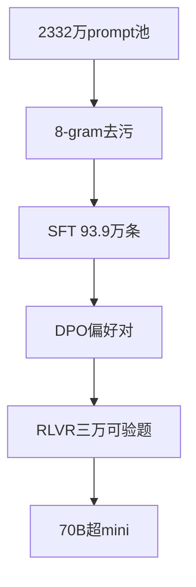

# Day38 Tülu 3 — NOTES

> 📖 阅读版：https://papa-panda.github.io/post-training/ai-data/day-38-2024-tulu-3/

<!-- viz:stats: SFT 939,344条 | DPO 8B 271,409对 | RLVR 29,946题 | 70B开发集均分76.0 -->
<!-- viz:flow: 2332万prompt池 → 8-gram去污 → SFT → DPO → RLVR -->
<!-- viz:bars: 8B SFT 60.4 | 8B DPO 64.4 | 8B RLVR 64.8 -->

## 元信息
- Title: "Tülu 3: Pushing Frontiers in Open Language Model Post-Training"
- Authors / Org: Lambert et al. / AllenAI
- Link / arXiv: https://arxiv.org/abs/2411.15124
- Date read: 2026-09-30
- Tags: [rl-data, post-training-recipe, sft, dpo, rlvr, verifiable-reward, decontamination, curation]

## 一句话总结
开源后训练落后闭源不是算法问题，是数据配方不透明——Tülu 3 在 Llama 3.1 base 上给出可复现的全配方：939,344 条 SFT（23,327,961 prompt 池中精选 + persona 合成）→ DPO 偏好对（8B 271,409 / 70B 334,302，含 on-policy 采样、GPT-4o 打分）→ RLVR（29,946 道可验数学题 + IF 约束，二值验证器奖励），8-gram 去污做到评测集级别；70B 开发集均分 76.0，超 GPT-4o-mini（69.6）和 Claude 3.5 Haiku（75.3）。

## 大纲
- 问题背景：开源 post-training 配方落后闭源；训练数据和配方"同时是最关键的部分和透明度最低的部分"——Tülu 3 把权重、数据、代码、完整报告全开源（论文只训了 8B / 70B 两个规模）
- SFT 数据混合（Table 6）：23,327,961 prompt 池 → 实际用 939,344；构成 = 通用（WildChat GPT-4 子集 241,307→用 100,000、OpenAssistant、No Robots）+ 知识（FLAN v2 89,982、SciRIFF）+ 数学（OpenMathInstruct-2 21,972,791→只用 50,000、NuminaMath-TIR）+ 代码（Evol CodeAlpaca 107,276）+ 安全（CoCoNot、WildJailbreak、WildGuardMix 各 5 万/1 万）+ 多语（Aya 100,000）+ persona 合成（GPT-4o-2024-08-06 生成，~250K Persona Hub 人设，产出 Persona MATH 149,960 / Persona IF 29,980 等；Python 用 claude-3-5-sonnet）
- DPO 偏好数据（354,192 实例总量；8B 271,409 对 / 70B 334,302 对）：三阶段——选 prompt → 4 个外部模型 + 1 个 on-policy（当前 SFT 模型）各采样 → GPT-4o-2024-0806 按 4 个维度 1–5 打分，Argilla 二值化取最高为 chosen；用 length-normalized DPO
- RLVR（可验证奖励 RL）：GSM8K Train 7,473 + MATH Train 7,500 + IF 可验约束 14,973 = 29,946 prompts；奖励是二值验证器（答对得 α=10，答错 0；缺 EOS 额外 −10），PPO + KL 惩罚；8B：MATH 42.0→43.7、GSM8K 84.3→87.6、IFEval-strict 81.1→82.4；70B 提升微弱（GSM8K 93.5→93.5 饱和）
- 去污（8-gram 匹配）：测试样本 >50% token 与同一训练样本共享 8-gram 判显著重叠；训练集若与任一评测集 >2% 实例重叠即判污染；删掉 NuminaMath-TIR 11.3%（vs MATH）、Evol CodeAlpaca 3.5%（vs HumanEval）、WildChat GPT-4 5.4%（vs 安全评测）；发现 Evol CodeAlpaca–HumanEval 重叠 70.7%、NuminaMath-TIR–MATH 18.2%、LMSys Chat 1M–AlpacaEval 46.5%（后者直接弃用）
- 评测设计：开发集（调模型时用）vs 未见集（只评最终模型，开发时绝不看分）；未见集含 MMLU-Pro、GPQA、BigCodeBench、IFEval-OOD（52 约束）、HREF（新）
- 没进配方的尝试：Online DPO（200K episodes 数学）、rejection sampling、RM 分数叠加可验奖励、Persona Math/Code 偏好数据——全被判"没可靠提升"

## 流程图

## 核心
1. **Motivation**: 开源后训练配方落后闭源，根因是"训练数据和配方同时是最关键的部分和透明度最低的部分"。Tülu 3 的立场：把 SFT → DPO → RLVR 三阶段的全部数据配方、去污工具、评测实现、训练代码开源，让社区能复现和改编。scope 限定 ai data：这篇的三个阶段全是数据工程——SFT 混合是数据选择，DPO 是偏好数据生产管线，RLVR 是可验证奖励数据设计。
2. **Data Pipeline**:
   - **SFT**：23,327,961 prompt 池 → 精选 939,344 条。池子结构：通用对话（WildChat GPT-4 真实用户对话 241,307→用 100,000、OpenAssistant、No Robots）、知识召回（FLAN v2、SciRIFF、TableGPT）、数学（OpenMathInstruct-2 池 21,972,791 占 94% 但只用 50,000、NuminaMath-TIR 64,312 全用）、代码（Evol CodeAlpaca 107,276）、安全不遵从（CoCoNot 10,983、WildJailbreak / WildGuardMix 各 50,000）、多语（Aya 202,285→用 100,000）、精确指令遵循（Persona IF 29,980）。persona 合成：按 ~250K Persona Hub 人设约束合成，GPT-4o-2024-08-06 生成（数学解用 GPT-4o、Python 程序用 claude-3-5-sonnet），共 ~220K 数学 + ~35K 代码实例。
   - **DPO**：总量 354,192 实例；最终混合 8B 271,409 对 / 70B 334,302 对。三阶段：(1) 从 SFT 用过/没用过的 prompt + 清洗后 UltraFeedback + IF-augmented prompt 里选；(2) 每个 prompt 由 4 个外部模型（Llama 3.1、GPT-4o、Qwen2.5 等）+ 1 个 on-policy（当前 Tülu SFT 模型）采样回复；(3) GPT-4o-2024-0806 按 helpfulness / instruction-following / honesty / truthfulness 四维度 1–5 打分，Argilla 法取最高为 chosen、低分随机抽为 rejected。训练用 length-normalized DPO。
   - **RLVR**：allenai/RLVR-GSM-MATH-IF-Mixed-Constraints，GSM8K Train 7,473 + MATH Train 7,500 + IF 可验约束 14,973 = 29,946 prompts（"roughly 30,000 prompts with ground truth labels"）。奖励 = 二值验证器：答对 α=10、答错 0；缺 EOS 额外 −10。数学题验证 = 抽答案精确匹配；IF 约束 = 每个约束模板的专用 verifier 函数。PPO + KL 惩罚，value model 从通用 RM 初始化。
   - **去污**：8-gram 匹配（Dubey et al. 2024 做法）；测试样本 >50% token 与同一训练样本共享 8-gram 判显著重叠；训练集与任一评测集重叠 >2% 实例即判污染。污染 vs 未见集的整集弃用（如 LMSys Chat 1M、ShareGPT）；污染 vs 开发集的整集删或实例级删。实际删除：NuminaMath-TIR 11.3%、Evol CodeAlpaca 3.5%、WildChat GPT-4 5.4%、WildJailbreak 0.7%、WildGuardMix 1.1%。多轮去污导致中间混合版本"small drops in performance"（Figure 3 caption）。
   - **评测**：开发集（MMLU、PopQA、TruthfulQA、BBH、DROP、MATH、GSM8K、HumanEval(+)、IFEval、AlpacaEval 2、Tülu3 Safety 六任务均值）vs 未见集（MMLU-Pro、GPQA、AGIEval、Deepmind Mathematics、BigCodeBench、IFEval-OOD、HREF；开发时绝不看未见集分数）。
3. **Key Tricks**:
   - **On-policy 偏好数据**：DPO 管线里每个 prompt 必采 1 条当前 SFT 模型的回复——偏好数据不只来自"更强的外部模型"，on-policy 样本让 DPO 学的是"自己错在哪"；
   - **去污是硬门槛**：Evol CodeAlpaca–HumanEval 70.7% 重叠、NuminaMath-TIR–MATH 18.2%——开源数据集的评测污染比想象中严重得多；宁可掉点分也要做实例级删除；
   - **RLVR 的验证器即数据**：奖励函数不是模型，是"抽答案精确匹配 + 约束模板 verifier"——数据工作的形态从"标注"变成"写 verifier"；α=10 是 pilot 实验定的，没再调；
   - **失败清单同样开源**：Online DPO（200K episodes）、rejection sampling、"RM 分数叠加可验奖励"（更差更噪声）、Persona Math/Code 偏好数据（轻微掉均分，只保留 Persona IF）、SFT 训 2 epoch 最优——负结果是配方的一部分；
   - **开发集/未见集分离**：调参只看开发集，未见集只跑最终模型——防"评测过拟合"的组织纪律。
4. **Results** (Table 2，开发集均值)：
   - 8B：Tülu 3 64.8 vs Llama 3.1 8B Instruct 62.2、Qwen 2.5 7B 57.8；AlpacaEval 2 LC 胜率 34.5 vs Llama 24.2；GSM8K 87.6 vs 83.4；MATH 43.7 vs 42.5；
   - 70B：76.0 vs Llama 3.1 70B 73.4、Qwen 2.5 72B 71.5、GPT-4o-mini 69.6、Claude 3.5 Haiku 75.3；AlpacaEval 2 49.8 vs Llama 33.4、vs GPT-4o-mini 49.7；安全均值 88.3 vs Llama 76.5；
   - 阶段消融：8B SFT 60.4 → DPO 64.4 → RLVR 64.8；70B 72.6 → 75.9 → 76.0——DPO 贡献最大，RLVR 在 8B 上对数学/IF 有实质提升（GSM8K 84.3→87.6），70B 上已饱和。

## 可迁移
- 对你现在 coding data 工作的 1-2 个直接可试的点：(1) On-policy 偏好采样：DPO 数据里每个 prompt 都混入当前 SFT 模型的 1 条采样——code 偏好数据别只用外部强模型（GPT-4o/Qwen）生成，混入自己模型的 on-policy 样本，用可验信号（编译通过/单测通过）做 judge，学的是"自己错在哪"。(2) "写 verifier 代替标注"：RLVR 的数据工作 = 写约束模板的 verifier 函数；code 里 lint 规则、格式约束、单测模板天然就是 verifier——Day37 DAPO 的"答案转整数"和这里的思路同源：把奖励噪声在数据源头掐死。
- Infra 视角：(1) 去污是评测 infra 的前置成本——8-gram 全量训练集 × 评测集比对是固定工程投入，coding 数据里"爬来的代码 vs 评测集"同样要做；(2) 开发集/未见集两套评测、开发时绝不看未见集分数——coding eval harness 设计里 holdout 测试集必须物理隔离，否则分数虚高；(3) Persona Hub 式合成（~250K 人设 × 任务约束）是防合成数据模式塌缩的低成本多样性来源，code 合成 prompt 可照抄。

## 疑问 / 下一步
- SFT 池 23,327,961 里 OpenMathInstruct-2 占 21,972,791（94%）但只用了 50,000——这 50K 的"multi-skill selection"具体采样策略是什么？论文 Table 6 只给了结果，没给选择算法。
- RLVR 的 14,973 道 IF 可验题是怎么从 IFEval 约束模板批量生成的？coding 里"可验约束"（如"函数必须含类型注解"）能不能照抄这套模板→verifier 的管线？
- Persona Math/Code 偏好数据"轻微掉均分"被弃用，但 Persona IF 保留——为什么 IF 类 persona 合成有效、数学/代码无效？是 verifier 质量问题还是任务性质问题？

## 原文金句 (1-2句)
> The underlying training data and recipes for post-training are simultaneously the most important pieces of the puzzle and the portion with the least transparency.

> Do Not Use the Scores from RM — adding RM scores on top of verifiable rewards is worse and noisier.

## 思考题
1. Tülu 3 用 8-gram 去污（>50% token 重叠判显著、>2% 判污染），代价是中间版本"small drops in performance"；而 Evol CodeAlpaca–HumanEval 70.7%、NuminaMath-TIR–MATH 18.2% 的重叠说明开源 coding/math 数据污染极重：coding data 里"爬来的代码 vs 评测集"的污染阈值该怎么定？去污的性能代价和"分数虚高"之间怎么做取舍？
2. RLVR 在 8B 上 GSM8K 84.3→87.6 有实质提升，70B 上 93.5→93.5 零增益（饱和）；而 Online DPO、rejection sampling 根本没进最终配方：什么信号下 RL 该停、什么信号下该加数据？可验奖励的"天花板"到底是数据集饱和还是模型能力饱和，怎么区分？
