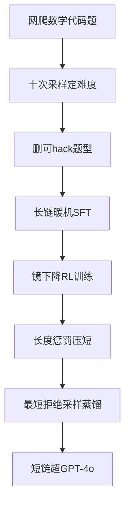

# Day39 Kimi k1.5 — NOTES

> 📖 阅读版：https://htmlpreview.github.io/?https://github.com/Papa-Panda/post-training/blob/master/ai-data/day-39-2025-kimi-k1-5/index.html

<!-- viz:stats: 上下文 32k→128k | CoT判分器准确率 98.5 | 测试样例生成 323题 -->
<!-- viz:flow: 网爬题 → 难度过滤 → 长链暖机 → RL训练 → long2short -->
<!-- viz:bars: CoT判分器 98.5 | 经典判分器 84.4 -->

## 元信息
- Title: "Kimi k1.5: Scaling Reinforcement Learning with LLMs"
- Authors / Org: Kimi Team / Moonshot AI
- Link / arXiv: https://arxiv.org/abs/2501.12599
- Date read: 2026-10-01
- Tags: [rl-data, long-cot, rl-training-data, verifiable-reward, long2short, curation, curriculum-sampling, reward-model]

## 一句话总结
Long-CoT 的 RL 数据实战：靠"RL prompt 数据三原则（多样性 / 难度均衡 / 可验）+ 自动过滤"造 prompt 池、课程采样与优先采样决定训练喂什么、小型长链 warmup 暖机，RL 阶段只做简化框架（online mirror descent，无 MCTS / value / PRM）并把上下文拉到 128k；长链打平 o1（AIME 77.5、MATH-500 96.2、Codeforces 94 百分位），再用最短拒绝采样 / DPO / 权重合并 / long2short RL 把长链压缩给短链模型，短链 AIME 60.8 超 GPT-4o 最高达 550%。

## 大纲
- RL prompt 池的数据三原则：多样性覆盖（STEM / 代码 / 通用推理）、难度均衡、可准确验证；自动过滤选"需丰富推理且易评测"的题，tagging 系统保证学科均衡
- 难度与防 hack 过滤：每题用 SFT 模型高温采样 10 次，pass 率做难度代理；删选择题 / 判断题 / 证明题；无 CoT 猜中 $N=8$ 次内即判可 hack 删除
- 长链暖机：prompt 工程 + 类拒绝采样造"小而高质量"长链 warmup 集，内含规划 / 评估 / 反思 / 探索四个认知过程，轻量 SFT 暖机
- RL 训练期数据工程：课程采样（先易后难，数据自带年级/难度标签）+ 优先采样（按 $1-s_i$ 采样成功率低的题）；长度惩罚 warm-up（先不加、后常数）；数学 CoT 判分器 vs 经典判分器（各 ~800k 训练数据，人工抽查 98.5 vs 84.4）；代码测试样例自动生成（CYaRon 生成器 + 10 个 ground truth 提交交叉验证，323 题入库）
- 简化 RL 框架：online mirror descent 直接优化终值奖励，砍掉 MCTS / value 网络 / PRM；上下文 32k→128k（预训练 long-context 激活 131,072 tokens）；partial rollout 复用前序轨迹大块提采样效率
- long2short 四法：最短拒绝采样（ $n=8$ 采最短正确解做 SFT）、权重平均合并长短模型、DPO（最短正确为正、1.5 倍长以上为负）、long2short RL 第二阶段（压最大 rollout 长度 + 长度惩罚）

## 流程图

## 核心
1. **Motivation**: 论文开宗明义：next-token 预训练的扩展受"可用高质量数据量"封顶（§1）。RL 开新轴——模型靠奖励自己探索、自己产数据，不被静态数据集封顶；但此前公开工作没做出有竞争力的结果。k1.5 的核心论断是数据侧的：RL 成败取决于 RL prompt 池的"质量与多样性"（§2.1），以及训练喂数据的方式；长上下文则是 RL 持续扩展的关键维度（context length ≈ 搜索步数，替代显式 MCTS）。
2. **Data Pipeline**:
   - **RL prompt 池（§2.1）**：三原则——多样性覆盖、难度均衡、可准确验证。来源：STEM 学科题、竞赛题、通用推理题，文本 + 图文。自动过滤选"需要丰富推理、易于评测"的题；tagging 系统按领域/学科分类保均衡。难度：SFT 模型高温采样 10 次，pass 率做难度代理（越低越难），顺手预过滤掉 trivial 题。防 hack：选择题 / 判断题 / 证明题整类剔除（答案易猜导致"答对但推理错"的假阳性）；通用问答题让模型无 CoT 纯猜， $N=8$ 次内猜中即判可 hack 删除。
   - **长链 warmup（§2.2）**：用 prompt 工程 + 类拒绝采样造"小而高质量"长链暖机集，覆盖规划 / 评估 / 反思 / 探索四种认知过程，文本 + 图像输入都有验证过的推理路径；轻量 SFT 暖机，让模型先内化推理策略再进 RL。
   - **RL 训练期采样（§2.3.4）**：课程采样——数据自带年级/难度标签，先易后难，避免早期算力浪费在"零正确样本"的难题上；优先采样——跟踪每题成功率 $s_i$ ，按 $1-s_i$ 采样，算力往模型最弱的题倾斜。训练集 $\mathcal{D}$ 先全量 warm-up 再只训难题，Figure 9 显示显著优于均匀采样。
   - **长度惩罚（§2.3.3）**：RL 训练中出现 overthinking（长度暴涨）。同题 $k$ 个采样中，正确且短的加奖、长的扣分，答错的长回复显式惩罚（ $\lambda = 0.5 - (\mathrm{len} - \mathrm{min\_len}) / (\mathrm{max\_len} - \mathrm{min\_len})$ ）；warm-up 策略：前期不加惩罚，后期加常数惩罚，避免拖慢初期训练。
   - **数学奖励建模（§2.3.5）**：两种 RM 各 ~800k 训练数据——经典 value-head RM（输入题 + 参考答案 + 回复，输出标量；人工抽查 ~84.4）vs CoT RM（先逐步推理再输出 JSON 判分；~98.5）。RL 阶段用 CoT RM，保证反馈正确。形态上这和 Tülu 3 的"写 verifier 代替标注"同源：数据工作从"标注对错"变成"训练一个会推理的判分器"。
   - **代码测试样例生成（§2.3.5）**：网爬题多数无测试样例，用 CYaRon 库 + Kimi k1.5 base 按题面生成测试样例：每题先产 50 个测试样例、随机抽 10 个 ground truth 提交跑，≥7/10 一致判样例有效；整套样例被 ≥9/10 提交全过，题+样例入库。统计：1000 道在线竞赛题中 614 道无需 special judge，做出 463 个生成器（每题 ≥40 个有效样例），323 题入库。——无单测的网爬代码题，这是唯一可扩展的 verifier 来源。
   - **Vision RL 数据**：三类——真实世界数据（需看图的科学题、看图定位、图表分析）、合成视觉推理数据（程序化生成的空间/几何/交互场景，无限量）、文本渲染数据（把文档/代码/结构化数据转成图片，保证图文输入一致性）。
   - **long2short（§2.4）**：(1) 最短拒绝采样——同题采 $n=8$ 次，取最短正确解做 SFT；(2) 模型合并——长短模型权重直接平均，零训练提 token 效率；(3) DPO——最短正确为正例，更长回复（含 1.5 倍于正例的正确长回复）为负例；(4) long2short RL——单独第二阶段，大幅压低最大 rollout 长度 + 长度惩罚。
   - **简化框架（§2.3.2/§2.6，一句带过）**：online mirror descent 变体，直接优化终值奖励，砍掉 value 网络（论文论证：长链训练里探索错路本身有价值，传统 credit assignment 反而有害）；infra 侧 partial rollout 复用前序轨迹大块，避免从头重采样。
3. **Key Tricks**:
   - **"猜中即删"的防 hack 过滤**：不试图写更聪明的 verifier，而是把"可 hack 的题"整类从数据源头剔除——选择题/判断题/证明题直接不要，无 CoT 猜中 8 次内的通用题也删。reward hacking 防范前移到数据清洗；
   - **难度 = 自己模型的 10 次采样 pass 率**：难度标签不靠人工分级，靠"模型 intrinsic 能力"标定，一份过滤同时服务课程采样和优先采样两套策略；
   - **长度惩罚 warm-up**：前期纯优化不加惩罚（防拖慢），后期常数惩罚——和 Day37 DAPO 的 overlong shaping 思路同构，都是"先学对、再压短"；
   - **CoT RM 替代标量 RM**：800k 对 800k，判分准确率 84.4→98.5——奖励模型的形态从"标量打分"变成"推理后判分"，数据工作的重心从标注量变成判分器质量；
   - **测试样例生成器的双重阈值**：样例级 ≥7/10 提交一致、题级 ≥9/10 全过——用 ground truth 提交做"多数投票"，把不可靠的生成样例洗成可靠的 verifier。
4. **Results**（abstract + §2.4）：
   - 长链：AIME 77.5、MATH-500 96.2、Codeforces 94 百分位、MathVista 74.9——打平 o1；
   - 短链（long2short 后）：AIME 60.8、MATH-500 94.6、LiveCodeBench 47.3——超 GPT-4o / Claude Sonnet 3.5，最高达 +550%；
   - 课程采样消融（Figure 9）：warm-up 全量后聚焦难题，显著优于均匀采样；
   - Vanilla SFT 规模参考：文本 ~1M（50 万通用问答 / 20 万代码 / 20 万数学科学 / 5k 创意写作 / 2 万长上下文）+ 图文 1M；先 32k 训 1 epoch 再 128k 训 1 epoch。

## 可迁移
- 对你现在 coding data 工作的 1-2 个直接可试的点：(1) "猜中即删"防 hack 过滤：coding 题里"蒙对型"（选择题、单断言简单题）天然可 hack，照抄无 CoT 猜 $N=8$ 次内即删；难度用自己模型 10 次采样 pass 率标定，顺手喂给课程采样。(2) 测试样例自动生成管线：CYaRon 式生成器 + 10 个 ground truth 提交交叉验证（≥7/10 一致判有效、≥9/10 全过入库）——网爬代码题无单测时，这是唯一可扩展的 verifier 来源，比人工写单测便宜一个量级。
- Infra 视角：(1) Partial rollout 复用前序轨迹大块——长链采样是 RL 训练的显性成本中心，rollout / trainer 解耦 + replay buffer 是 agentic RL infra 的核心件，这正是转型要补的。(2) CoT RM 把"奖励"变成"判分推理"：评测自动化的成本从标注移到判分模型推理，token 预算要进 infra 规划；判分器的可靠性（98.5 vs 84.4）直接决定 RL 数据质量上限。

## 疑问 / 下一步
- 长链 warmup 集"小而高质量"但论文没给具体规模；prompt 工程长链 vs 后续 RL 探索各自贡献多少？（消融只给了课程采样）
- 优先采样（ $1-s_i$ ）和课程采样（先易后难）是先后用还是加权混用？Figure 9 只有课程采样 vs 均匀采样的对比。
- 短链 AIME 60.8 超 GPT-4o 达 +550%——这个相对提升的基线是怎么算的？（GPT-4o 的 AIME 分数本身很低，相对数容易夸张。）

## 原文金句 (1-2句)
> Our observation identifies the context length as a key dimension of the continued scaling of RL with LLMs.

> We exclude the value network in our training system... By using the justification of the final answer derived from a long CoT as the reward signal, the model can learn the pattern of trial and error from taking z' as long as it successfully recovers and reaches the correct answer.

## 思考题
1. k1.5 的防 hack 数据设计是"整类剔除可 hack 题型"（选择题/判断题/证明题删，无 CoT 猜中 8 次内即删），而 Day35 PRM 走的是"逐步骤监督"的重武器路线：coding data 里哪些题型是天然可 hack 的？能不能照抄这套"猜中即删"自动过滤，而不是堆更重的 verifier？
2. CoT RM（98.5）对经典 RM（84.4）：800k 对 800k，奖励模型从"标量打分"变成"推理后判分"，数据工作重心从标注量移到判分器质量。判分器本身由长链模型微调而来——它的可靠性会不会成为 RL 数据质量的新天花板？这和 Day36 RLAIF "AI 反馈做偏好数据"的可信度问题是不是同一个坑？
