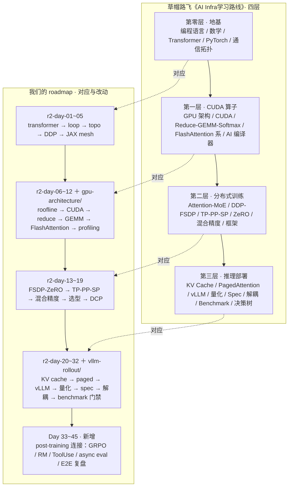

# AI Infrastructure Labs

A systems-first path through the compute, communication, and memory costs of training and serving large models. The organizing question is always:

> What extra work or complexity does a technique introduce, what resource does it save, and where does the trade stop paying off?

This directory contains two generations of material. The `r2-day-*` sequence is the current, cleaner learning path. The older `day-*` directories are retained as experiments and historical notes; their CPU simulations are not hardware benchmarks.

## Current path

```text
model computation
  -> framework execution
  -> topology and collectives
  -> replicated data parallelism
  -> declarative sharding
  -> GPU memory wall
  -> CUDA execution and access patterns
  -> FSDP / tensor-pipeline-sequence parallelism
  -> checkpointing
  -> inference and rollout serving
  -> evaluation and reliability gates
```

| Lesson | Focus | Executable evidence | Status |
|---|---|---|---|
| [`r2-day-01-transformer`](r2-day-01-transformer/README.md) | Decoder dimensions and parameter accounting | Python dimension/parameter model | CPU model |
| [`r2-day-02-pytorch-loop`](r2-day-02-pytorch-loop/README.md) | Training-loop state, optimizer, checkpoint | Minimal loop with explicit fallback | CPU path; accelerator profiling pending |
| [`r2-day-03-topo-nccl`](r2-day-03-topo-nccl/README.md) | Topology labels and ring collective cost | Unit-aware $\alpha$ – $\beta$ model and semantic tests | CPU model; NCCL measurement pending |
| [`r2-day-04-ddp`](r2-day-04-ddp/README.md) | DDP ownership, data sharding, gradient synchronization | `torchrun` demo plus dependency-free invariants | CPU/Gloo when PyTorch is available |
| [`r2-day-05-jax-mesh`](r2-day-05-jax-mesh/README.md) | Mesh and declarative partitioning | JAX/fallback shape model | Multi-device execution pending |
| [`r2-day-06-gpu-architecture`](r2-day-06-gpu-architecture/README.md) | Roofline, HBM traffic, shared-memory capacity | Analytical model and six tests | CPU model; CUDA measurement pending |
| [`r2-day-07-cuda-programming-model`](r2-day-07-cuda-programming-model/README.md) | Grid/block/warp, coalescing, bank conflicts | Address model, eight tests, CUDA source | CPU model; CUDA run pending |

The full intended sequence is in [`ROADMAP_45D.md`](ROADMAP_45D.md). It is a curriculum map, not a claim that every planned lesson has been implemented.

## Knowledge map: 草帽路飞路线 vs. 我们的 roadmap

本路线以草帽路飞《[AI Infra学习路线](https://zhuanlan.zhihu.com/p/2021970155182326008)》为骨架。
贯穿两者的组织问题是同一个：**计算 / 通信 / 显存**的不可能三角，
每项技术都问：牺牲什么、换取什么、何时不赚。

> 说明：已按原文（最后编辑 2026-06-08）逐条核对；下方"完整知识地图"为原文知识条目转录，
> 讲解文字略去，详见原文。



| 文章的层 | 文章覆盖（原文） | 我们的对应 | 差异 |
|---|---|---|---|
| 第零层 · 地基 | 编程语言、数学基础、Transformer、PyTorch、通信拓扑 | r2-day-01~05（Day 1–5） | 我们把 DDP、JAX 提进地基；编程语言/数学标为前置按需补 |
| 第一层 · CUDA 算子 | GPU 架构、CUDA 编程、Reduce/GEMM/Softmax/融合、FlashAttention 系、AI 编译器 | r2-day-06~12 ＋ `gpu-architecture/` 独立 track（Day 6–12） | 硬件与 kernel 深挖拆成独立 track，本目录只保留系统视角的成本模型 |
| 第二层 · 分布式训练 | Attention/MoE 变种、DDP/FSDP、TP/PP/SP、ZeRO、混合精度/重计算、框架选型 | r2-day-13~17（Day 13–17） | 对齐；`day-15-megatron-3d` 等旧实验保留为历史 |
| 第三层 · 推理部署 | 推理基础、推理引擎、量化、Spec 解码、P/D 解耦、Benchmark、优化选型决策树 | r2-day-20~25 ＋ `vllm-rollout/`（Day 18–25） | 对齐；我们加了回归门禁（eval/reliability） |
| 新人破局指南 | 学习路径（0–3/3–6/6+ 月）＋ 核心思维模型（六组权衡） | — | 文章的权衡表即我们的组织问题"牺牲什么、换取什么"，直接引用 |
| （文章无） | — | Day 26–30 post-training 连接层 | **新增**：GRPO vs PPO、RM 校准、训练→推理联动、数据飞轮、E2E |
| （文章无） | — | side tracks：`day-11-paper2-mech-load`、`day-14-pue-cost` | **降级**：设施/热/负载预测标为非核心；文章主干本来就不含这类主题 |

改动一句话：文章多了编程语言/数学前置与新人破局指南；我们把 DDP/JAX 提进地基、
硬件深挖独立成 track；文章止于推理部署，我们向后接了 post-training；设施主题明确出界。

### 我们的30天浏览计划：30个主要知识点

文章的完整知识树（200+ 知识点）是"地图全貌"，下面是我们自己的浏览路线：
每天一个主题，浏览足矣——能用一句话说清它**牺牲什么、换取什么、何时不赚**即可，
推导和实测细节之后再慢慢学。括号内是文章四层中的位置。

**第零层 · 地基（Day 1–5）**

1. Transformer Decoder 白板（地基）：手绘 $(B,S,D)$ 张量流，hidden 4096、32 层手算总参。
2. PyTorch 训练循环（地基）：loop state、optimizer、checkpoint 落盘。
3. 通信拓扑与 NCCL（地基）：NVLink vs PCIe/IB 数量级， $\alpha$ – $\beta$ 模型，ring all-reduce 公式。
4. DDP（地基）：数据分片、梯度 all-reduce 同步；30 分钟把单卡循环改成 DDP。
5. JAX Mesh 声明式分片（地基）：pjit/sharding，声明式 vs 命令式。

**第一层 · CUDA 算子（Day 6–12）**

6. GPU 架构与 Roofline（CUDA）：存储层级、HBM 带宽、算术强度 $I=F/Q$ 。
7. CUDA 编程模型（CUDA）：grid/block/warp，coalescing，bank conflict。
8. Parallel Reduction（CUDA）：最朴素 → warp shuffle → shared tree。
9. GEMM Tiling（CUDA）：分块矩阵乘，目标 50% cuBLAS。
10. FlashAttention（CUDA）：tiling + online softmax，省的是 HBM 读写。
11. Triton / torch.compile（CUDA）：fused kernel，一句话说清何时不如手写。
12. Profiling（CUDA）：Nsight Systems/Compute，看 host 拖后与 SOL%。

**第二层 · 分布式训练（Day 13–17）**

13. Attention 变种（分布式）：MHA → MQA/GQA/MLA，省的是 KV cache。
14. FSDP / ZeRO 显存账（分布式）：7B FP16 14GB + Adam 56GB，ZeRO-2 vs ZeRO-3。
15. TP / PP / SP（分布式）：64 卡 TP=8 机内、PP=4、DP=2；为何 TP 不跨机。
16. 混合精度与重计算（分布式）：BF16 指数位 8 vs 5，重计算换显存。
17. 框架选型与容错（分布式）：Megatron / DeepSpeed / FSDP 一句选型，DCP async ckpt。

**第三层 · 推理部署（Day 18–25）**

18. Prefill vs Decode（推理）：compute bound vs memory bound，TTFT/TPOT。
19. KV Cache 算账（推理）：7B 模型 32GB 手算，batch 放大。
20. PagedAttention + Continuous Batching（推理）：虚拟页表，请求拼单。
21. vLLM / SGLang 实战（推理）：部署对比表，vllm-rollout/ 联动。
22. 量化决策树（推理）：70B INT4 35GB，何时 INT4 反而慢于 INT8。
23. Speculative Decoding（推理）：草稿 + 验证，无偏性保证。
24. Prefill / Decode 解耦 + Goodput（推理）：配比算账。
25. Benchmark 与回归门禁（推理）：6 个指标，TPOT P95 退化 5% 即 block。

**新增 · post-training 连接（Day 26–30）**

26. GRPO vs PPO 的系统差异（新增）：rollout/buffer 对 infra 的不同要求。
27. Reward Model 与校准（新增）： $\sigma$ /ECE，reward hacking 的系统视角。
28. 训练 → 推理联动（新增）：vLLM rollout pipeline，async eval。
29. 数据飞轮（新增）：coding data flywheel， $\$/\mathrm{useful}$ rollout。
30. E2E 复盘（新增）：系统设计题，可复现配置与残余风险清单。

完整知识地图见下一节，本节 30 个主题即是从中挑出的浏览主干。

## 完整知识地图（草帽路飞原文 · 知识条目转录）

> 转录自原文（最后编辑 2026-06-08），只保留**知识条目、推荐资料、检验标准**三类，
> 条目内的讲解文字略去，措辞贴原文、压缩为一行一条。原文全景导语：
> 核心权衡是"ZeRO 用通信换显存；重计算用计算换显存；量化用精度换显存和带宽"。
> 括号内"→ Day N"指我们 30 天浏览计划中对应的主题。

### 第零层 · 前置知识

**0.1 知识点**

- 编程语言（前置，未进 30 天）：Python——面向对象、装饰器、生成器、多进程/多线程、性能 profiling；C/C++——指针、内存管理、编译链接，能读懂 C++ 项目代码、写简单 C++ 函数并编译运行；Linux——命令行、Shell 脚本、进程管理、环境变量配置。
- 数学基础（前置；线性代数直觉并入 Day 1）：矩阵乘法/转置/分块、特征值分解，维度变换直觉 $(B,S,H)\times(H,V)\to(B,S,V)$ ；概率分布/期望/方差、Softmax 概率解释、交叉熵含义；微积分了解即可（链式法则、梯度含义）。
- Transformer 架构（→ Day 1）：Self-Attention——Q/K/V 含义， $QK^T\to\mathrm{scale}\to\mathrm{softmax}\to PV$ ， $O(N^2)$ 复杂度；FFN——两层线性变换 + 激活；位置编码——Sinusoidal、RoPE；LayerNorm——Pre-Norm vs Post-Norm；完整前向——token embedding → Attention → Add & Norm → FFN → Add & Norm，每步输入输出维度。
- PyTorch 框架（→ Day 2）：Tensor 操作、autograd、Module / Parameter 组织；训练循环 DataLoader → forward → loss → backward → optimizer.step；state_dict、checkpoint；调试 `torch.cuda.memory_summary()`、`torch.profiler`。
- 通信拓扑（→ Day 3）：NVLink / NVSwitch 带宽与拓扑；InfiniBand、RoCE；AllReduce / AllGather / ReduceScatter 含义与开销；NCCL 用法与调优。

**0.2 推荐资料**

论文 Attention Is All You Need（必读）；The Illustrated Transformer（Jay Alammar）；琳琅阿木 图文详解 LLM inference；PyTorch 官方 60 Minute Blitz；3Blue1Brown 线性代数的本质；MIT 6.S081 / Linux 命令行；Karpathy《Let's build GPT from scratch》；NVIDIA NCCL 文档；NVIDIA Deep Learning Performance Guide。

**0.3 检验标准**

- 白板默写 Transformer Decoder Block 并标注维度，解释 Q/K/V 线性投影；
- 手算 7B（hidden 4096、32 头、32 层、vocab 32000）总参，误差 ≤20%；
- 独立写出完整训练循环（含 DataLoader、forward、loss、backward、optimizer step、学习率调度、checkpoint 保存）并在 GPU 跑通；
- 读懂 CUDA kernel 的 host 端代码（malloc、memcpy、kernel launch、free）；
- Linux 日常：SSH、tmux、conda/pip、nvidia-smi、git、bash 脚本批量提交任务；
- 读懂 `nvidia-smi topo -m` 的 NV、SYS、NODE 标记；
- 画出 AllReduce、AllGather、ReduceScatter 数据流，说清通信量公式（Ring AllReduce ≈ $2(N-1)/N$ × 数据量）。

### 第一层 · CUDA 编程与算子优化

**1.1 知识点**

- GPU 硬件架构（→ Day 6）：SM、Tensor Core、CUDA Core 区别与协作；A100 / H100 / H200 算力、显存带宽、HBM 容量对比；Memory Wall——显存带宽瓶颈比算力瓶颈更致命；存储层次：寄存器 > 共享内存 > L1/L2 Cache > HBM > 主机内存。
- CUDA 编程基础（→ Day 7）：Grid / Block / Thread 层级与线程索引计算；全局内存、共享内存、寄存器、常量内存；Warp（32 线程最小调度单位）、Bank Conflict、Coalesced Access、Occupancy；核心直觉"内存访问模式决定运行速度"。
- 常见算子实现与优化（→ Day 8/9/10）：Reduce——Warp Shuffle、多级归约；GEMM——分块、向量化、Shared Memory Tiling、Tensor Core；Softmax——online normalizer；算子融合——合 kernel 减少全局内存读写。
- Attention 算子（→ Day 10）：FlashAttention V1/V2——tiling 降 HBM 访问；FlashAttention-3——Hopper 利用率；Flash-Decoding / ++——Decode 阶段加速；FlashInfer——serving 可组合 Attention 引擎；PagedAttention CUDA Kernel——vLLM 底层实现。
- AI 编译器（→ Day 11）：Triton；TVM / XLA 计算图优化与代码生成；torch.compile——Graph Break 与性能收益。

**1.2 推荐资料**

NVIDIA GPU 架构白皮书（Ampere / Hopper）；小小将 CUDA 编程入门极简教程；CUDA Programming Guide；PeakCrosser CUDA Reduce 优化；猛猿 从零到 CUDA GEMM 优化；MegEngine Bot CUDA 矩阵乘法终极优化；Online normalizer calculation for softmax；OneFlow 高效 Softmax kernel；成诚 OneFlow 世界最快框架；FlashAttention V1/V2/3 论文；Flash-Decoding 技术报告；FlashInfer 论文 + Repo；猛猿 图解 FlashAttention V1/V2；方佳瑞 PagedAttention CUDA 实现；Triton 官方教程；torch.compile profiling；Nsight Systems / Compute User Guide。

**1.3 检验标准**

- 说出 H100：HBM 80GB、带宽 ~3.35TB/s、L2 50MB、共享内存 228KB/SM，解释带宽先成瓶颈；
- 估算 2GB 梯度 AllReduce 在 NVLink（900GB/s）vs PCIe Gen5（64GB/s）耗时差；
- Reduce 三连（原子加 → 共享内存树形归约 → Warp Shuffle），Nsight Compute 对比 throughput；
- 32×32 矩阵转置：先写 32-way bank conflict 版，加 padding 消除，Nsight Compute 验证 conflict 降到 0；
- Shared Memory Tiling GEMM，1024×1024 达到 cuBLAS 50% 以上；
- 白板推导 FlashAttention tiling（外层 KV block、内层 Q block），online softmax，HBM 读写 $O(N^2)\to O(N)$ ；
- Triton 写 fused Softmax kernel，对比正确性与性能；
- Nsight Systems 抓 iteration trace 定位 GPU idle gap；Nsight Compute 读 SOL 面板判 memory/compute bound。

### 第二层 · 分布式训练

**2.1 知识点**

- 模型架构演进（→ Day 13）：MHA → MQA → GQA → MLA（影响 TP 切分与推理显存规划）；MoE / DeepSeekMoE——Expert Parallelism。
- 数据并行（→ Day 4/14）：DP 单进程多卡；DDP 多进程 AllReduce 梯度同步；FSDP——PyTorch 原生 ZeRO-3。
- 模型并行 3D（→ Day 15）：TP——矩阵乘按维度切分、通信密集、限单机；PP——按层切到多机；SP——按序列切、配 TP 降激活显存。
- 显存优化（→ Day 14/16）：ZeRO-1/2/3（优化器/梯度/参数切分，用通信换显存）；混合精度 FP16 / BF16 / FP8；梯度累积；Activation Checkpointing（用计算换显存）。
- 训练框架（→ Day 17）：Megatron-LM（TP/PP 标杆）；DeepSpeed（ZeRO 核心）；PyTorch FSDP。

**2.2 推荐资料**

DeepSeek V2（MLA）、DeepSeekMoE 论文；苏剑林 MHA→MLA；Megatron-LM、ZeRO 论文；DeepSpeed 官方文档；PyTorch DDP / FSDP 教程。

**2.3 检验标准**

- 口算 7B：FP16 参数 ~14GB、Adam 状态 ~56GB，判单卡 80GB 能否放下；
- 一句话 ZeRO-2 vs ZeRO-3（ZeRO-2 参数每卡各存一份；ZeRO-3 参数也切，通信量约翻倍）；
- 30 分钟把单卡脚本改成 DDP 跑通；
- 64 卡（8 节点 × 8 卡）设计 TP=8、PP=4、DP=2，标 NVLink / IB，解释 TP 不跨机；
- BF16 vs FP16（指数 8 位 vs 5 位，动态范围近 FP32）。

### 第三层 · 推理与部署

**3.1 LLM 推理基础（→ Day 18/19）**

- 知识点：Prefill vs Decode 两阶段；KV Cache——"显存刺客"，生命周期与碎片；指标 TTFT / TPOT / 吞吐 / P50·P95。
- 资料：琳琅阿木 KV Cache 图解；CMU《Towards Efficient Generative LLM Serving》Survey。
- 检验：解释 Prefill 快、Decode 慢（compute bound vs memory bound）；手算 LLaMA-2-7B（32 层、32 头、head_dim 128）ctx 4096、batch 16、FP16 ≈ 32GB；链路 tokenize → prefill → decode → sampling（Top-p/Top-k）→ detokenize，指高并发瓶颈。

**3.2 推理引擎（→ Day 20/21）**

- 知识点：PagedAttention（虚拟页管 KV，解碎片）；Continuous Batching；Prefix Cache / RadixAttention；Chunked Prefill；vLLM / SGLang / TensorRT-LLM 选型。
- 资料：vLLM 论文/Repo/文档、猛猿 vLLM 源码解析；SGLang 论文；TensorRT-LLM 文档；Orca 论文；吃果冻不吐果冻皮 Continuous Batching；DefTruth Prefix Cache 图解。
- 检验：vLLM + SGLang 部署 7B 成 OpenAI 兼容 API，同压测对比；讲清 Continuous vs Static Batching（利用率 30% 拉到 80%+）；画 KV 管理全链路；结构化回答选型依据。

**3.3 量化（→ Day 22）**

- 知识点：W8A8 SmoothQuant（activation outlier 转到 weight）；Weight-only INT4（GPTQ / AWQ）；KV Cache 量化（KIVI 2-bit）；FP8（Hopper 原生）；决策树：通用→W8A8，更省→INT4，长上下文/大并发→KV 量化。
- 资料：SmoothQuant / GPTQ / AWQ / KIVI / Marlin 论文；TensorRT-LLM 量化工具链；vLLM 量化支持。
- 检验：70B + 2×A100 快速判断（FP16 140GB → W8A8 ~70GB → INT4 ~35GB）；FP16 vs AWQ-INT4 throughput + 质量对比报告；解释 INT4 有时慢于 INT8（unpack/dequant、Tensor Core 利用率）；量化掉点排查清单。

**3.4 Speculative Decoding（→ Day 23）**

- 知识点：Speculative Sampling（Draft 猜、Target 验证，分布无偏）；Medusa（多 head 免 draft）；EAGLE-2（动态 draft tree）；Block Verification。
- 资料：四篇论文；vLLM / TensorRT-LLM spec 支持；SGLang cFSM。
- 检验：解释 rejection sampling 为何保分布；实测代码生成 vs 开放对话加速差；列 ≥3 种不赚情形（高温采样、大 batch、acceptance < 50%）；与量化 / Continuous Batching 叠加冲突点。

**3.5 Prefill/Decode 解耦（→ Day 24）**

- 知识点：混合 batching 互扰、尾延迟爆炸；DistServe（OSDI'24）；Splitwise（ISCA）；TaiChi（2025）；Goodput（满足 SLO 的有效吞吐 ≠ 裸 QPS）。
- 资料：三篇论文；《Disaggregated Inference: 18 Months Later》；MLC microserving。
- 检验：定量证明 decode P95 TPOT 被 prefill 拖慢 3–5 倍；解释 goodput；按负载推导 P/D 池配比；风险清单（KV 迁移带宽、调度复杂度、负载不均浪费）。

**3.6 性能分析与 Benchmark（→ Day 25）**

- 知识点：指标 QPS / TTFT / TPOT / token/s / P50·P95；torch.profiler；Nsight Systems / Compute；GenAI-Perf、Triton Perf Analyzer；MLPerf Inference；回归门禁。
- 资料：profiler / GenAI-Perf / Triton 文档；MLPerf Inference（Datacenter）；v5.0 LLM 任务解读。
- 检验：报告含 6 指标；config 化可复现；TPOT P95 退化 15% → bisect → trace 对比；定门禁规则（如退化超 5% block merge）进 CI。

**3.7 优化选型决策树（→ Day 22–25 综合）**

- 先定症状：[A] TTFT 高 / [B] TPOT 高 / [C] 显存不够 / [D] 尾延迟失控。
- [A]：长 prompt → Chunked Prefill / 高效 GEMM；CPU/调度瓶颈 → Nsight Systems 查 idle gap；高前缀重复 → Prefix Cache / RadixAttention。
- [B]：KV 搬运瓶颈 → FlashAttention / FlashInfer；串行本质 → Speculative；并发不足 → Continuous Batching。
- [C]：KV 大户 → PagedAttention / KIVI；权重大 → INT4（1/4）/ W8A8（1/2）。
- [D]：P/D 互扰 → 解耦部署；SLO 极严 → TaiChi 类统一调度。
- 顺序：先 OOM → TTFT → TPOT/吞吐 → 尾延迟。

### 新人破局指南

- 学习路径：0–3 个月——完成第零层检验 + CUDA 基础（Reduce/GEMM）+ DDP 上两卡；3–6 个月——精读 Megatron-LM / ZeRO / FlashAttention / vLLM 四篇 + 开源贡献 + 量化/Spec；6 个月+——集群部署大模型、性能回归体系、P/D 解耦前沿、跟踪 FP8 / RDMA / 新架构。
- 核心思维模型（与我们的组织问题一致）：ZeRO——通信换显存；重计算——计算换显存；量化——精度换显存+带宽+吞吐；Spec——Prefill 开销换 Decode 速度；P/D 解耦——复杂度+迁移开销换尾延迟+goodput；FlashAttention——实现复杂度换显存+速度。

### 参考资料（原文：24 篇论文 + 项目 + 文档）

- 论文：Attention Is All You Need；Megatron-LM；ZeRO；FlashAttention V1/V2/3；Flash-Decoding；FlashInfer；vLLM；SGLang；Orca；DistServe；Splitwise；SmoothQuant；GPTQ；AWQ；KIVI；Marlin；Speculative Sampling；Medusa；EAGLE-2；Block Verification；Online normalizer for softmax；DeepSeek V2；DeepSeekMoE；CMU LLM Serving Survey。
- 项目/工具：vLLM、SGLang、DeepSpeed、Megatron-LM、FlashAttention、FlashInfer、TensorRT-LLM、Triton。
- 文档：CUDA Programming Guide、NCCL、Nsight Systems/Compute、Deep Learning Performance Guide、DeepSpeed、PyTorch 教程/DDP/FSDP、vLLM、TensorRT-LLM、Triton 教程、MLPerf Inference、GenAI-Perf。

## Core models

### Communication

For a ring over $p$ ranks and a payload of $S$ bytes per rank, the idealized per-rank transfer volumes are:

$$V_{\mathrm{RS}}=V_{\mathrm{AG}}=\frac{p-1}{p}S,\qquad V_{\mathrm{AR}}=2\frac{p-1}{p}S.$$

A simple latency-bandwidth estimate is:

$$T_{\mathrm{ring}}\approx n_{\mathrm{steps}}\alpha+\frac{V}{B_{\mathrm{effective}}}.$$

This is a lower-order mechanism model. Real NCCL behavior also depends on topology, channel count, protocol, chunking, contention, and its algorithm selection. Product “total bandwidth” and measured collective bandwidth are not interchangeable.

### Memory

For arithmetic intensity $I=F/Q$ with $F$ FLOPs and $Q$ bytes transferred from the bottleneck memory level, the Roofline bound is:

$$P\le\min(P_{\mathrm{peak}},B I).$$

A memory-saving method is incomplete until its additional communication, recomputation, fragmentation, and temporary buffers are accounted for.

### Correctness before speed

Every distributed experiment should separate three questions:

1. **Semantics:** Are samples partitioned as intended, gradients synchronized, and replicas equal after the step?
2. **Accounting:** Are bytes, bandwidth units, and collective phases defined consistently?
3. **Measurement:** Was the real backend synchronized and measured with the workload/configuration recorded?

A CPU fallback can answer the first two in limited cases. It cannot establish GPU latency, bandwidth, MFU, or scaling efficiency.

## Older experiments

The original `day-*` labs remain useful as focused prototypes:

- distributed basics: [`day-01-ddp-basics`](day-01-ddp-basics/), [`day-02-fsdp`](day-02-fsdp/), [`day-03-fsdp-perblock`](day-03-fsdp-perblock/), [`day-07-checkpoint-recovery`](day-07-checkpoint-recovery/), [`day-15-megatron-3d`](day-15-megatron-3d/);
- post-training links: [`day-04-rlhf-vs-agentic-rl`](day-04-rlhf-vs-agentic-rl/), [`day-08-eval-infra`](day-08-eval-infra/), [`day-10-vllm`](day-10-vllm/), [`day-12-reward-model`](day-12-reward-model/), [`day-13-reliability-slo`](day-13-reliability-slo/);
- capacity/profiling prototypes: [`day-07-h100-beyond-7b`](day-07-h100-beyond-7b/), [`day-12b-profile-tool-legacy`](day-12b-profile-tool-legacy/);
- **non-core side tracks:** [`day-06-paper1-rl-infra`](day-06-paper1-rl-infra/), [`day-11-paper2-mech-load`](day-11-paper2-mech-load/), and [`day-14-pue-cost`](day-14-pue-cost/) concern workload forecasting or facility/thermal models rather than AI-infrastructure mechanisms.

Numbers in those directories marked simulation, proxy, estimate, or pending hardware validation must remain labeled that way.

## Boundaries with other tracks

- [`gpu-architecture/`](../gpu-architecture/README.md) owns the deeper hardware/kernel treatment. These labs use that cost model in training and serving systems.
- [`vllm-rollout/`](../vllm-rollout/README.md) is the canonical rollout-serving stress-test track; `day-10-vllm` is retained as an earlier snapshot.
- [`grpo-vs-ppo/`](../grpo-vs-ppo/README.md) owns policy-objective derivations. This directory discusses their systems consequences only.
- [`model-aware-data-curation/`](../model-aware-data-curation/README.md) owns model-aware data selection; this directory owns execution and resource costs.
- [`harness-engineering/`](../harness-engineering/README.md) owns agent runtime/control-plane design, not GPU or collective implementation.

## Run the current checks

```bash
python3 -m unittest discover -s ai-infra/r2-day-03-topo-nccl -p 'test_*.py' -v
python3 -m unittest discover -s ai-infra/r2-day-04-ddp -p 'test_*.py' -v
python3 -m unittest discover -s ai-infra/r2-day-06-gpu-architecture -p 'test_*.py' -v
python3 -m unittest discover -s ai-infra/r2-day-07-cuda-programming-model -p 'test_*.py' -v
```

## Primary references

- PyTorch DistributedDataParallel design note: https://docs.pytorch.org/docs/main/notes/ddp
- PyTorch DistributedDataParallel API: https://docs.pytorch.org/docs/stable/generated/torch.nn.parallel.DistributedDataParallel.html
- NCCL collective semantics: https://docs.nvidia.com/deeplearning/nccl/user-guide/docs/usage/collectives.html
- CUDA C++ Programming Guide: https://docs.nvidia.com/cuda/cuda-c-programming-guide/index.html
- CUDA C++ Best Practices Guide: https://docs.nvidia.com/cuda/cuda-c-best-practices-guide/index.html
