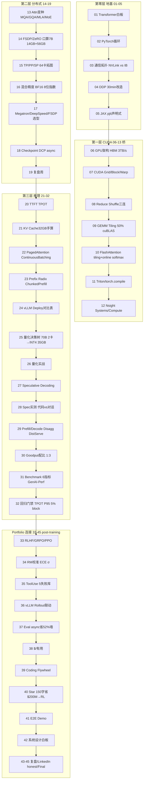

# rl-infra — RL Infra Labs (纯 AI Infra主干)

> 目标：45天粗略理解 **纯 AI Infra** 全链路，`计算/通信/显存` 不可能三角取舍，不含机房 PUE。
> 草帽路飞《AI Infra学习路线》四层：地基→CUDA→分布式训练→推理部署，对齐已重写进 Sheet `ai_infra` (1JxGiu)。

## 四层图（mermaid）



## 目录

```
rl-infra/
├── day-01-ddp-basics/           [地基] DDP grad sync Ring量
├── day-02-fsdp/                 [分布式] FSDP intro 显存对比
├── day-03-fsdp-perblock/        [分布式] per-block + profiler 32×1.99ms
├── day-04-rlhf-vs-agentic-rl/   [连接] RLHF vs DPO vs GRPO 1句区分
├── day-05-jax-pjit/             [地基] Mesh声明式切分
├── day-06-paper1-rl-infra/      [side-track] Paper1 autoscaling→RL bridge（已移出主干考核）
├── day-07-checkpoint-recovery/  [分布式] Full vs Sharded DCP crash 12ms/0.7s恢复
├── day-07-h100-beyond-7b/       7B/13B/70B外推
├── day-08-eval-infra/           [推理上游] sync p50 1.141s瓶颈92.85%→async 0.527s省52%
├── day-10-vllm/                 [推理] vLLM基座含TTFT/TPOT指标 12-18%失败基线
├── day-11-paper2-mech-load/     [side-track] 机械负载Tj 82.49C 0.83%→SLO映射，已移出主干
├── day-12-reward-model/         [连接] RM ECE 0.0906→0.0881 σ0.045 5 ensemble
├── day-13-reliability-slo/      [SLO] success0.955 queue p95 0.385s jitter0.146 tj90.5C throttle2.5%
├── day-14-pue-cost/            [side-track] PUE 1.2576 overhead25.76%→$/useful 0.000244，纯AI Infra不考核
├── day-15-megatron-3d/          [分布式] 7B 17GB→8.62GB TP2, 70B G8 TP4PP2 25GB bubble12%
├── day-16-monetization-v1/      [连接] queue 68.8% thermal1.67pp cost22.1% Star
└── day-17-profile-tool/         [分布式] DDP AllReduce 0.0404s comm 46.5% CPU proxy → FSDP AllGather 60% vs ReduceScatter 40% per-block 32×1.99ms
```

## 为什么4层

- 草帽路飞原版已验证：入门0-3月地基够用，3-6月精读Megatron/ZeRO/FlashAttention/vLLM四里程碑，6月以上端到端+门禁。
- 你的覆盖版：每天30-60min鸟瞰，只记**牺牲什么/换取什么/何时不赚**，45天后白板能画全链路。

源：https://zhuanlan.zhihu.com/p/2021970155182326008
