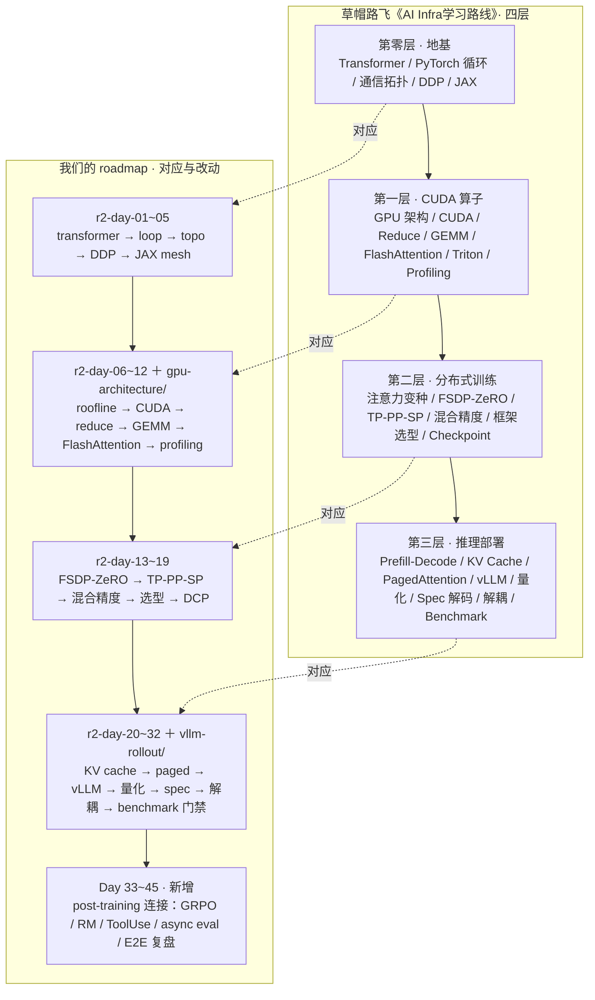

# AI Infrastructure Labs

A systems-first path through the compute, communication, and memory costs of training and serving large models. The organizing question is always:

> What extra work or complexity does a technique introduce, what resource does it save, and where does the trade stop paying off?

This directory contains two generations of material. The `r2-day-*` sequence is the current, cleaner learning path. The older `day-*` directories are retained as experiments and historical notes; their CPU simulations are not hardware benchmarks.

## Current path

```text
model computation
  -> framework execution
  -> topology and collectives
  -> replicated data parallelism
  -> declarative sharding
  -> GPU memory wall
  -> CUDA execution and access patterns
  -> FSDP / tensor-pipeline-sequence parallelism
  -> checkpointing
  -> inference and rollout serving
  -> evaluation and reliability gates
```

| Lesson | Focus | Executable evidence | Status |
|---|---|---|---|
| [`r2-day-01-transformer`](r2-day-01-transformer/README.md) | Decoder dimensions and parameter accounting | Python dimension/parameter model | CPU model |
| [`r2-day-02-pytorch-loop`](r2-day-02-pytorch-loop/README.md) | Training-loop state, optimizer, checkpoint | Minimal loop with explicit fallback | CPU path; accelerator profiling pending |
| [`r2-day-03-topo-nccl`](r2-day-03-topo-nccl/README.md) | Topology labels and ring collective cost | Unit-aware $\alpha$ – $\beta$ model and semantic tests | CPU model; NCCL measurement pending |
| [`r2-day-04-ddp`](r2-day-04-ddp/README.md) | DDP ownership, data sharding, gradient synchronization | `torchrun` demo plus dependency-free invariants | CPU/Gloo when PyTorch is available |
| [`r2-day-05-jax-mesh`](r2-day-05-jax-mesh/README.md) | Mesh and declarative partitioning | JAX/fallback shape model | Multi-device execution pending |
| [`r2-day-06-gpu-architecture`](r2-day-06-gpu-architecture/README.md) | Roofline, HBM traffic, shared-memory capacity | Analytical model and six tests | CPU model; CUDA measurement pending |
| [`r2-day-07-cuda-programming-model`](r2-day-07-cuda-programming-model/README.md) | Grid/block/warp, coalescing, bank conflicts | Address model, eight tests, CUDA source | CPU model; CUDA run pending |

The full intended sequence is in [`ROADMAP_45D.md`](ROADMAP_45D.md). It is a curriculum map, not a claim that every planned lesson has been implemented.

## Knowledge map: 草帽路飞路线 vs. 我们的 roadmap

本路线以草帽路飞《[AI Infra学习路线](https://zhuanlan.zhihu.com/p/2021970155182326008)》为骨架
（转述见 [`ROADMAP_45D.md`](ROADMAP_45D.md)）。贯穿两者的组织问题是同一个：
**计算 / 通信 / 显存**的不可能三角，每项技术都问：牺牲什么、换取什么、何时不赚。

> 说明：知乎本次拒绝了直接抓取，左侧"文章"一栏依据 ROADMAP_45D.md 中对原文四层结构的转述整理；
> 若与原文有出入请指出，我来修正。



| 文章的层 | 文章覆盖（据 ROADMAP 转述） | 我们的对应 | 差异 |
|---|---|---|---|
| 第零层 · 地基 | Transformer 白板、PyTorch 循环、通信拓扑、DDP、JAX 声明式 | r2-day-01~05 | 基本对齐：够用即可 |
| 第一层 · CUDA 算子 | GPU 架构、CUDA、Reduce、GEMM Tiling、FlashAttention、Triton、Profiling | r2-day-06~12 ＋ `gpu-architecture/` 独立 track | 硬件与 kernel 深挖拆成独立 track，本目录只保留系统视角的成本模型 |
| 第二层 · 分布式训练 | 注意力变种、FSDP/ZeRO、TP/PP/SP、混合精度/重计算、框架选型、Checkpoint | r2-day-13~19 | 对齐；`day-15-megatron-3d` 等旧实验保留为历史 |
| 第三层 · 推理部署 | Prefill/Decode、KV Cache、PagedAttention、vLLM、量化、Spec 解码、解耦、Benchmark | r2-day-20~32 ＋ `vllm-rollout/` | 对齐；我们加了回归门禁（eval/reliability） |
| （文章无） | — | Day 33~45 post-training 连接层 | **新增**：GRPO vs PPO、RM 校准、ToolUse、vLLM 联动、async eval、coding flywheel、E2E |
| （文章无） | — | side tracks：`day-11-paper2-mech-load`、`day-14-pue-cost` | **降级**：设施/热/负载预测标为非核心；文章主干本来就不含这类主题 |

三处改动一句话：文章止于推理部署，我们向后接了 post-training；硬件深挖独立成 track；设施主题明确出界。

### 我们的30天浏览计划：30个主要知识点

文章的完整知识树（200+ 知识点）是"地图全貌"，下面是我们自己的浏览路线：
每天一个主题，浏览足矣——能用一句话说清它**牺牲什么、换取什么、何时不赚**即可，
推导和实测细节之后再慢慢学。括号内是文章四层中的位置。

**第零层 · 地基（Day 1–5）**

1. Transformer Decoder 白板（地基）：手绘 $(B,S,D)$ 张量流，hidden 4096、32 层手算总参。
2. PyTorch 训练循环（地基）：loop state、optimizer、checkpoint 落盘。
3. 通信拓扑与 NCCL（地基）：NVLink vs PCIe/IB 数量级， $\alpha$ – $\beta$ 模型，ring all-reduce 公式。
4. DDP（地基）：数据分片、梯度 all-reduce 同步；30 分钟把单卡循环改成 DDP。
5. JAX Mesh 声明式分片（地基）：pjit/sharding，声明式 vs 命令式。

**第一层 · CUDA 算子（Day 6–12）**

6. GPU 架构与 Roofline（CUDA）：存储层级、HBM 带宽、算术强度 $I=F/Q$ 。
7. CUDA 编程模型（CUDA）：grid/block/warp，coalescing，bank conflict。
8. Parallel Reduction（CUDA）：最朴素 → warp shuffle → shared tree。
9. GEMM Tiling（CUDA）：分块矩阵乘，目标 50% cuBLAS。
10. FlashAttention（CUDA）：tiling + online softmax，省的是 HBM 读写。
11. Triton / torch.compile（CUDA）：fused kernel，一句话说清何时不如手写。
12. Profiling（CUDA）：Nsight Systems/Compute，看 host 拖后与 SOL%。

**第二层 · 分布式训练（Day 13–17）**

13. Attention 变种（分布式）：MHA → MQA/GQA/MLA，省的是 KV cache。
14. FSDP / ZeRO 显存账（分布式）：7B FP16 14GB + Adam 56GB，ZeRO-2 vs ZeRO-3。
15. TP / PP / SP（分布式）：64 卡 TP=8 机内、PP=4、DP=2；为何 TP 不跨机。
16. 混合精度与重计算（分布式）：BF16 指数位 8 vs 5，重计算换显存。
17. 框架选型与容错（分布式）：Megatron / DeepSpeed / FSDP 一句选型，DCP async ckpt。

**第三层 · 推理部署（Day 18–25）**

18. Prefill vs Decode（推理）：compute bound vs memory bound，TTFT/TPOT。
19. KV Cache 算账（推理）：7B 模型 32GB 手算，batch 放大。
20. PagedAttention + Continuous Batching（推理）：虚拟页表，请求拼单。
21. vLLM / SGLang 实战（推理）：部署对比表，vllm-rollout/ 联动。
22. 量化决策树（推理）：70B INT4 35GB，何时 INT4 反而慢于 INT8。
23. Speculative Decoding（推理）：草稿 + 验证，无偏性保证。
24. Prefill / Decode 解耦 + Goodput（推理）：配比算账。
25. Benchmark 与回归门禁（推理）：6 个指标，TPOT P95 退化 5% 即 block。

**新增 · post-training 连接（Day 26–30）**

26. GRPO vs PPO 的系统差异（新增）：rollout/buffer 对 infra 的不同要求。
27. Reward Model 与校准（新增）： $\sigma$ /ECE，reward hacking 的系统视角。
28. 训练 → 推理联动（新增）：vLLM rollout pipeline，async eval。
29. 数据飞轮（新增）：coding data flywheel， $\$/\mathrm{useful}$ rollout。
30. E2E 复盘（新增）：系统设计题，可复现配置与残余风险清单。

完整 200+ 知识点详细树见下方"完整知识地图"一节（待原文提取完成后补入），
本节 30 个主题即是从中挑出的浏览主干。

## Core models

### Communication

For a ring over $p$ ranks and a payload of $S$ bytes per rank, the idealized per-rank transfer volumes are:

$$V_{\mathrm{RS}}=V_{\mathrm{AG}}=\frac{p-1}{p}S,\qquad V_{\mathrm{AR}}=2\frac{p-1}{p}S.$$

A simple latency-bandwidth estimate is:

$$T_{\mathrm{ring}}\approx n_{\mathrm{steps}}\alpha+\frac{V}{B_{\mathrm{effective}}}.$$

This is a lower-order mechanism model. Real NCCL behavior also depends on topology, channel count, protocol, chunking, contention, and its algorithm selection. Product “total bandwidth” and measured collective bandwidth are not interchangeable.

### Memory

For arithmetic intensity $I=F/Q$ with $F$ FLOPs and $Q$ bytes transferred from the bottleneck memory level, the Roofline bound is:

$$P\le\min(P_{\mathrm{peak}},B I).$$

A memory-saving method is incomplete until its additional communication, recomputation, fragmentation, and temporary buffers are accounted for.

### Correctness before speed

Every distributed experiment should separate three questions:

1. **Semantics:** Are samples partitioned as intended, gradients synchronized, and replicas equal after the step?
2. **Accounting:** Are bytes, bandwidth units, and collective phases defined consistently?
3. **Measurement:** Was the real backend synchronized and measured with the workload/configuration recorded?

A CPU fallback can answer the first two in limited cases. It cannot establish GPU latency, bandwidth, MFU, or scaling efficiency.

## Older experiments

The original `day-*` labs remain useful as focused prototypes:

- distributed basics: [`day-01-ddp-basics`](day-01-ddp-basics/), [`day-02-fsdp`](day-02-fsdp/), [`day-03-fsdp-perblock`](day-03-fsdp-perblock/), [`day-07-checkpoint-recovery`](day-07-checkpoint-recovery/), [`day-15-megatron-3d`](day-15-megatron-3d/);
- post-training links: [`day-04-rlhf-vs-agentic-rl`](day-04-rlhf-vs-agentic-rl/), [`day-08-eval-infra`](day-08-eval-infra/), [`day-10-vllm`](day-10-vllm/), [`day-12-reward-model`](day-12-reward-model/), [`day-13-reliability-slo`](day-13-reliability-slo/);
- capacity/profiling prototypes: [`day-07-h100-beyond-7b`](day-07-h100-beyond-7b/), [`day-12b-profile-tool-legacy`](day-12b-profile-tool-legacy/);
- **non-core side tracks:** [`day-06-paper1-rl-infra`](day-06-paper1-rl-infra/), [`day-11-paper2-mech-load`](day-11-paper2-mech-load/), and [`day-14-pue-cost`](day-14-pue-cost/) concern workload forecasting or facility/thermal models rather than AI-infrastructure mechanisms.

Numbers in those directories marked simulation, proxy, estimate, or pending hardware validation must remain labeled that way.

## Boundaries with other tracks

- [`gpu-architecture/`](../gpu-architecture/README.md) owns the deeper hardware/kernel treatment. These labs use that cost model in training and serving systems.
- [`vllm-rollout/`](../vllm-rollout/README.md) is the canonical rollout-serving stress-test track; `day-10-vllm` is retained as an earlier snapshot.
- [`grpo-vs-ppo/`](../grpo-vs-ppo/README.md) owns policy-objective derivations. This directory discusses their systems consequences only.
- [`model-aware-data-curation/`](../model-aware-data-curation/README.md) owns model-aware data selection; this directory owns execution and resource costs.
- [`harness-engineering/`](../harness-engineering/README.md) owns agent runtime/control-plane design, not GPU or collective implementation.

## Run the current checks

```bash
python3 -m unittest discover -s ai-infra/r2-day-03-topo-nccl -p 'test_*.py' -v
python3 -m unittest discover -s ai-infra/r2-day-04-ddp -p 'test_*.py' -v
python3 -m unittest discover -s ai-infra/r2-day-06-gpu-architecture -p 'test_*.py' -v
python3 -m unittest discover -s ai-infra/r2-day-07-cuda-programming-model -p 'test_*.py' -v
```

## Primary references

- PyTorch DistributedDataParallel design note: https://docs.pytorch.org/docs/main/notes/ddp
- PyTorch DistributedDataParallel API: https://docs.pytorch.org/docs/stable/generated/torch.nn.parallel.DistributedDataParallel.html
- NCCL collective semantics: https://docs.nvidia.com/deeplearning/nccl/user-guide/docs/usage/collectives.html
- CUDA C++ Programming Guide: https://docs.nvidia.com/cuda/cuda-c-programming-guide/index.html
- CUDA C++ Best Practices Guide: https://docs.nvidia.com/cuda/cuda-c-best-practices-guide/index.html
