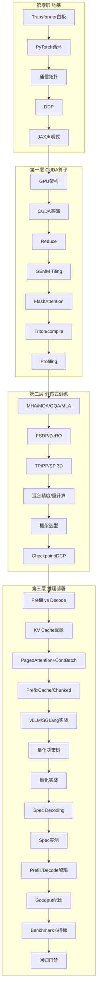

# AI Infra 45天 · 计划覆盖图（不含设施 PUE）

> 本文是计划中的课程覆盖图，不代表 45 个主题均已实现或验证。完成状态以各目录中的代码、测试与测量记录为准。
> 目标：建立纯 AI Infra 全链路的系统直觉，能讲清每层 **牺牲什么、换取什么、何时不赚**。
> 参考：草帽路飞《AI Infra学习路线》的四层结构，并连接 post-training / Agentic RL 系统。
> 约束：每节为 30–60 分钟鸟瞰，不以手写完整 kernel 为目标；设施/热管理主题只作为非核心 side track。

灵感源：https://zhuanlan.zhihu.com/p/2021970155182326008

---

## 核心思维（贯穿45天）

所有优化都是 **计算 / 通信 / 显存** 不可能三角取舍：

| 技术 | 牺牲 | 换取 |
| ZeRO | 通信 | 显存 |
| Activation Checkpoint | 计算 | 显存 |
| 量化 | 精度 | 显存+带宽+吞吐 |
| Speculative Decoding | Prefill 开销 | Decode 速度 |
| Prefill/Decode 解耦 | 系统复杂度+KV迁移 | 尾延迟+goodput |
| FlashAttention | 实现复杂度 | 显存+速度 |

问法：这个技术多做了什么？省了什么？什么时候不赚？

---

## 四层架构（草帽路飞原版）

### Phase 定义

- **第零层 01-05天 地基「够用即可」**：Transformer Decoder 手绘、PyTorch loop、topo NVLink 900GB/s vs PCIe 64GB/s、DDP 30min改造、JAX Mesh 声明式
- **第一层 06-13天 CUDA**：GPU存储 寄存器>ShMem>L1/L2>HBM，coalesced，最朴素Reduce→Shuffle，Tiled GEMM 50% cuBLAS，FlashAttention tiling+online softmax，Triton fused，Nsight System看host拖后+Compute看SOL
- **第二层 14-19天 分布式**：MHA→MLA省KV，7B FP16 14GB+Adam 56GB单80GB判断，ZeRO三句区分，64卡TP=8机内PP=4 DP=2为何TP不能跨机，BF16指数8位vs 5位，Megatron/DeepSpeed/FSDP一句选型，DCP async ckpt
- **第三层 21-32天 推理**：Compute vs Memory bound，7B 2*32*32*128*4096*16*2B≈32GB cache，vLLM Paged虚拟页，Static vs Continuous 30%→80%，Shared前缀复用，长prefill分块防拖慢，真机部署对比表，70B 2*A100 140GB→INT4 35GB压法，INT4慢于INT8边界，Spec实习生草稿+主编验证无偏，DistServe/Splitwise网约车分拣，Goodput才等于体验，GenAI-Perf一键6指标，TPOT P95退化5%即block
- **Portfolio 33-45天 post-training 连接**：RLHF vs GRPO、RM 校准、ToolUse 失败分类、训练→vLLM 流水线、异步评测、$/useful rollout、coding-data flywheel、端到端 demo 与系统设计复盘

---

## 45天日历（计划覆盖版）

> 每行是一个鸟瞰问题与可验证产出；此列表不等于完成清单。

- 01 Transformer架构
- 02 PyTorch loop
- 03 通信拓扑 NVLink/IB/NCCL
- 04 DDP
- 05 JAX pjit
- 06 GPU架构 HBM 3.35TB/s
- 07 CUDA编程模型
- 08 Reduce三连
- 09 GEMM Tiling
- 10 FlashAttention白板
- 11 Triton/torch.compile
- 12 Profiling Nsight 双剑
- 13 Attention变种 MQA/GQA/MLA/MoE
- 14 FSDP/ZeRO 显存账
- 15 TP/PP/SP 64卡拓图
- 16 BF16混合精度/重计算
- 17 Megatron/DeepSpeed/FSDP选型
- 18 Checkpoint&Recovery DCP
- 19 复盘周
- 20-21 TTFT/TPOT & KV Cache 32GB手算
- 22-23 PagedAttention/Cont Batch/Prefix
- 24-25 vLLM实战部署对比表
- 25-27 量化决策树+实战 INT4 35GB
- 27-29 Spec Decoding + 实测场景
- 29-31 Disagg + Goodput配比1:3
- 31-32 Benchmark 6指标+门禁
- 33-40 RL芯连接：GRPO/RM σ/ECE/ToolUse 5失败/vLLM联动/async eval/$有用/coding flywheel/Star故事
- 41-45 E2E Demo+系统设计+复盘+最终总结

---

## 非核心 side track

- `day-11-paper2-mech-load`、`day-14-pue-cost` 与 `day-06-paper1-rl-infra` 保留为历史实验；它们研究设施/热/工作负载预测，不属于 AI Infra 主干。其代理或模拟数字不能当作 GPU 系统测量。

---

## 检验标准（粗略理解版，不求完美）

- 白板默写 Decoder Block (B,S,D) 无错
- 给7B hidden 4096 32层 手算总参误差<20%
- DDP改造不查文档30min跑通
- 8卡 topo -m 说清NV12 vs SYS
- 能画 AllReduce Ring通信量公式
- FlashAttention白板画 tiling外层KV内层Q SRAM完成
- 说清ZeRO-2 vs ZeRO-3 一句区分：2只AllReduce梯度，3连参数也切forward/back都要Gather通信翻倍但显存1/N
- KV Cache手算32GB判断80GB剩多少
- 能解释 Prefill快Decode慢 compute vs memory bound
- 讲清 PagedAttention虚拟页表思想像OS，Continuous Batching网约车拼单
- 量化选型：70B 2卡怎么压一句话到单卡的tradeoff
- Spec Sampling无偏保证 rejection sampling数学等价
- DistServe动机：混批TPOT P95被prefill拖慢3-5倍定量
- Benchmark能输出固定模板6指标复现config只改一变量
- `43-45` 能用可复现配置、测量记录和残余风险总结端到端系统设计

---

## 使用方式

1. 从当前完成度较高的 `r2-day-*` 课程开始；每节在相邻主题之间写清 `Connection to Prev`。
2. 对公式运行语义测试；对性能结论保存硬件、软件、配置、命令和原始测量。
3. 只有具备实现与证据的条目才标为完成；计划项继续保留在本路线图中。
4. 数据与评测专题分别参考 `ai-data/`、`model-aware-data-curation/` 与 `eval-*`。
