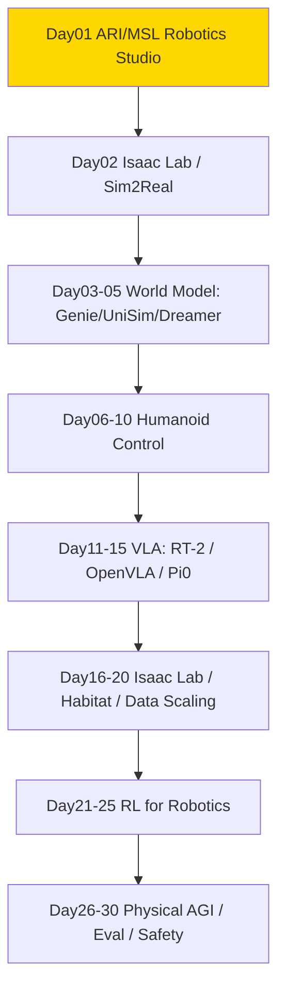

# ai-physical — Physical AI / 人形机器人 / World Model

> 专门读 **Physical AI** 相关的 paper / 系统 / 开源项目的沉淀区。服务于从 ML for Infra → Post-training / Agentic RL Infra → Physical AI 转型，重点是 **humanoid / world model / sim2real / Isaac Lab / Habitat / 控制 / RL for robotics**。
> Scope：Physical AI 全链路，不谈纯 LLM data curation（那是 ai-data）。
> 命名对齐 `ai-data/day-01-xxx`，`ai-physical/day-01-xxx` ~ `day-30-xxx`，便于 Day N 直连。原 `physical-ai/` 为早期命名，现统一为 `ai-physical/`，两者内容一致。

## 结构

```
ai-physical/
├── README.md                # 本路线图（1已完成/30总规划）
├── PAPER_TEMPLATE.md
├── reading-log.csv          # 快速索引
└── day-01-xxx/              # 每篇一个文件夹
    ├── NOTES.md             # 必须含「和之前工作的关系」
    └── assets/
```

## 发展路线图 (1/30 - 起步)

> 总计 **30篇** 即闭环，当前 Day01 已完成 ARI/MSL/Robotics Studio 起点。

### 图谱总览



### 30天闭环计划 (拟定)

| Day | 拟定 Folder | 标题 | Tier |
|-----|-------------|------|------|
| 01 | day-01-2025-ari-msl-robotics-studio | Meta ARI / MSL / Robotics Studio ✅已完成 2026-08-23 | S |
| 02 | day-02-2024-isaac-lab | Isaac Lab / Isaac Sim | S |
| 03 | day-03-2024-genie-world-model | Genie / Genie2 | S |
| 04 | day-04-2024-unisim | UniSim | S |
| 05 | day-05-2023-dreamerv3 | DreamerV3 | S |
| 06 | day-06-2024-humanoid-whole-body | Whole-body Control | S |
| 07 | day-07-2024-locomotion | Locomotion | A |
| 08 | day-08-2024-rt2-openvla | RT-2 / OpenVLA | S |
| 09 | day-09-2024-pi0 | Pi0 / Pi0.5 | S |
| 10 | day-10-2024-habitat | Habitat 3.0 / Habitat Lab | A |

### Day N 映射表 (1已完成)

| Day | Folder | 贡献 | Tier |
|-----|--------|------|------|
| 01 | day-01-2025-ari-msl-robotics-studio | Physical AGI 定义，MSL 生态，humanoid scaling 哲学，learning from human experience vs teleop | S |

### 每日Job

- 命名 `day-{01..30}-{year}-{slug}`，对齐 ai-data
- Scope：Physical AI / humanoid / world model / sim2real / Isaac Lab / Habitat / 控制 / RL for robotics
- 讨论：在 Hatch `career` thread

---
- GitHub: https://github.com/Papa-Panda/post-training/tree/master/ai-physical
---
