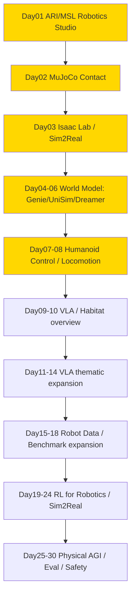

# physical-ai — Physical AI / 人形机器人 / World Model

> 专门读 **Physical AI** 相关的 paper / 系统 / 开源项目的沉淀区。服务于从 ML for Infra → Post-training / Agentic RL Infra → Physical AI 转型，重点是 **humanoid / world model / sim2real / Isaac Lab / Habitat / 控制 / RL for robotics**。
> Scope：Physical AI 全链路，不谈纯 LLM data curation（那是 ai-data）。
> 命名对齐 `ai-data/day-01-xxx`，`physical-ai/day-01-xxx` ~ `day-30-xxx`，便于 Day N 直连。

## 结构

```
physical-ai/
├── README.md                # 本路线图（18已完成/30总规划）
├── PAPER_TEMPLATE.md
├── reading-log.csv          # 快速索引
└── day-01-xxx/              # 每篇一个文件夹
    ├── NOTES.md             # 必须含「和之前工作的关系」
    └── assets/
```

## 发展路线图 (18/30 - 进行中)

> 总计 **30篇** 即闭环。Day01–10 已完成总览脚手架，Day11 起按专题顺序扩展；当前 Day17 BridgeData V2 已完成。Day11–30 主题已锁定，后续严格按表顺延。

### 图谱总览



### 30天闭环计划

| Day | Folder | 标题 | Tier |
|-----|--------|------|------|
| 01 | day-01-2025-ari-msl-robotics-studio | Meta ARI / MSL / Robotics Studio ✅ 2026-08-23 | S |
| 02 | day-02-2024-mujoco | MuJoCo Contact Model ✅ 2026-08-23 | S |
| 03 | day-03-2025-isaac-lab | Isaac Lab / Isaac Sim — USD + PhysX + Sim2Real ✅ 2026-08-24 | S |
| 04 | day-04-2024-genie-world-model | Genie / Genie 2 / Genie 3 — latent action 可交互生成式世界 ✅ 2026-08-25 | S |
| 05 | day-05-2023-unisim | UniSim — action-conditioned video diffusion + learned simulator RL ✅ 2026-08-26 | S |
| 06 | day-06-2023-dreamerv3 | DreamerV3 — latent RSSM + imagined actor-critic ✅ 2026-08-27 | S |
| 07 | day-07-2024-h2o-whole-body-control | H2O — Human-to-Humanoid Real-Time Whole-Body Teleoperation ✅ 2026-08-28 | S |
| 08 | day-08-2024-humanoid-gym-locomotion | Humanoid-Gym — RL Locomotion + Sim2Sim + Zero-Shot Sim2Real ✅ 2026-08-29 | A |
| 09 | day-09-2024-rt2-openvla | RT-2 / OpenVLA — action tokenization + web knowledge transfer + open VLA scaling ✅ 2026-08-30 | S |
| 10 | day-10-2023-habitat-3 | Habitat 3.0 / Habitat-Lab — humanoid simulation + HITL + social collaboration ✅ 2026-08-31 | A |
| 11 | day-11-2024-pi0-flow-vla | π₀ — flow matching VLA + high-frequency action chunks ✅ 2026-09-01 | S |
| 12 | day-12-2023-diffusion-policy | Diffusion Policy — visuomotor diffusion + receding-horizon control ✅ 2026-09-02 | S |
| 13 | day-13-2024-octo | Octo — open generalist robot policy + diffusion readout ✅ 2026-09-03 | S |
| 14 | day-14-2025-pi05-open-world | π₀.₅ — open-world VLA + knowledge insulation ✅ 2026-09-05 | S |
| 15 | day-15-2023-open-x-embodiment-rtx | Open X-Embodiment / RT-X — cross-robot data scaling ✅ 2026-09-06 | S |
| 16 | day-16-2024-droid | DROID — in-the-wild robot manipulation dataset ✅ 2026-09-07 | S |
| 17 | day-17-2023-bridgedata-v2 | BridgeData V2 — scalable heterogeneous imitation data ✅ 2026-09-08 | A |
| 18 | day-18-2024-robocasa | RoboCasa — large-scale simulation data for everyday manipulation ✅ 2026-09-09 | A |
| 19 | day-19-2017-ppo-robotics | PPO for Robotics — clipped policy optimization and rollout systems | S |
| 20 | day-20-2023-rlpd | RLPD — sample-efficient real-world robot RL with prior data | S |
| 21 | day-21-2019-domain-randomization | Domain Randomization — visual/dynamics randomization for sim2real | S |
| 22 | day-22-2021-rma | RMA — rapid motor adaptation under latent dynamics | S |
| 23 | day-23-2019-residual-rl | Residual RL — combine classical control priors with learned correction | A |
| 24 | day-24-sim2real-system-identification | System Identification + Sim2Real Evaluation — calibrate and gate transfer | A |
| 25 | day-25-2022-gato | Gato — one generalist policy across modalities and embodiments | A |
| 26 | day-26-2025-groot-n1 | GR00T N1 — humanoid foundation model and dual-system reasoning/control | S |
| 27 | day-27-2025-cosmos-world-foundation | Cosmos — world foundation models for Physical AI data generation | A |
| 28 | day-28-maniskill-robosuite-eval | ManiSkill / robosuite — reproducible manipulation benchmarks | A |
| 29 | day-29-safe-robot-learning | Safe Robot Learning — constraints, shielding, CBF and runtime monitors | S |
| 30 | day-30-physical-ai-eval-data-flywheel | Physical AI Eval + Data Flywheel — end-to-end synthesis | S |

### Day N 映射表 (18已完成)

| Day | Folder | 贡献 | Tier |
|-----|--------|------|------|
| 01 | day-01-2025-ari-msl-robotics-studio | Physical AGI 定义，MSL 生态，humanoid scaling 哲学，learning from human experience vs teleop | S |
| 02 | day-02-2024-mujoco | MuJoCo fast accurate contact, MJCF, MJX million steps/s, lightweight baseline for humanoid control | S |
| 03 | day-03-2025-isaac-lab | OpenUSD scene layer + PhysX Direct-GPU + RTX tiled rendering + manager-based MDP + domain randomization, scalable sim2real platform | S |
| 04 | day-04-2024-genie-world-model | Genie foundation world model：无标签视频 → latent action → 可交互生成式世界 | S |
| 05 | day-05-2023-unisim | 多源数据统一为 action-in-video-out；video diffusion simulator + learned reward 支持 VLM / RL 与 zero-shot real-robot transfer | S |
| 06 | day-06-2023-dreamerv3 | 离散 latent RSSM + imagined actor-critic；free bits / symlog / two-hot / percentile normalization 支撑固定超参跨 150+ tasks | S |
| 07 | day-07-2024-h2o-whole-body-control | sim-to-data 筛掉 embodiment-infeasible motions；deployable goal state + PPO + domain randomization 实现 RGB 驱动 H1 全身控制与 zero-shot sim2real | S |
| 08 | day-08-2024-humanoid-gym-locomotion | Isaac Gym 8192-env PPO + 15-frame history + asymmetric critic + gait prior；MuJoCo sim2sim gate 后在 XBot-S/L 展示 zero-shot sim2real locomotion | A |
| 09 | day-09-2024-rt2-openvla | RT-2 把 action 变成 token 并用 web+robot co-finetuning 保留语义；OpenVLA 用 970k OpenX demonstrations、DINOv2+SigLIP+Llama 2 7B 与 LoRA/量化把 VLA 变成开源可适配系统 | S |
| 10 | day-10-2023-habitat-3 | 高速 SMPL-X humanoid + HITL + Social Navigation/Rearrangement；以 partner population 和未见场景评测协作泛化，暴露 oracle skill → learned skill 的层间 distribution shift | A |
| 11 | day-11-2024-pi0-flow-vla | PaliGemma + 300M action expert，以 conditional flow matching 联合生成 50-step 连续 action chunk；10k+ 小时跨 embodiment 预训练后用高质量数据 post-train | S |
| 12 | day-12-2023-diffusion-policy | 在动作序列上做条件 DDPM/DDIM，以 observation/prediction/execution 三个 horizon 连接多峰行为克隆、时间一致性与闭环重规划 | S |
| 13 | day-13-2024-octo | 25 个 OXE 数据集约 80 万轨迹 + block-masked Transformer + diffusion action chunk；以可插拔 token/readout 接口适配新传感器、动作空间与机器人 | S |
| 14 | day-14-2025-pi05-open-world | 异构 co-training（多机器人+web+子任务预测+检测）+ knowledge insulation 两阶段配方，首次在未见真实家庭完成长程灵巧操作 | S |
| 15 | day-15-2023-open-x-embodiment-rtx | 60 数据集 / 22 embodiment / 100万+ 轨迹统一为 RLDS + 7 维末端动作接口；RT-1-X 小域 +50%，RT-2-X emergent skills ~3×（去 Bridge 消融钉死因果） | S |
| 16 | day-16-2024-droid | 18 台统一 Franka、50 采集员、52 栋建筑 564 真实场景采 76k 轨迹（350h/86任务）；本域小数据 + DROID co-train diffusion policy，6 任务 × 4 地点平均 +20%，场景覆盖即泛化增益 | S |
| 17 | day-17-2023-bridgedata-v2 | WidowX 250 廉价臂 60,096 轨迹 / 24 环境 / 13 技能，全部带语言标注；同一套数据跑通 GCBC / D-GCBC / ACT / CRL / LCBC / RT-1 六种 offline 方法；技能多样性 13 vs 3 在等量数据下未见 pick-and-place 0.30→0.65 | A |
| 18 | day-18-2024-robocasa | MimicGen 的 SE(3) 搬运把 1,250 条人类演示放大到 100K+ 轨迹；BC-Transformer 28.8% → 47.6% 单调 scaling；真机 co-train seen 13.6% → 24.4%（+79% 相对），unseen 2.6% → 9.3%；合成是覆盖四轴的 reality 端 | A |
| 19 | day-19-2017-ppo-robotics | 从 clipped surrogate、GAE 到并行 rollout，建立 robot policy optimization 的 actor-critic 基线 | S |
| 20 | day-20-2023-rlpd | 把离线先验数据与在线交互混合，提升真实机器人 RL 的样本效率与稳定性 | S |
| 21 | day-21-2019-domain-randomization | 对视觉、动力学、延迟和接触参数随机化，使策略对真实参数后验保持鲁棒 | S |
| 22 | day-22-2021-rma | base policy + adaptation module 从近期 history 在线推断 latent dynamics，快速适应地形与载荷 | S |
| 23 | day-23-2019-residual-rl | 在模型控制器动作上学习 residual，以先验稳定性缩小探索空间并保留可解释接口 | A |
| 24 | day-24-sim2real-system-identification | 用参数辨识、sim2sim、hardware-in-the-loop 和分桶指标把 sim2real 从口号变成 release gate | A |
| 25 | day-25-2022-gato | 统一 observation/action token 序列展示 generalist agent 范式，同时检视跨任务容量与控制精度限制 | A |
| 26 | day-26-2025-groot-n1 | 双系统 VLM reasoning + diffusion control 面向 humanoid，多 embodiment 数据与部署栈联合设计 | S |
| 27 | day-27-2025-cosmos-world-foundation | 以世界基础模型生成/筛选 Physical AI 训练数据，评估视频 realism 与 action-grounded usefulness 的差距 | A |
| 28 | day-28-maniskill-robosuite-eval | 统一任务、资产、传感器和成功判据，建立算法与系统的可复现实验矩阵 | A |
| 29 | day-29-safe-robot-learning | 约束 MDP、control barrier function、shield 和 runtime monitor 共同覆盖训练与部署安全 | S |
| 30 | day-30-physical-ai-eval-data-flywheel | 汇总 state/action/latency/safety 指标，设计 failure → triage → recollect/resimulate → retrain → gated deploy 闭环 | S |

---
- GitHub: https://github.com/Papa-Panda/post-training/tree/master/physical-ai
---

## 问答记录

> 跨单篇 Day 的通识问答归档（physical AI side chat 用户主动提问整理；Day N 推送卡片与提醒类消息已跳过）。归属单篇的问答见各 `day-*/NOTES.md` 末尾的"问答补充"。

### 语言作为动作 input 是否过于模糊（2026-09-05）

**问**：语言这个作为动作的 input 是不是过于模糊了？

**答**：是，这是 VLA 最核心的张力，也是它最诚实的地方。"把杯子放进水槽"完全没说抓哪里、走哪条线、用多大力——语言天生就是欠定的。但 VLA 的赌注恰恰是：接受这种模糊，让学到的策略从观测里把它补全。语言只负责"做什么、做哪个"（意图和指代），"怎么做"交给视觉和动作分布：同一个指令对应很多条合法轨迹，所以才需要 flow 或 diffusion 这种多峰动作头，而不是单值回归。当然，模糊是有代价的：精细接触任务上，纯语言条件就是不如目标图像或 3D 关键点精确——这也是为什么 Octo 同时接受目标图像，π₀.₅ 要把指令先分解成子任务：每分解一层，模糊就少一分。说白了，人类之间说话也一样模糊，我们靠共享的感知和上下文补全；VLA 想复制的正是这套机制。

**关联**：Day09（语言指代）/ Day13（目标图像条件）/ Day14（子任务分解）。

### Roadmap 与自动驾驶的关系（2026-09-05）

**问**：roadmap 上的东西和自动驾驶啥关系？

**答**：关系很近，可以说是一套数学、两套身体。自动驾驶和机器人都是具身智能：观测→决策→控制，POMDP 那套框架完全通用。Roadmap 上的很多东西在自动驾驶里都有直接对应：Day04 到 Day06 的世界模型就是驾驶世界模型（给定方向盘动作预测未来画面）；Day12 的 diffusion 策略对应自动驾驶里的 diffusion 轨迹规划；Day02/03 的仿真对应 CARLA 这类驾驶仿真；Day09 起的 VLA 对应"导航指令→方向盘"的端到端驾驶。最大的区别是身体复杂度：车只有 2 个自由度（方向盘加油门），机械臂 7 个自由度起步，还要处理接触力。所以自动驾驶更早落地（数据多、动作简单），机器人还在补数据和接触物理这两课。抽象层的数学基本可以直接平移到自动驾驶。

### POMDP 是什么（2026-09-05）

**问**：POMDP 是啥？POMDP 全称是？

**答**：全称 Partially Observable Markov Decision Process，中文叫部分可观测马尔可夫决策过程。它就是"看不见完整真相"的决策问题：MDP 假设你能直接看到真实状态 $ s $ （比如棋盘），POMDP 说你只能看到观测 $ o $ （比如摄像头画面），真实状态藏在后面： $ o\sim p(o\mid s) $ 。所以智能体得维护一个"信念" $ b(s)=p(s\mid\text{history}) $ ，再基于信念做决策。机器人全是 POMDP：你永远看不到物体的真实质量和摩擦系数，只能看到图像。这就是为什么 Day06 的 DreamerV3 要学一个隐状态 RSSM——它就是在学这个信念 $ b(s) $ 。而这几天的 VLA 策略 $ \pi(A\mid O,c) $ ，本质上就是 POMDP 策略：基于观测历史、而不是真实状态来做动作。

**符号**： $ s $ 真实状态； $ o $ 观测； $ b(s) $ 信念（对状态的后验）； $ A $ 动作； $ O $ 观测历史； $ c $ 任务条件。

**关联**：Day06（RSSM 学信念）/ Day14（双层时间尺度分层 POMDP）。

### Day09/11/12/13 四个数学并排（2026-09-05）

**问**：有点感觉，但还是不清楚四个的数学啥样。

**答**：四个其实在学同一个东西：示范数据上的条件动作分布

$$p_\theta(A\mid O,c).$$

差别只在于 **A 怎么表示、这个分布怎么参数化**。

**Day09 RT-2/OpenVLA：离散化 + 自回归**。连续 7 维动作 $ a=(\Delta x,\Delta y,\Delta z,\Delta r_x,\Delta r_y,\Delta r_z,\text{gripper}) $ 先归一化，再每维切成 256 个 bin，变成 token $ t_1..t_7 $ ：

$$p_\theta(t_{1:7}\mid I,\ell)=\prod_{j=1}^{7}p_\theta(t_j\mid t_{<j},I,\ell).$$

训练：交叉熵 $ \mathcal{L}=-\mathbb{E}\sum_j\log p_\theta(t_j\mid t_{<j},I,\ell) $ 。推理：逐 token 采样再 detokenize，1–6 Hz。直觉：把动作当语言来"说"，简单但量化吃精度。

**Day11 π₀：连续动作块 + flow matching**。 $ A=(a_t,...,a_{t+49})\in\mathbb{R}^{50\times d_a} $ ，一次生成 50 步；构造直线路径 $ A^\tau=(1-\tau)\epsilon+\tau A $ ， $ \tau\in[0,1] $ ：

$$\mathcal{L}_{\rm FM}=\mathbb{E}\|v_\theta(A^\tau,o,\tau)-(A-\epsilon)\|^2.$$

训练学的是速度场 $ v_\theta $ ；推理从噪声出发解 ODE $ dA/d\tau=v_\theta $ ，10 步 Euler 积分到 $ \tau=1 $ 。直觉：学一个"把噪声推向真实动作"的向量场；执行前 16–25 步就重规划。

**Day12 Diffusion Policy：连续轨迹 + DDPM 去噪**。 $ A^0=(a_t,...,a_{t+T_p-1}) $ ，前向加噪 $ A^k=\sqrt{\bar\alpha_k}A^0+\sqrt{1-\bar\alpha_k}\epsilon $ ， $ k=1..100 $ ：

$$\mathcal{L}_{\rm DP}=\mathbb{E}\|\epsilon-\epsilon_\theta(O,A^k,k)\|_2^2.$$

训练学的是噪声预测器 $ \epsilon_\theta $ ；推理从纯噪声出发，DDIM 10 步去噪回动作，执行前 $ T_a $ 步后重观测。直觉：和 π₀ 一样学 $ p(A\mid O) $ ，但参数化成"去噪器"——离散时间步 $ k $ vs 连续 $ \tau $ 是两者最表层的区别。

**Day13 Octo：多域加权 + 小 diffusion head**。

$$\min_\theta\sum_{d=1}^{25}q_d\,\mathbb{E}_{\tau\sim\mathcal{D}_d}[\mathcal{L}_{\text{diffusion}}(\theta;\tau,d)].$$

策略 $ \pi_\theta(A_t\mid O_t,c) $ ， $ A_t\in\mathbb{R}^{4\times d_a} $ 。训练 loss 和 DP 同家族，但按数据域加权 $ q_d $ 混合 25 个数据集；推理大 Transformer 只跑 1 次提特征，轻量 MLP head 做 20 步去噪。直觉：数学上是 DP 的亲戚，创新在数据混合和模块化接口。

一句话串起来：**Day09 把动作离散成词来"说"；Day11/12/13 都是连续生成式——π₀ 用流（连续 $ \tau $ 学速度），DP 用扩散（离散 $ k $ 学噪声），Octo 把扩散装进多域大模型里。**

**符号**： $ A $ 动作（块/轨迹）； $ O $ 观测（历史）； $ c $ 任务条件； $ \theta $ 参数； $ I $ 图像； $ \ell $ 语言指令； $ d_a $ 动作维度； $ \epsilon $ 高斯噪声； $ q_d $ 数据域权重。

### 四个 input 各自的含义（2026-09-05）

**问**：每一个进一步讲讲 input 的含义。

**答**：所有输入其实都在干一件事：**消除歧义**——视觉解决"东西在哪"，语言/目标解决"要干什么"，本体感知解决"我在哪"。

- **Day09** $ p(t\mid I,\ell) $ ： $ I $ 单张 RGB 图像（256×256）——当前世界长什么样（杯子在哪、桌子边缘在哪；RT-2 只有这一路视觉，遮挡一多就容易瞎）； $ \ell $ 语言指令 token（如"拿起红杯子"）——在多个物体里**指代**目标，靠 web 数据预训练认识没见过的物体描述，这是纯机器人数据做不到的。
- **Day11** $ v_\theta(A^\tau,o,\tau) $ ：多视角图像（最多 3 个相机，空间覆盖、减少遮挡死角）；本体感知 $ q_t $ （关节角/末端位姿，"我身体现在在哪"——动作是相对量，没有 $ q_t $ 就不知道从哪开始动）；语言 $ \ell $ （任务指令，π₀ 还用了细粒度子任务标注）； $ \tau\in[0,1] $ flow 时间（"去噪进行到哪了"，告诉网络当前噪声水平）； $ A^\tau $ 为 $ \tau $ 时刻的带噪动作块（被逐步打磨的对象）。
- **Day12** $ \epsilon_\theta(O,A^k,k) $ ： $ O=(o_{t-T_o+1},...,o_t) $ ，最近 $ T_o=2 $ 帧——单帧看不出杯子在动，**历史帧带来速度信息**； $ k=1..100 $ 扩散时间步（离散版 $ \tau $ ）； $ A^k $ 为 $ k $ 步噪声下的动作轨迹（被去噪的对象）；注意**没有语言**——任务直接 baked 在权重里，换任务就得重训，这是它和 VLA 的本质区别。
- **Day13** $ \pi_\theta(A_t\mid O_t,c) $ ： $ O_t $ 图像+本体感知，各模态独立 tokenizer； $ c $ 语言**或**目标图像——语言负责语义（"收拾桌子"），目标图像负责"变成这个样子"，正好补"语言太模糊"的问题；mask 机制——某个机器人缺某种传感器就 mask 掉，**模块化接口**让一个模型能跨 25 种不同身体。

串起来看：从 Day09 到 Day13，输入越来越丰富——单图→多视角+本体感知→历史帧→多模态可插拔；每加一路输入，都是在把原来靠"猜"的部分变成靠"看"的部分。

### Day09/11/12/13 各自解决了什么问题：2×2（2026-09-05）

**问**：day 11 12 解决了预测对象的问题，day 9 13 呢？

**答**：四天正好各解决一个不同的问题。**Day11/12 解决的是"预测什么"**：别再逐维回归单步动作了，直接生成整段连续、多峰的动作分布（一个用流，一个用扩散）。**Day09 解决的是"以什么为条件"**：策略凭什么听懂"拿起那个没见过的杯子"？答案是把互联网规模的 VLM 语义接进来——web 数据 + 机器人数据联合训练，语言成了指代和泛化的载体；它没解决动作精度，解决的是**语义**。**Day13 解决的是"在什么数据上训"**：25 种机器人，摄像头、关节、动作空间全不一样，怎么训一个模型？答案是模块化接口（各模态独立 tokenizer + mask）加多域加权混合；它没发明新的动作生成数学（head 还是 diffusion 那套），解决的是**跨身体的数据统一**。所以 2×2 是：横轴"预测目标"（Day11/12：连续多峰动作），纵轴"条件与数据"（Day09：语言语义条件；Day13：跨 embodiment 数据混合）。Day14 π₀.₅ 就是把这几条线收拢：π₀ 的动作生成 + Day09 的语义 + Day13 的跨身体数据，再加子任务分层。

### Day11/12 训练出来的模型分别是什么（2026-09-05）

**问**：day 11 12 训练出来的模型是啥？

**答**：都是"观测→动作"的生成模型，但体量和内涵差很多。**Day11 π₀**：得到一个大 checkpoint——PaliGemma（3B，负责看懂场景和指令）+ 300M action expert（实现速度场 $ v_\theta $ ）；它"知道"的是在 10k+ 小时多机器人数据上学到的**通用手眼协调**——给定图像、关节状态和一句话，输出 50 步连续动作，是个有常识的"手"。**Day12 Diffusion Policy**：得到一个小得多的去噪网络 $ \epsilon_\theta $ ——视觉编码器（ResNet 之类）+ CNN/Transformer 去噪头，没有语言模型；它"知道"的只有一件事：**这一个任务**的视觉到动作的映射——输入最近 2 帧图像，输出 $ T_p $ 步轨迹，换个任务、换个桌子就得重训一个。所以 π₀ 是"一个模型干很多活"，Diffusion Policy 是"一个模型只会一招，但这一招很准"。（注：π₀ 的多任务靠语言输入切换任务，见 day-11 NOTES 问答补充的修正条。）

### 接口即泛化 vs 配方即泛化（2026-09-06）

**问**：相对 Day13 Octo 的模块化 readout，π₀.₅ 反其道而行——用同一个 backbone 同时做语义预测和动作生成（hybrid examples），把泛化归因于训练配方而不是接口插拔，怎么理解？

**答**：这是深度学习里经典的一场仗：**归纳偏置放哪**——放架构里，还是放数据里。**Octo 的哲学：接口即泛化**——像一家部门分明的公司，部门之间用 API 通信：理解部门（大 Transformer）和动作部门（小 diffusion head）之间只通过 readout token 这个"API"对话；新机器人来了，写个新 tokenizer 插上去就行，泛化能力来自接口设计；代价是 API 可能太窄、信息过不去，好处是干净、可预测、微调便宜。**π₀.₅ 的哲学：配方即泛化**——像一个全栈团队，所有人共享同一套知识：语义预测和动作生成用同一个 backbone，hybrid examples（混合批次、不同 loss）一起训；它的赌注是只要数据配方对，共享表示会**自己**长出"语义"和"控制"的分工，不需要架构上硬切一刀。**具体的技术差异就一句话**：Octo 的动作梯度只流过小 head，backbone 被 readout 瓶颈保护着；π₀.₅ 的动作梯度直接冲进同一套做语言的权重——所以它才需要"knowledge insulation"两阶段训练，怕的就是动作数据把 VLM 的语义知识洗掉；Octo 用架构隔离风险，π₀.₅ 用训练配方管理风险。**怎么看这个分歧**：跟各自要解决的问题有关——Octo 要吃 25 种身体，异构必须隔离在输入端；π₀.₅ 要做长程任务的"想+做"紧耦合，中间插个瓶颈反而碍事。两边都有证据，领域还没收敛——这也是 Day16–18 数据论文值得看的原因：答案可能不在架构也不在配方，而在数据本身。

**关联**：Day13（模块化 readout）/ Day14（hybrid 单 backbone）/ Day16–18（数据论文）。

### 固定硬件路线的业界代表（2026-09-07）

**问**：之前有哪些工作也是这种固定硬件的？（Day16 DROID 卡片之后，业界层面的追问。）

**答**：固定硬件其实是更老的主流路线：

- **RT-1 / RT-2**：Google 的 Everyday Robots 机械臂，13 万条 episode，固定硬件 + 多任务——Day09 讲过。
- **BC-Z**：同一批 Everyday Robots 硬件，100 个任务，固定硬件 + 语言条件。
- **MT-Opt / QT-Opt**：更早的 Google 抓取系列，58 万次抓取，全是固定硬件刷出来的。
- **BridgeData V2**：WidowX 250 廉价臂，6 万条轨迹，玩具厨房——正好是 Day17 的主题，固定硬件 + 低成本采集。

对比着看就有意思了：RT 系列是固定硬件 + 实验室/办公室，Bridge 是固定硬件 + 便宜 + 玩具厨房，DROID 是固定硬件 + 贵臂 + 真实世界 564 个场景。三者都是"一次只扩张一个多样性轴"，DROID 只是把场景轴推到了极致。

**关联**：repo 内固定硬件三处（Day09 RT-2 / Day12 Diffusion Policy / Day16 DROID）见 day-16 NOTES「问答补充（2026-09-07）」；Day13 Octo、Day14 π₀.₅ 是跨 embodiment 反例（同见各自 NOTES 问答补充）。
