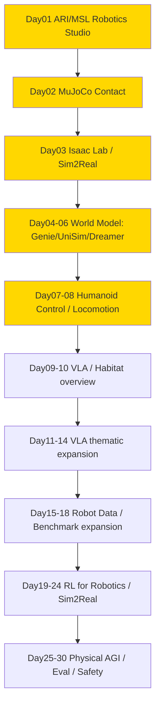

# physical-ai — Physical AI / 人形机器人 / World Model

> 专门读 **Physical AI** 相关的 paper / 系统 / 开源项目的沉淀区。服务于从 ML for Infra → Post-training / Agentic RL Infra → Physical AI 转型，重点是 **humanoid / world model / sim2real / Isaac Lab / Habitat / 控制 / RL for robotics**。
> Scope：Physical AI 全链路，不谈纯 LLM data curation（那是 ai-data）。
> 命名对齐 `ai-data/day-01-xxx`，`physical-ai/day-01-xxx` ~ `day-30-xxx`，便于 Day N 直连。

## 结构

```
physical-ai/
├── README.md                # 本路线图（13已完成/30总规划）
├── PAPER_TEMPLATE.md
├── reading-log.csv          # 快速索引
└── day-01-xxx/              # 每篇一个文件夹
    ├── NOTES.md             # 必须含「和之前工作的关系」
    └── assets/
```

## 发展路线图 (13/30 - 进行中)

> 总计 **30篇** 即闭环。Day01–10 已完成总览脚手架，Day11 起按专题顺序扩展；当前 Day13 Octo 已完成。Day11–30 主题已锁定，后续严格按表顺延。

### 图谱总览



### 30天闭环计划

| Day | Folder | 标题 | Tier |
|-----|--------|------|------|
| 01 | day-01-2025-ari-msl-robotics-studio | Meta ARI / MSL / Robotics Studio ✅ 2026-08-23 | S |
| 02 | day-02-2024-mujoco | MuJoCo Contact Model ✅ 2026-08-23 | S |
| 03 | day-03-2025-isaac-lab | Isaac Lab / Isaac Sim — USD + PhysX + Sim2Real ✅ 2026-08-24 | S |
| 04 | day-04-2024-genie-world-model | Genie / Genie 2 / Genie 3 — latent action 可交互生成式世界 ✅ 2026-08-25 | S |
| 05 | day-05-2023-unisim | UniSim — action-conditioned video diffusion + learned simulator RL ✅ 2026-08-26 | S |
| 06 | day-06-2023-dreamerv3 | DreamerV3 — latent RSSM + imagined actor-critic ✅ 2026-08-27 | S |
| 07 | day-07-2024-h2o-whole-body-control | H2O — Human-to-Humanoid Real-Time Whole-Body Teleoperation ✅ 2026-08-28 | S |
| 08 | day-08-2024-humanoid-gym-locomotion | Humanoid-Gym — RL Locomotion + Sim2Sim + Zero-Shot Sim2Real ✅ 2026-08-29 | A |
| 09 | day-09-2024-rt2-openvla | RT-2 / OpenVLA — action tokenization + web knowledge transfer + open VLA scaling ✅ 2026-08-30 | S |
| 10 | day-10-2023-habitat-3 | Habitat 3.0 / Habitat-Lab — humanoid simulation + HITL + social collaboration ✅ 2026-08-31 | A |
| 11 | day-11-2024-pi0-flow-vla | π₀ — flow matching VLA + high-frequency action chunks ✅ 2026-09-01 | S |
| 12 | day-12-2023-diffusion-policy | Diffusion Policy — visuomotor diffusion + receding-horizon control ✅ 2026-09-02 | S |
| 13 | day-13-2024-octo | Octo — open generalist robot policy + diffusion readout ✅ 2026-09-03 | S |
| 14 | day-14-2025-pi05-open-world | π₀.₅ — open-world VLA + knowledge insulation | S |
| 15 | day-15-2023-open-x-embodiment-rtx | Open X-Embodiment / RT-X — cross-robot data scaling | S |
| 16 | day-16-2024-droid | DROID — in-the-wild robot manipulation dataset | S |
| 17 | day-17-2023-bridgedata-v2 | BridgeData V2 — scalable heterogeneous imitation data | A |
| 18 | day-18-2024-robocasa | RoboCasa — large-scale simulation data for everyday manipulation | A |
| 19 | day-19-2017-ppo-robotics | PPO for Robotics — clipped policy optimization and rollout systems | S |
| 20 | day-20-2023-rlpd | RLPD — sample-efficient real-world robot RL with prior data | S |
| 21 | day-21-2019-domain-randomization | Domain Randomization — visual/dynamics randomization for sim2real | S |
| 22 | day-22-2021-rma | RMA — rapid motor adaptation under latent dynamics | S |
| 23 | day-23-2019-residual-rl | Residual RL — combine classical control priors with learned correction | A |
| 24 | day-24-sim2real-system-identification | System Identification + Sim2Real Evaluation — calibrate and gate transfer | A |
| 25 | day-25-2022-gato | Gato — one generalist policy across modalities and embodiments | A |
| 26 | day-26-2025-groot-n1 | GR00T N1 — humanoid foundation model and dual-system reasoning/control | S |
| 27 | day-27-2025-cosmos-world-foundation | Cosmos — world foundation models for Physical AI data generation | A |
| 28 | day-28-maniskill-robosuite-eval | ManiSkill / robosuite — reproducible manipulation benchmarks | A |
| 29 | day-29-safe-robot-learning | Safe Robot Learning — constraints, shielding, CBF and runtime monitors | S |
| 30 | day-30-physical-ai-eval-data-flywheel | Physical AI Eval + Data Flywheel — end-to-end synthesis | S |

### Day N 映射表 (13已完成)

| Day | Folder | 贡献 | Tier |
|-----|--------|------|------|
| 01 | day-01-2025-ari-msl-robotics-studio | Physical AGI 定义，MSL 生态，humanoid scaling 哲学，learning from human experience vs teleop | S |
| 02 | day-02-2024-mujoco | MuJoCo fast accurate contact, MJCF, MJX million steps/s, lightweight baseline for humanoid control | S |
| 03 | day-03-2025-isaac-lab | OpenUSD scene layer + PhysX Direct-GPU + RTX tiled rendering + manager-based MDP + domain randomization, scalable sim2real platform | S |
| 04 | day-04-2024-genie-world-model | Genie foundation world model：无标签视频 → latent action → 可交互生成式世界 | S |
| 05 | day-05-2023-unisim | 多源数据统一为 action-in-video-out；video diffusion simulator + learned reward 支持 VLM / RL 与 zero-shot real-robot transfer | S |
| 06 | day-06-2023-dreamerv3 | 离散 latent RSSM + imagined actor-critic；free bits / symlog / two-hot / percentile normalization 支撑固定超参跨 150+ tasks | S |
| 07 | day-07-2024-h2o-whole-body-control | sim-to-data 筛掉 embodiment-infeasible motions；deployable goal state + PPO + domain randomization 实现 RGB 驱动 H1 全身控制与 zero-shot sim2real | S |
| 08 | day-08-2024-humanoid-gym-locomotion | Isaac Gym 8192-env PPO + 15-frame history + asymmetric critic + gait prior；MuJoCo sim2sim gate 后在 XBot-S/L 展示 zero-shot sim2real locomotion | A |
| 09 | day-09-2024-rt2-openvla | RT-2 把 action 变成 token 并用 web+robot co-finetuning 保留语义；OpenVLA 用 970k OpenX demonstrations、DINOv2+SigLIP+Llama 2 7B 与 LoRA/量化把 VLA 变成开源可适配系统 | S |
| 10 | day-10-2023-habitat-3 | 高速 SMPL-X humanoid + HITL + Social Navigation/Rearrangement；以 partner population 和未见场景评测协作泛化，暴露 oracle skill → learned skill 的层间 distribution shift | A |
| 11 | day-11-2024-pi0-flow-vla | PaliGemma + 300M action expert，以 conditional flow matching 联合生成 50-step 连续 action chunk；10k+ 小时跨 embodiment 预训练后用高质量数据 post-train | S |
| 12 | day-12-2023-diffusion-policy | 在动作序列上做条件 DDPM/DDIM，以 observation/prediction/execution 三个 horizon 连接多峰行为克隆、时间一致性与闭环重规划 | S |
| 13 | day-13-2024-octo | 25 个 OXE 数据集约 80 万轨迹 + block-masked Transformer + diffusion action chunk；以可插拔 token/readout 接口适配新传感器、动作空间与机器人 | S |
| 14 | day-14-2025-pi05-open-world | 通过 co-training / knowledge insulation 强化未见环境、长时程任务与语言条件泛化 | S |
| 15 | day-15-2023-open-x-embodiment-rtx | 统一 22 种机器人数据 schema，研究跨机器人规模化与 embodiment transfer 的收益边界 | S |
| 16 | day-16-2024-droid | 多机构、真实家庭/办公场景的 Franka 数据采集体系，聚焦数据多样性、标准化与分布偏差 | S |
| 17 | day-17-2023-bridgedata-v2 | 廉价遥操作与异构场景扩展 imitation data，研究组合泛化和 downstream adaptation | A |
| 18 | day-18-2024-robocasa | 用程序化家庭场景和大规模仿真轨迹扩充 manipulation 数据，连接 Habitat 总览与 sim2real | A |
| 19 | day-19-2017-ppo-robotics | 从 clipped surrogate、GAE 到并行 rollout，建立 robot policy optimization 的 actor-critic 基线 | S |
| 20 | day-20-2023-rlpd | 把离线先验数据与在线交互混合，提升真实机器人 RL 的样本效率与稳定性 | S |
| 21 | day-21-2019-domain-randomization | 对视觉、动力学、延迟和接触参数随机化，使策略对真实参数后验保持鲁棒 | S |
| 22 | day-22-2021-rma | base policy + adaptation module 从近期 history 在线推断 latent dynamics，快速适应地形与载荷 | S |
| 23 | day-23-2019-residual-rl | 在模型控制器动作上学习 residual，以先验稳定性缩小探索空间并保留可解释接口 | A |
| 24 | day-24-sim2real-system-identification | 用参数辨识、sim2sim、hardware-in-the-loop 和分桶指标把 sim2real 从口号变成 release gate | A |
| 25 | day-25-2022-gato | 统一 observation/action token 序列展示 generalist agent 范式，同时检视跨任务容量与控制精度限制 | A |
| 26 | day-26-2025-groot-n1 | 双系统 VLM reasoning + diffusion control 面向 humanoid，多 embodiment 数据与部署栈联合设计 | S |
| 27 | day-27-2025-cosmos-world-foundation | 以世界基础模型生成/筛选 Physical AI 训练数据，评估视频 realism 与 action-grounded usefulness 的差距 | A |
| 28 | day-28-maniskill-robosuite-eval | 统一任务、资产、传感器和成功判据，建立算法与系统的可复现实验矩阵 | A |
| 29 | day-29-safe-robot-learning | 约束 MDP、control barrier function、shield 和 runtime monitor 共同覆盖训练与部署安全 | S |
| 30 | day-30-physical-ai-eval-data-flywheel | 汇总 state/action/latency/safety 指标，设计 failure → triage → recollect/resimulate → retrain → gated deploy 闭环 | S |

---
- GitHub: https://github.com/Papa-Panda/post-training/tree/master/physical-ai
---
