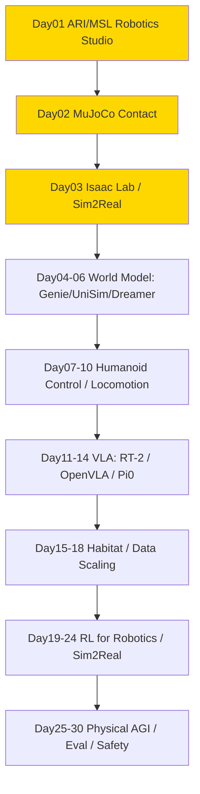

# physical-ai — Physical AI / 人形机器人 / World Model

> 专门读 **Physical AI** 相关的 paper / 系统 / 开源项目的沉淀区。服务于从 ML for Infra → Post-training / Agentic RL Infra → Physical AI 转型，重点是 **humanoid / world model / sim2real / Isaac Lab / Habitat / 控制 / RL for robotics**。
> Scope：Physical AI 全链路，不谈纯 LLM data curation（那是 ai-data）。
> 命名对齐 `ai-data/day-01-xxx`，`physical-ai/day-01-xxx` ~ `day-30-xxx`，便于 Day N 直连。

## 结构

```
physical-ai/
├── README.md                # 本路线图（6已完成/30总规划）
├── PAPER_TEMPLATE.md
├── reading-log.csv          # 快速索引
└── day-01-xxx/              # 每篇一个文件夹
    ├── NOTES.md             # 必须含「和之前工作的关系」
    └── assets/
```

## 发展路线图 (6/30 - 已起步)

> 总计 **30篇** 即闭环，当前 Day01 ARI/MSL + Day02 MuJoCo + Day03 Isaac Lab + Day04 Genie + Day05 UniSim + Day06 DreamerV3 已完成。

### 图谱总览



### 30天闭环计划

| Day | Folder | 标题 | Tier |
|-----|--------|------|------|
| 01 | day-01-2025-ari-msl-robotics-studio | Meta ARI / MSL / Robotics Studio ✅ 2026-08-23 | S |
| 02 | day-02-2024-mujoco | MuJoCo Contact Model ✅ 2026-08-23 | S |
| 03 | day-03-2025-isaac-lab | Isaac Lab / Isaac Sim — USD + PhysX + Sim2Real ✅ 2026-08-24 | S |
| 04 | day-04-2024-genie-world-model | Genie / Genie 2 / Genie 3 — latent action 可交互生成式世界 | S |
| 05 | day-05-2023-unisim | UniSim — action-conditioned video diffusion + learned simulator RL | S |
| 06 | day-06-2023-dreamerv3 | DreamerV3 — latent RSSM + imagined actor-critic ✅ 2026-08-27 | S |
| 07 | day-07-2024-humanoid-whole-body | Whole-body Control | S |
| 08 | day-08-2024-locomotion | Locomotion | A |
| 09 | day-09-2024-rt2-openvla | RT-2 / OpenVLA | S |
| 10 | day-10-2024-habitat | Habitat 3.0 / Habitat Lab | A |

### Day N 映射表 (6已完成)

| Day | Folder | 贡献 | Tier |
|-----|--------|------|------|
| 01 | day-01-2025-ari-msl-robotics-studio | Physical AGI 定义，MSL 生态，humanoid scaling 哲学，learning from human experience vs teleop | S |
| 02 | day-02-2024-mujoco | MuJoCo fast accurate contact, MJCF, MJX million steps/s, lightweight baseline for humanoid control | S |
| 03 | day-03-2025-isaac-lab | OpenUSD scene layer + PhysX Direct-GPU + RTX tiled rendering + manager-based MDP + domain randomization, scalable sim2real platform | S |
| 04 | day-04-2024-genie-world-model | Genie foundation world model：无标签视频 → latent action → 可交互生成式世界 | S |
| 05 | day-05-2023-unisim | 多源数据统一为 action-in-video-out；video diffusion simulator + learned reward 支持 VLM / RL 与 zero-shot real-robot transfer | S |
| 06 | day-06-2023-dreamerv3 | 离散 latent RSSM + imagined actor-critic；free bits / symlog / two-hot / percentile normalization 支撑固定超参跨 150+ tasks | S |

---
- GitHub: https://github.com/Papa-Panda/post-training/tree/master/physical-ai
---
