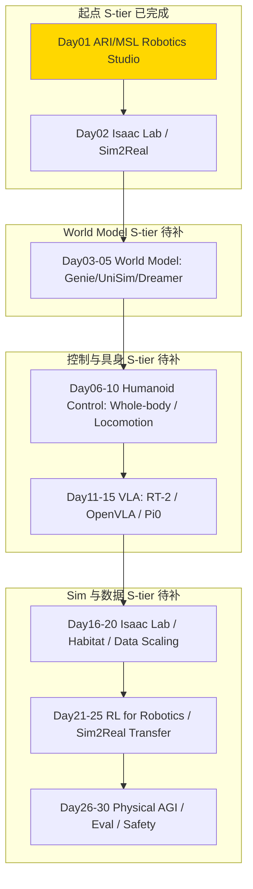

# physical-ai — Physical AI / 人形机器人 / World Model

> 专门读 **Physical AI** 相关的 paper / 系统 / 开源项目的沉淀区。服务于从 ML for Infra → Post-training / Agentic RL Infra → Physical AI 转型，重点是 **humanoid / world model / sim2real / Isaac Lab / Habitat / 控制 / RL for robotics**。
> Scope：Physical AI 全链路，不谈纯 LLM data curation（那是 ai-data）。
> 命名对齐 `ai-data/day-01-xxx`，`physical-ai/day-01-xxx` ~ `day-30-xxx`，便于 Day N 直连。

## 结构

```
physical-ai/
├── README.md                # 本路线图（1已完成/30总规划）
├── PAPER_TEMPLATE.md
├── reading-log.csv          # 快速索引
└── day-01-xxx/              # 每篇一个文件夹
    ├── NOTES.md             # 必须含「和之前工作的关系」
    └── assets/
```

## 发展路线图 (1/30 - 起步)

> 总计 **30篇** 即闭环，当前 Day01 已完成 ARI/MSL/Robotics Studio 起点。

### 图谱总览 (Mermaid - 完整版 30篇规划)



### 主线 vs 支线 判定 (1已完成)

| Tier | 判定 | Days | 说明 |
|------|------|------|------|
| **S-tier 必读** | 范式定义 | 01 | ARI/MSL/Robotics Studio — Meta Physical AI 战略起点，physical AGI 定义，人形机器人 scaling 路径 |
| **A-tier 重要** | 你的转型直接可用 | 02-05 | Isaac Lab, Habitat, World Model |
| **B-tier 技巧** | 单点改进 | 06-10 | 控制、VLA 细节 |

### 30天闭环计划 (拟定)

| Day | 拟定 Folder | 标题 | 为什么是主干 | Tier |
|-----|-------------|------|-------------|------|
| 01 | day-01-2025-ari-msl-robotics-studio | Meta ARI / MSL / Robotics Studio ✅已完成 2026-08-23 | Physical AGI 定义，humanoid scaling via human experience, MSL 生态 | S |
| 02 | day-02-2024-isaac-lab | Isaac Lab / Isaac Sim | Sim2Real 基座，USD + PhysX，Meta 用法对照 | S |
| 03 | day-03-2024-genie-world-model | Genie / Genie2 | World Model 生成可玩环境 | S |
| 04 | day-04-2024-unisim | UniSim | 真实世界交互模拟 | S |
| 05 | day-05-2023-dreamerv3 | DreamerV3 | Model-based RL 通用智能体 | S |
| 06 | day-06-2024-humanoid-whole-body | Whole-body Control | 人形全身控制 | S |
| 07 | day-07-2024-locomotion | Locomotion / Quadruped → Biped | 行走/平衡 | A |
| 08 | day-08-2024-rt2-openvla | RT-2 / OpenVLA | VLA 基座 | S |
| 09 | day-09-2024-pi0 | Pi0 / Pi0.5 | 新一代 VLA | S |
| 10 | day-10-2024-habitat | Habitat 3.0 / Habitat Lab | 具身 AI 评测 | A |

> 后续 Day11-30 待补充：RL for robotics, Sim2Real, Physical AGI Eval, Safety

### Day N 映射表 (1已完成)

| Day | Folder | 贡献 | Tier |
|-----|--------|------|------|
| 01 | day-01-2025-ari-msl-robotics-studio | Physical AGI 定义，MSL 生态，humanoid scaling 哲学，learning from human experience vs teleop | S |

### 每日Job

- 命名 `day-{01..30}-{year}-{slug}` 两位数，顺序递增，对齐 ai-data
- 每日Job自动：建骨架 → 更新 reading-log → push commit `feat(physical-ai): Day N` → 同步本README映射表新增一行
- Scope约束：每日NOTES只记 Physical AI / Robotics，不谈纯 LLM SFT 数据

---
关联：
- infra轨道：`ai-infra/day-01-ddp-basics/` ~ `day-12-reward-model`
- data轨道：`ai-data/day-01-xxx` ~ `day-30-xxx`
- 讨论：在 Hatch `career` thread / `physical-ai` thread
- GitHub树：https://github.com/Papa-Panda/post-training/tree/master/physical-ai
---
