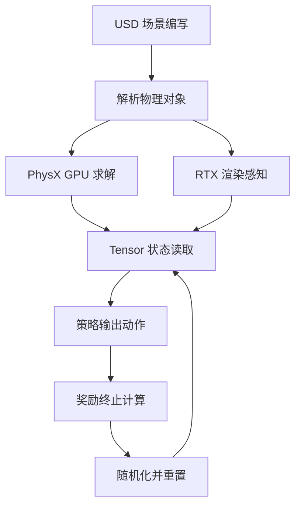

# Day 03 — Isaac Lab / Isaac Sim：USD + PhysX + Sim2Real 基座

> 📖 阅读版：https://papa-panda.github.io/post-training/physical-ai/day-03-2025-isaac-lab/

> Day 03 of physical-ai track, following Day02 MuJoCo. Focus on how OpenUSD, PhysX, RTX rendering, GPU-resident tensors, and domain randomization form a scalable robot-learning stack.

## 元信息
- Title: Isaac Lab: A GPU-Accelerated Simulation Framework for Multi-Modal Robot Learning
- Authors / Org: Mayank Mittal, Kelly Guo, Gavriel State, Spencer Huang et al. / NVIDIA
- Link / arXiv / Blog: https://arxiv.org/abs/2511.04831v1 / https://research.nvidia.com/publication/2025-09_isaac-lab-gpu-accelerated-simulation-framework-multi-modal-robot-learning
- Publication date: 2025-09-29
- Date read: 2026-08-24
- Tags: [physical-ai, isaac-lab, isaac-sim, openusd, physx, sim2real, domain-randomization, robotics-rl]
- Thread: physical-ai
- Folder: day-03-2025-isaac-lab
- GitHub: https://github.com/Papa-Panda/post-training/tree/master/physical-ai/day-03-2025-isaac-lab

## 一句话总结
Isaac Lab 把 Isaac Sim 的 OpenUSD 场景层、PhysX 5 GPU 物理、RTX 多模态渲染封装成模块化 robot-learning 框架：用 GPU-resident batched tensors、可组合 MDP managers、精细 actuator/sensor 模型与 domain randomization，把大规模 RL / IL 训练和 sim-to-real 部署接成一条流水线。

## 大纲

- **背景与动机**：真机数据贵、慢、有风险，长尾/故障场景难复现；Isaac Gym 已证明 GPU 全链路可把复杂任务训练从 days 压到 hours，但其场景表达、视觉传感与工具链不足以支撑多模态学习 → Isaac Lab 要把 physics、rendering、sensing、actuation、数据采集、RL/IL 与 sim2real 统一为平台。
- **OpenUSD 场景层**：prims 层级 stage + schema 表达几何/物理/语义/传感器/材质；layering、references、instancing 做无损组合与资产复用；可转换 URDF/MJCF；robotics 约定 meters + Z-up。
- **PhysX 5 + GPU 运行层**：Direct-GPU + Tensor API 让 state/control 以 CUDA tensors 读写，避免 CPU↔GPU 搬运；OmniPhysics 启动时把 USD"编译"为 PhysX 对象，训练循环不再读写 USD。
- **RTX 渲染与多模态传感**：RGB/depth/normals/语义分割；TiledCamera 把数千相机排进一个 framebuffer 一次 render；Warp RayCaster 负责低分辨率 depth/height scan。
- **Task API 与训练接口**：Manager-based（MDP 拆成 obs/actions/rewards/terminations/commands/curricula/events/recording 八个 manager，独立配置与日志）vs Direct（最低开销，单卡仅快 3.53%）；Gymnasium 接口 + SKRL/RSL-RL/RL-Games/SB3/Ray。
- **数据与 sim2real 闭环**：大规模并行 env + Replicator 过程化随机化产 sim 数据；teleop（keyboard/spacemouse/XR）+ RoboMimic + Mimic 增广产 demo 数据；physics/vision 随机化、actuator delay 建模、ADR 与 teacher-student/real fine-tuning 补四层 gap。

## 流程图

## 和之前工作的关系

- **接了哪条线：** 接 Day01 的 humanoid / Physical AGI 战略与 Day02 的仿真物理地基；Day03 回答“如何把一个物理引擎扩成可用于感知、控制、数据生成和部署的完整训练平台”。
- **补了哪个短板：** MuJoCo 更像轻量、精确的 dynamics engine；Isaac Lab 补上复杂 3D scene authoring、视觉传感器、GPU 规模化、多机训练、demonstration pipeline 与 sim2real 工具链。
- **替代 / 分叉 / 改进：** Isaac Lab 不是简单替代 MuJoCo。MuJoCo/MJX 适合快速控制实验和轻量 dynamics；Isaac Lab 适合高保真、多模态、复杂场景训练。未来 Newton / MuJoCo Warp 说明两条路线正在融合，而非二选一。
- **对之前 Day X 的直接对比：** Day02 的 MJCF 以机器人动力学为中心；Day03 的 USD 同时承载 geometry、physics、semantics、sensors、materials，并用 layering / references / instancing 管理复杂世界。MuJoCo 是 control unit test，Isaac Lab 更接近 perception-control integration test。

## 为什么今天读它

Day03 路线图指定 Isaac Lab / Isaac Sim。它位于 Physical AI 软件栈中间层：向下连接场景、物理、渲染和传感器，向上连接 Gymnasium、RSL-RL、RL-Games、SKRL、SB3、Ray、RoboMimic 等训练框架；先理解这层，后续 Genie / UniSim world model、whole-body control、VLA 与 sim2real 才有共同坐标系。

## 今天的 3 问
1. **USD 为什么不仅是“3D 文件格式”？** scene graph、schema、layering、references、instancing 如何让 robot / object / sensor / material / semantics 成为可组合、可复用、可随机化的数据层？
2. **PhysX 为什么能支撑大规模 RL？** USD 场景何时被解析成 PhysX 对象，Direct-GPU + Tensor API 如何避免 CPU↔GPU 搬运，哪些参数仍会落回 CPU 成为瓶颈？
3. **Sim2Real 真正靠什么闭环？** actuator delay / torque limit、multi-frequency sensing、physics + visual domain randomization、system identification、teacher-student / RL fine-tuning 各自补哪一种 gap？

## 核心

1. **Motivation：从 physics engine 到 multi-modal robot-learning platform**
   - 真机交互数据昂贵、慢且有风险，极端/故障场景又难重复；仿真提供可控、可复现、安全的 stress test 与数据生成。
   - Isaac Gym 已证明 simulation + policy learning 全放 GPU 可把复杂任务训练从 days 降到 hours，但其 raw buffers、有限场景表达和视觉能力不够支撑下一阶段的 multi-modal learning。
   - Isaac Lab 作为 Isaac Gym 的后继者，目标不是只把 physics 加速，而是把 physics、rendering、sensing、actuation、data collection、RL/IL 和 sim2real best practices 统一起来。

2. **System / Method：USD → OmniPhysics → PhysX / RTX → Tensor API → RL**
   - **OpenUSD 场景层**：场景是由 prims 构成的层次化 stage；schema 表达 geometry、rigid bodies、collisions、joints、materials、semantic IDs 和 cameras。Layering 支持无损协作，references / instancing 复用资产。Isaac Lab 可转换 URDF、MJCF 和 OBJ/DAE，并规定 robotics 的 meters + Z-up 约定。
   - **PhysX 5 物理层**：支持 rigid/articulated bodies，也支持 cloth、fluids、soft bodies 与 solver 间 two-way coupling；SDF collision 适合精密装配中的非凸几何。PhysX Direct-GPU 让 state/control 直接以 CUDA tensors 读写。
   - **运行时关键路径**：先用 USD author 场景；启动 simulation 后，OmniPhysics 将 USD 解析为 PhysX objects。训练期间为避免 USD read/write bottleneck，状态通过 OmniPhysics Tensor API / PhysX Direct-GPU 访问。Prototype environment 可复制成数千实例，`/World/envs/*/Robot` 映射成 batch 第一维。
   - **RTX / sensors**：Omniverse RTX 生成 RGB、depth、normals、semantic segmentation；TiledCamera 将数千相机排进一个 GPU framebuffer，一次 render pass 后重建 per-env tensor，避免 host-device copy。Warp RayCaster 更适合低分辨率 depth / height scan。
   - **Task API**：Manager-based workflow 把 MDP 拆成 observations、actions、rewards、terminations、commands、curricula、events、recording；Direct workflow 直接操作 joint state / contact / sensor，追求最低 overhead。

3. **Training / Data Details：Sim 数据、Real 数据与可验证信号**
   - **RL 接口**：遵循 Gymnasium；内置 SKRL、RSL-RL、RL-Games、Stable-Baselines3、Ray。每一步包含 action processing → 多个 physics substeps / decimation → optional rendering → termination/reward → per-env reset → command/observation update。
   - **Sim 数据**：大规模并行 env 产生 proprioception、contact、RGB/depth/segmentation、LiDAR/height scan；procedural scenes 与 Replicator 随机化 geometry、texture、material、lighting。
   - **Real / demo 数据**：支持 keyboard、spacemouse、XR teleoperation；与 RoboMimic 对接，HDF5 可转 LeRobot 的 Parquet + MP4。Isaac Lab Mimic 可把少量 human demonstrations 分段、刚体变换、重组，生成更多 object-centric trajectories。
   - **Reward / verifiable signal**：任务 success、速度/姿态跟踪、接触/力约束、collision、energy、termination 等由独立 manager terms 计算并逐项记录；这使 reward attribution、ablation 与 regression test 可自动化。
   - **Sim2Real knobs**：physics 侧 randomize friction、armature、gravity、mass；vision 侧 randomize texture、material、lighting/background；同时建模 sensor rate/noise、actuator delay、velocity/effort limit。ADR 根据 policy performance 自动扩张难度。

4. **Key Tricks：最值得抄的细节**
   - **Trick 1 — Authoring / runtime 分层**：USD 用于“世界的声明与组合”，PhysX Tensor API 用于“训练时的高速状态更新”。把可读可协作的数据层和高吞吐 runtime 解耦，避免每个 physics step 都读写 USD。
   - **Trick 2 — 端到端 GPU-resident loop**：PhysX Direct-GPU + batched Views + GPU reward/observation kernels，让 simulation → observation → policy → action 留在 GPU；这比单纯“物理引擎跑在 GPU”更关键。
   - **Trick 3 — Gap 拆解而非一招 Domain Randomization**：动力学 gap 用 friction/mass/armature + actuator delay/torque curve + system identification；感知 gap 用 RTX / tiled rendering + texture/light randomization；控制 gap 用 teacher-student、residual RL 与 real-world fine-tuning。
   - **Trick 4 — Manager-based MDP 可观测性**：reward、termination、curriculum 等 term 独立配置和日志化，略牺牲吞吐换复现与快速 ablation；论文中 direct workflow 单卡只平均快 3.53%。
   - **Trick 5 — 多频率真实感**：physics、control、render、IMU/camera 并非同频。通过 decimation 和 sensor update frequency 显式模拟，避免“所有组件完美同步”的仿真假象。

5. **Results：吞吐与真实部署证据**
   - **Scale**：8× RTX Pro 6000、16,384 env 下，DextrAH teacher 超过 0.9M training FPS，Franka cabinet 超过 1.6M FPS；多 GPU 接近线性扩展。
   - **Abstraction overhead**：ANYmal rough-terrain benchmark 中，Direct workflow 在单张 RTX Pro 6000 平均仅比 Manager-based 快 3.53%，env 增大或 perception 占主导后差距趋近于零。
   - **Sensor trade-off**：naive USD camera 超过 48 个并行 camera 即 OOM；TiledCamera / RayCasterCamera 可扩到数千 env。低分辨率 RayCaster 更高效，高分辨率与多 GPU 大规模下 TiledCamera 更有优势。
   - **Sim2Real**：Isaac Lab 训练的 Spot policy 零样本上真机跑到 5.2 m/s；Factory assembly tasks 报告 83–99% zero-shot sim2real success；AutoMate 的 specialist/generalist policies 在 sim 与 real 都约 80%。这些是引用的下游系统结果，不应误读为 Isaac Lab 单独贡献。

## 可迁移 / Transfer

- **方法在 held-out 上是否 transfer？模型 vs 框架哪个贡献更大？**
  - 跨场景、跨 embodiment 与真机 transfer 已有多项案例，但结果依赖具体 policy、reward、system identification、domain randomization 和硬件模型；Isaac Lab 提供 enabling infrastructure，不等于自动消除 sim2real gap。
  - 框架贡献是统一、并行与可复现；最终 performance 仍由 task formulation 与 policy/training recipe 决定。

- **对 Infra → Post-training → Physical AI 迁移的直接启发：**
  1. **Robot rollout 是带物理约束的 rollout engine**：env replicas 类似并行 generation workers；state/action tensors 类似 KV / token buffers；reward terms 类似 verifiers。核心问题同样是吞吐、尾延迟、故障隔离、数据质量与闭环可观测性。
  2. **Sim2Real 是 distribution shift engineering**：domain randomization 类似数据增强，但必须覆盖 physics、sensor、actuator 与 timing 四层；只随机 texture 属于浅层 augmentation。

- **Infra 视角：可扩展性 / 成本 / 评测自动化 / 可复现性：**
  - 可扩展性：瓶颈会从 PhysX 转向 rendering、VRAM、CPU orchestration 与 runtime parameter updates；要按 state-only、raycast、photoreal 三类 workload 分别 benchmark。
  - 成本：manager abstraction 的 3.53% 平均单卡开销往往值得换来 term-level logging、配置复用和 ablation 速度；极限 benchmark 再切 Direct workflow。
  - 评测：固定 USD assets + randomization seed + per-term metrics，可构建 sim regression suite；真机用少量 canonical tasks 做 final gate。
  - 可复现性：记录 Isaac Sim / Isaac Lab / PhysX 版本、GPU、env count、solver iterations、control decimation、sensor frequencies 与 randomization distributions，不能只保存 policy checkpoint。

## 疑问 / 下一步

- **没看懂 / 想深挖：** PhysX 的 GPU contact solver 与 MuJoCo optimization-based soft contact 在 humanoid 多接触下，如何系统比较 stability、accuracy、throughput 与 transfer，而不是只比 FPS？
- **限制提醒：** state/control 可直接驻留 GPU，但 friction、mass、joint properties 等 simulation parameters 当前仍需 CPU API 修改；DR 高频更新可能被 CPU orchestration 卡住。Photoreal 不等于 physically accurate，视觉 realism 与 dynamics fidelity 必须分开测。
- **第一个小实验：** 安装 Isaac Lab，跑 `Isaac-Velocity-Rough-G1-v0`（或当前 release 对应 G1 rough-terrain task），记录 1 / 256 / 1024 env 的 FPS、VRAM、reset cost；随机化 friction、mass、actuator delay 后比较 success / fall rate，再用固定 seed 复现。
- **下一步：** Day04 Genie / Genie 2 world model：从“显式 physics simulator”切到“学习出来的可交互世界”，对比可控性、可验证性、长时一致性与数据规模。

## 原文金句 (1-2句)

> “Isaac Lab combines high-fidelity GPU parallel physics, photorealistic rendering, and a modular, composable architecture for designing environments and training robot policies.”

> “By running the agent-environment interaction loop entirely on the GPU, these frameworks avoid inefficiencies associated with frequent CPU-GPU data transfers.”

## 今晚产出

- [ ] 画出 `USD stage → OmniPhysics → PhysX tensors → policy → action` 一页数据流图
- [ ] 跑通一个 G1 / Humanoid locomotion demo，并记录 GPU、env count、FPS、VRAM
- [ ] 做一个 2×2 ablation：friction randomization on/off × actuator delay on/off，观察 fall rate / tracking reward
- [ ] 写 5 句话回答：为什么 USD 不是 MJCF 的简单替代、为什么 photoreal 也不能保证 sim2real

## 连接
- 上一篇: Day02 — MuJoCo: Multi-Joint dynamics with Contact
- 下一篇预告: Day04 — Genie / Genie 2: 可交互生成式 World Model
- 相关: Day01 ARI/MSL Robotics Studio（humanoid / Physical AGI 战略）；后续 Whole-body Control / VLA / Habitat / Sim2Real

## 参考链接
- Paper (arXiv): https://arxiv.org/abs/2511.04831v1
- NVIDIA Research: https://research.nvidia.com/publication/2025-09_isaac-lab-gpu-accelerated-simulation-framework-multi-modal-robot-learning
- Code: https://github.com/isaac-sim/IsaacLab
- Reference architecture: https://isaac-sim.github.io/IsaacLab/v2.1.0/source/refs/reference_architecture/index.html

## 第二轮复习（2026-09-28）

> 本轮核验：arXiv:2511.04831v1（submitted 2025-11-06）实际提交日期与作者表；论文结论官宣 Newton 可微 GPU 物理集成路线，与 Day02 复习核验的 Isaac Sim 6.0 + Newton 互证。初读技术事实无硬伤，补两处元信息修正 + 一处 roadmap 实证。

### 元信息修正

- **发表日期**：NOTES 写 "Publication date: 2025-09-29" 与 arXiv 提交历史不符。arXiv:2511.04831v1 的 submitted 日期是 **2025-11-06**（arXiv ID 的 2511 即 2025 年 11 月）。NVIDIA Research 页面 URL slug 的 "2025-09" 是项目页标签口径，不是 arXiv 发表日期——以后统一以 arXiv submitted 日期为准。
- **作者**：NOTES 写 "Mayank Mittal, Kelly Guo, Gavriel State, Spencer Huang et al." 有误。实际核心贡献者为 Mayank Mittal、Pascal Roth、James Tigue、Antoine Richard、Octi Zhang、Peter Du、Antonio Serrano-Muñoz、Xinjie Yao、René Zurbrügg、Nikita Rudin 等，全文共 105 位作者（NVIDIA 挂名）。"Kelly Guo" 查无此人，疑为 Orbit 论文（mittal2023orbit）的 Yunrong Guo 或本文作者表中的 Yijie Guo 误记；Gavriel State / Spencer Huang 是 Orbit 系谱作者，在本文作者表中位置靠后，并非 lead。
- **Newton 路线官方化**：论文结论原文写 "upcoming integration with the differentiable, GPU-accelerated Newton physics engine"——Newton 是**可微**的 GPU 物理引擎，目标是 scalable、data-efficient、gradient-based robot learning。Day02 复习核验的"Isaac Sim 6.0 用 Newton 补研究级物理、Newton 收编 MuJoCo Warp 为 8 种可插拔 solver 之一"与此互证。初读"未来 Newton / MuJoCo Warp 说明两条路线正在融合"的预判被官方 roadmap 证实：不是竞争，是 Isaac 生态在吸收 MuJoCo 的接触数学。

### 一句话总结

Isaac Lab 的本质不是"更好的物理引擎"，而是把仿真从"动力学求解器"升级为"数据工厂操作系统"：USD 做世界的数据层、PhysX 做 GPU 上的求解器、RTX 做传感器、Tensor API 做高速总线、Manager-based MDP 做可观测的训练接口。**34 天后回看：Day03 是整条路线的"规模层"——它不回答"物理算得对不对"（那是 Day02 的公理层），它回答"怎么一次跑 16,384 个世界、把多模态数据喂给策略"。**

### 和之前工作的关系

- **vs Day02 MuJoCo（直接对比：规模层 vs 公理层）**：Day02 回答"接触怎么算对"（soft + convex + analytically invertible 的凸优化接触），Day03 回答"怎么算得多、看得真"（USD + PhysX + photoreal + GPU-resident tensors）。初读的"竞争"叙事已更新为"吸收"：论文结论官宣 Newton（可微 GPU 物理）集成，Newton 收编 MuJoCo Warp 为可插拔 solver——"MuJoCo 的接触数学跑在 Isaac 的规模管道里"。选型答案不再是二选一，是拼装。
- **vs Day09/10（总览脚手架）**：RT-2 / OpenVLA 的 VLA 训练需要大规模 sim rollout 做数据与验证，Isaac Lab 就是这类训练的"数据工厂"；Habitat 3.0（Day10）是 social/HITL 场景仿真，Isaac Lab 是 physics-first 仿真——两个总览 Day 定了"仿真双轨"：社会交互仿真 vs 物理操控仿真，Day03 是后者一轨的基座。
- **vs Day11–18（分专题：VLA 与数据）**：π₀（Day11）/ Diffusion Policy（Day12）/ Octo（Day13）/ π₀.₅（Day14）这类 VLA 与扩散策略的 sim 训练大量发生在 Isaac 生态；DROID（Day16）/ BridgeData V2（Day17）/ Open X-Embodiment（Day15）是真机数据，与 Isaac Lab 的 sim 数据形成"双数据源"；RoboCasa（Day18）证明 sim 数据本身可以规模化——而 Isaac Lab 的 Replicator + procedural scenes 就是工业级的 sim 数据生产线，Day18 是它的学术预演。
- **vs Day19–24（RL / sim2real：被随机化、被辨识的对象）**：Day19 PPO 的 GPU 并行 rollout 范式（Isaac Gym 起源）被 Isaac Lab 继承并扩展到多模态；Day21 随机化的正是 Isaac Lab 暴露的 friction / mass / texture / lighting——但关键限制是 Day03 NOTES 明确指出的：这些 simulation parameters 仍走 CPU API 更新，DR 高频更新会被 CPU orchestration 卡住。含义：Day21 的 ADR（按 policy performance 自动扩张难度）在 Isaac Lab 里有一个工程天花板，Newton 的可微 GPU 物理正是要拆掉这道墙；Day22 RMA 的 adaptation 隐式编码 dynamics 参数、Day23 残差 RL 补控制 gap、Day24 SimOpt 拟合参数分布——三种"承认 sim 是近似"的路线全部跑在 Day03 这类平台上，而 Isaac Lab 的 manager-based MDP（reward/termination term 独立日志）正是 Day24 行为匹配需要的可观测性。
- **vs Day25–30（physical AGI / eval / safety）**：Day27 Cosmos 是"学习的世界模型"，Day03 是"编写的世界模型"（USD authoring）——两条路线分工见思考题 (b)；Day28 评测的 physical realism 轴（penetration / jitter）量的是"离物理引擎有多远"，而 Isaac Lab 的 TiledCamera / RayCaster 决定了评测感知输入的质量上限；Day30 数据飞轮的 resimulate 分支——Isaac Lab 就是那个"re"字发生的机器：固定 USD 资产 + 固定 seed + per-term metrics 构成 sim regression suite，真机 canonical tasks 做 final gate。
- **vs Day31–34（最新进展）**：Day31 Atlas（生成式世界模型）vs Day03（USD 编写世界）——"世界从哪来"的两种答案：authoring（精确、可控、可验证）vs generation（多样、便宜、难验证）；Day33 Figure Helix 2.5 进家庭 56%——家庭长尾场景恰恰是 USD authoring 最贵的地方（每个家庭都要建模），这是生成式路线最想吃掉的地盘；Day34 π₀.₇ 的组合泛化——π₀（Day11）→ π₀.₅（Day14）→ π₀.₇ 的 sim 训练底座正是这类平台，但 policy 的组合泛化补偿不了平台级限制（如参数更新走 CPU）；Day32 GPT-6 Astra 的 computer-use 是横向对照：数字世界的"仿真器"是 OS/API 沙盒，物理世界的仿真器是 Isaac Lab——两者都是"可复现、可加速、可随机化的 rollout 机器"，只是公理层不同。

### 核心

1. **Motivation 深挖**：为什么需要"平台"而不仅是"引擎"？真机数据贵/慢/险只是表层；深层是 robot learning 需要的数据是"反事实"的——极端、故障、长尾场景在真机上要么危险要么不可复现。Isaac Gym 证明了 GPU 全链路（sim → obs → policy → action 驻留 GPU）把复杂任务训练从 days 压到 hours，但它的 raw buffers、有限场景表达和视觉能力卡住了下一阶段：VLA 需要语义丰富的场景（USD 的 semantics schema），foundation model 需要多模态传感（RTX），大规模实验需要可观测的 MDP 接口（managers）。Day03 的动机链是：数据规模需求 ↑ → 场景复杂度 ↑ → 引擎必须变成平台。
2. **机制 = Authoring / Runtime 双层架构**：USD 是"世界的声明"（declarative）：prims 层级 stage + schema 表达 geometry / physics / semantics / sensors / materials + layering / references / instancing 做组合复用。启动时 OmniPhysics 把 USD 解析为 PhysX 对象——这是一次性的"编译"；训练时走 Tensor API / Direct-GPU，完全绕过 USD 读写。这个"编译一次、高速运行"的分层是 Day03 最核心的架构决策：它同时解释了 (a) 为什么训练循环没有 USD 读写 bottleneck，(b) 为什么 friction / mass / joint properties 等 simulation parameters 仍走 CPU API 更新——它们是"编译期"参数，不是"运行期"张量。这是理解 Isaac Lab 一切性能特征的总钥匙。
3. **GPU-resident loop 的规模数学**：每步 = action processing → N 个 physics substeps（decimation）→ optional rendering → termination / reward → per-env reset → observation 更新；state / action 以 batched tensors 驻留 GPU，`/World/envs/*/Robot` 映射为 batch 第一维。总吞吐满足

   $$FPS_{total} \approx N_{envs} \times FPS_{env}$$

   8× RTX Pro 6000、16,384 env 下 Franka cabinet 超 1.6M FPS 且多 GPU 接近线性扩展——说明瓶颈不在 PhysX 求解本身，而在 rendering / VRAM / CPU orchestration（NOTES 的 infra 视角已指出三类 workload 要分别 benchmark）。这是"数据并行"的 sim 版本。
4. **Manager-based MDP 的可观测性几乎是免费的**：MDP 拆成 observations / actions / rewards / terminations / commands / curricula / events / recording 八个 manager，每个 term 独立配置、独立日志。ANYmal benchmark 中 Direct workflow 单卡仅比 Manager-based 快 3.53%（原文数字），env 增大或 perception 主导后差距趋近于零。3.53% 换来的是 term-level reward attribution、自动化 ablation、regression test——这是 RL 从"炼丹"到"工程"的分界线，也是迁移节映射的支点。

### 边界

1. **参数更新的 CPU 天花板**：friction、mass、joint properties 等仍需 CPU API 修改——NOTES 明确指出 DR 高频更新可能被 CPU orchestration 卡住。含义：Day21 的 ADR（按 policy performance 自动扩张难度）的"自动"二字在 Isaac Lab 里打折扣；Day21 的随机化理想与 Day03 的工程现实之间有一道缝。Newton（可微、GPU，论文结论已官宣）正是要补这道缝。
2. **photoreal ≠ physically accurate**：RTX 解决的是感知 gap（texture / light 随机化），不是动力学 gap。视觉越真，越容易让人误以为"sim 很准"——perception fidelity（渲染）与 dynamics fidelity（物理）必须分开测。漂亮不等于对。
3. **引用的 sim2real 数字不是 Isaac Lab 的功劳**：Spot 5.2 m/s、Factory 83–99%、AutoMate sim/real 均约 80%——NOTES 明确标注"这些是引用的下游系统结果，不应误读为 Isaac Lab 单独贡献"。复习重申：平台提供 enabling infrastructure，performance 由 task formulation + policy + reward + system identification 决定。把平台 benchmark 和 policy benchmark 混为一谈，是这篇论文最容易被误读的地方。
4. **重与贵是定位，不是缺点**：USD 资产建模成本、显存（naive USD camera 超过 48 个并行即 OOM）、Isaac Sim 的重量——Day02 的"轻"（MuJoCo CPU 万级 steps/s）vs Day03 的"重"。小团队快速迭代仍选 MuJoCo / MJX；Isaac Lab 的入场券是 GPU 集群和资产管线。
5. **接触求解器的研究级差距**：Day02 复习已核验——Isaac Sim 6.0 用 Newton 补"研究级物理"，等于官方承认 PhysX 单独不够研究级。PhysX 是游戏级迭代求解器的工业优化版，不是 MuJoCo 那种凸优化统一求解器；接触丰富的 dexterous manipulation（DextrAH teacher 超 0.9M FPS 跑的是吞吐，不是接触精度）仍是软肋。

### 迁移到 post-training / Agentic RL Infra

- **可执行的映射**：把 Isaac Lab 的"Manager-based MDP 可观测性"搬进你的 agentic RL 训练管线——在 rollout workers（类比 env replicas）之上加一层 **term-level verifiers**：每个 rollout 的 reward 拆成独立可配置、可日志的 terms（格式正确性、工具调用成功率、答案正确性、效率惩罚……），像 Isaac Lab 的 reward managers 一样逐项记录。Isaac Lab 用 3.53% 的单卡开销证明了这层抽象几乎是免费的。进一步：Day30 飞轮的 triage 需要"失败聚类"，term-level 日志就是聚类的特征；resimulate 分支对应"对失败 term 定向重采样/重生成"。这和你 coding data 的 exec-filter 同构：exec 跑不通的代码不进 SFT，verifier 挂掉的 term 对应 rollout 被标记而不是整条丢弃——term 粒度让数据利用率从 0/1 变成连续谱。

### 思考题（综合 Day02 / Day03 / Day21 / Day24 / Day27 / Day31）

- **(a) CPU 天花板 vs ADR 的理想**：Day21 的 ADR 要求按 policy performance 高频调整随机化分布，但 Day03 的 simulation parameters 走 CPU API 更新。设计实验：在 Isaac Lab 里固定其他条件，只改变 DR 参数更新频率（每 N 个 episode 更新一次），测量最终 sim2real 迁移成功率 vs 训练吞吐。你预期存在一个"更新频率甜点"——这对"domain randomization 已解决 sim2real"的叙事意味着什么？Newton 的可微 GPU 物理（论文结论官宣）会如何改变这个 trade-off？Day24 的梯度法系统辨识需要什么数学性质——Newton 给得了吗，MuJoCo（Day02，analytically invertible）给得了吗？
- **(b) 两条"世界从哪来"的路线**：Day03（USD authoring：精确、可控、可验证）vs Day31 Atlas（生成式世界模型：多样、便宜、难验证）vs Day27 Cosmos。给出分工判据：什么任务必须用 authoring（提示：Day29 的 CBF 安全证书需要什么数学性质？Day30 飞轮的 sim regression suite 需要"固定 USD 资产 + 固定 seed 可复现"，生成式世界给得了吗？），什么任务生成式更优（提示：Day33 家庭场景的长尾视觉多样性）？Day05 UniSim 的混合路线（action-conditioned video diffusion + learned simulator RL）在这个光谱上位于哪里？
- **(c) 平台 benchmark vs 策略 benchmark 的混淆**：论文报告 Franka cabinet 超 1.6M FPS（8× RTX Pro 6000，16,384 env）、Spot 5.2 m/s zero-shot。若一篇 humanoid locomotion 论文用 Isaac Lab 训练、只报"1.6M FPS"和"真机跑通"，你作为 reviewer 要求它补充哪些披露？（提示：Day02 复习思考题 (c) 的最小披露标准——solver 类型、接触参数、CPU/GPU 路径、DR 分布、Isaac Sim / Lab / PhysX 版本、GPU 型号、env count、solver iterations、control decimation、sensor frequencies。）论证：为什么 Day30 飞轮的 gated deploy 必须把"sim 配置哈希"作为 release gate 的一部分？

参考链接（本轮复习）：
- arXiv:2511.04831v1（submitted 2025-11-06）：https://arxiv.org/abs/2511.04831v1
- NVIDIA Research publication page：https://research.nvidia.com/publication/2025-09_isaac-lab-gpu-accelerated-simulation-framework-multi-modal-robot-learning
- Isaac Lab GitHub：https://github.com/isaac-sim/IsaacLab

GitHub NOTES：https://github.com/Papa-Panda/post-training/blob/master/physical-ai/day-03-2025-isaac-lab/NOTES.md

<!-- viz:stats: 8× RTX Pro 6000 | 16,384 env | DextrAH teacher 超 0.9M FPS | Franka cabinet 超 1.6M FPS -->
<!-- viz:vs: Direct workflow | 单卡平均快 3.53% || Manager-based | reward/termination 独立配置; 牺牲吞吐换复现与 ablation -->
<!-- viz:flow: USD 场景编写 → 解析物理对象 → PhysX GPU 求解 → Tensor 状态读取 → 策略输出动作 -->
