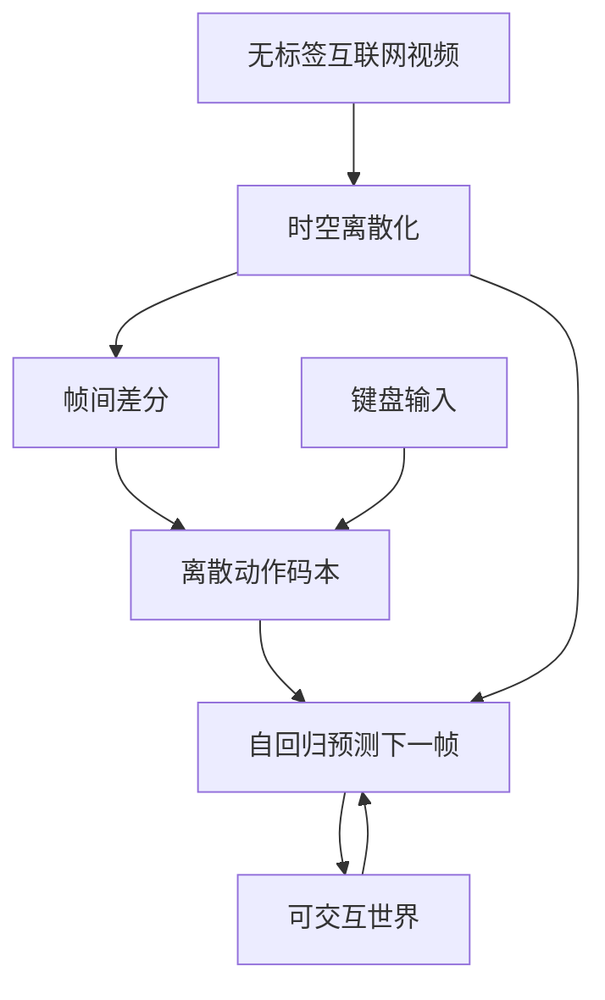

# Day 04 — Genie: Generative Interactive Environments (World Model)

> 📖 阅读版：https://papa-panda.github.io/post-training/physical-ai/day-04-2024-genie-world-model/

> Day 04 of physical-ai track, following Day03 Isaac Lab. First World Model entry.

## 元信息
- Title: Genie: Generative Interactive Environments
- Authors / Org: DeepMind — Bruce, Dennis, Edwards, Parker-Holder, Shi et al. (Feb 2024 Genie 1, Dec 2024 Genie 2, Aug 2025 Genie 3)
- Link / Blog: https://deepmind.google/research/publications/60474/ / https://en.wikipedia.org/wiki/Genie_(world_model) / https://techcrunch.com/2025/08/05/deepmind-thinks-genie-3-world-model-presents-stepping-stone-towards-agi/
- Date read: 2026-08-25
- Tags: [physical-ai, world-model, genie, sim2real, interactive-env, latent-action]
- Thread: physical-ai
- Folder: day-04-2024-genie-world-model
- GitHub: https://github.com/Papa-Panda/post-training/tree/master/physical-ai/day-04-2024-genie-world-model

## 一句话总结
Genie 是 DeepMind 的 foundation world model，从无标签 Internet videos 无监督训出，通过 spatiotemporal video tokenizer + autoregressive dynamics + latent action model，用单图/文本 prompt 生成可帧级交互的虚拟世界，11B 参数起点，Genie 2 扩展到 3D 10-20s 360p，Genie 3 到 720p 24fps 实时交互 1-2 分钟记忆。

## 大纲

- **世界从哪来**：无标签 Internet 视频 → 时空 tokenizer 离散化
  - 约 200k+ hours 游戏/网络视频（初读估计，未经证实），无需 action 标注
  - 时空压缩：视频 → 离散 tokens（VQ-VAE 时空版），把世界变成"语言"
- **动作从哪来**：帧间差分 → latent action model
  - 无监督：看两帧差，VQ 聚出离散 action codebook（Genie 1 demo 为 8 个）
  - 隐含假设：帧间变化多由 agent 动作引起——游戏/第一人称视频成立，纯旁观视频不成立
- **世界怎么转**：自回归 dynamics + 动作条件 → 帧级交互
  - Transformer：历史 tokens + latent action → 下一帧 tokens（cross-entropy 训练）
  - 键盘输入映射到 latent action space，用户帧级控制
- **记忆与 scale**：1s → 10–20s → 约 1min；720p 24fps 实时
  - 记忆 = history conditioning（长上下文），不是显式地图
  - 上限口径 vs 工程现实：GDC 2026 承认几分钟后相干性崩
- **三条 sim 路线分工**：Day02 公理层 / Day03 规模层 / Day04 生成层
  - 生成层负责覆盖度，规模层负责吞吐，公理层负责正确性
  - 互补：Genie 生成 diverse edge cases → Isaac 做 physics-correct filter
- **边界**：统计涌现的物理，不是因果保证
  - 官方承认 "not yet physics-aware"（穿过仙人掌）；latent action 语义天花板未被证明；全闭源不可验证

## 流程图

## 和之前工作的关系

- **接了哪条线：** 接 Day01 ARI/MSL 的 physical AGI 定义（learning from human experience）和 Day02 MuJoCo / Day03 Isaac Lab 的仿真基座线。MuJoCo/Isaac 是 physics-grounded sim，Genie 是 generative world model，两条 sim 路线分叉。
- **补了哪个短板：** 物理仿真器需要手工建 MJCF/USD + 材质，Genie 直接从视频学 dynamics，无需 action labels，用 latent action 隐式控制，补“如何从海量无标签视频 scale 出可交互环境”的短板。
- **替代 / 分叉 / 改进：** vs Isaac Lab：Isaac 准确但贵、需建模；Genie 便宜可无限生成但物理一致性弱，gamey artifacts。两者可互补：Genie 生成 diverse edge cases，Isaac 做 physics-correct filter。
- **对你 Infra 迁移的直接对比：** 你 ai-data 的合成数据 flywheel (Self-Instruct → Evol-Instruct) 类比到 Genie 的无标签视频 → latent action → endless envs，infra 挑战都是如何评一致性和防止漂移。

## 为什么今天读它

World Model 是 Physical AI 的另一半，Meta MSL 要做 personal superintelligence in physical world，需要能在想象中 rollout 的 model，Genie 是最经典的 foundation world model 基线，理解它才能看懂后续 UniSim / DreamerV3 / Waymo World Model。

## 今天的 3 问
1. Genie 如何在无 ground-truth action 情况下学出 latent action model？ST tokenizer 如何把视频切成离散 tokens 供 autoregressive dynamics 学？
2. Genie 1 → 2 → 3 的记忆从 1s → 10-20s → 1min + 720p 24fps 的关键技术跃迁是什么？自回归误差累积怎么缓解？
3. 对比 Isaac Lab 的 physics-correct sim，Genie 的 generative sim 在训练 humanoid VLA / RL 时 pros/cons？能否用 Genie 生成数据 + Isaac 验证形成闭环？

## 核心

1. **Motivation**: 传统 world model 需要 domain-specific + action labels，难以 scale。Genie 目标是从无标签 Internet videos 无监督训出可交互环境生成器，promptable via text / synthetic image / photo / sketch，endless variety，为 generalist agent 提供无限训练场。

2. **System / Method**:
   - **架构三件套 (11B Genie 1)**：spatiotemporal video tokenizer (视频 → 离散 tokens，类似 VQ-VAE 时空版) + autoregressive dynamics model (Transformer 预测下一帧 tokens，条件是历史帧 + latent action) + simple scalable latent action model (从相邻帧差分无监督学出离散 action codes，无需人工标)。
   - **交互**：用户键盘输入映射到 latent action space，帧级控制，尽管训练时无 action labels。
   - **Genie 2**：diffusion-based 3D，Imagen 3 生成首帧，支持 first-person / isometric / third-person，10-20s 一致性，记忆被遮挡后重现优于 Oasis。
   - **Genie 3**：实时交互，720p 24fps，promptable world events (改天气/加物体/调相机)，视觉记忆 1 分钟，自回归生成但保持物理一致性，Waymo 用其变体训 robotaxi edge cases。
   - **Project Genie (2026)**：Google AI Ultra 订阅 Web UI，World Sketching / Exploration / Remixing。

3. **Training / Data Details**:
   - 数据：大规模无标签 Internet videos + platformer 游戏视频，约 200k+ hours (?)，无需 action。
   - Tokenizer 训：重建视频帧，时空压缩。
   - Dynamics 训：给定历史 tokens + latent action 预测未来 tokens，cross-entropy。
   - Latent Action 训：看两帧差，学出可解释的离散 action codebook (8 actions in Genie 1 demo)，类似 VQ。
   - 无需 reward，可用于 imitation：从 unseen video 推断 latent actions 训 agent。

4. **Key Tricks**:
   - **Trick 1 - Latent Action from Video Only**：不靠人工标，用帧间变化无监督聚类出 action，避免 teleop 成本，和 Day01 ARI 的 human experience scaling 哲学同构。
   - **Trick 2 - Spatiotemporal Tokenizer + AR Dynamics**：把视频当语言，tokenizer 压到离散，Transformer 像 LLM 一样 next-token prediction 学世界 dynamics，复用 LLM infra。
   - **Trick 3 - Memory via History Conditioning**：Genie 2/3 通过 conditioning 过去 1 分钟帧来保持一致性，解决自回归漂移，类似 LLM 的 long context，物理一致性涌现而非显式编程。

5. **Results**:
   - Genie 1：2D platformer，1 fps，endless，11B 可控。
   - Genie 2：3D，360p，10-20s，multi-view，physics 推断水/烟但 gamey。
   - Genie 3：720p 24fps，1-2min，real-time interactive，promptable events，Waymo World Model 变体训 edge cases。
   - 对比：优于 Oasis 的记忆，Waymo 用其生成 street envs  via Street View。

## 可迁移 / Transfer

- **对你 Infra → Physical AI 迁移的 1-2 个直接启发：**
  1. **Data flywheel**：你 ai-data 的 15T → 5级过滤类比到 Internet video → ST tokenizer → latent action filter，如何从海量视频里筛出可交互片段是关键，质量门设计可复用。
  2. **Eval**：Genie 的一致性评测类似你 eval-bench-efficiency 的 IRT，如何自动评生成世界是否物理一致、记忆是否保持，可借鉴 VBench / physics benchmark。

- **Infra 视角：**
  - 可扩展性：Genie 像 LLM infra，tokenizer + AR 训练可 scale 到 100B，但 inference 24fps 实时要求高，需 speculative / distillation。
  - 成本：无标签视频便宜，比 Isaac 建模便宜，但训练 11B+ Transformer 贵。
  - 评测自动化：需 physics consistency / controllability 自动评，否则 human eval 贵。

## 疑问 / 下一步

- **没看懂的**：latent action codebook 具体大小和可解释性，8 个 action 如何覆盖 platformer 的复杂控制？
- **第一个实验**：跑 Genie 1 开源复现 (Oasis 300M) 对比，看 latent action 控制感；再试 Project Genie Web UI 生成一个 street scene 测记忆。
- **下一步预告**：Day05 UniSim — 真实世界交互模拟，real-world video + action 条件生成，和 Genie 的 game world 互补。

## 原文金句

> "We introduce Genie, the first generative interactive environment trained in an unsupervised manner from unlabelled Internet videos. The model can be prompted to generate an endless variety of action-controllable virtual worlds" — DeepMind Abstract

> "Genie 3 is the first real-time interactive general-purpose world model... It can generate both photo-realistic and imaginary worlds, and everything in between." — Shlomi Fruchter, DeepMind Research Director

## 今晚产出

- [x] Day04 Genie NOTES 初版
- [ ] Genie 2/3 vs Oasis 记忆对比视频
- [ ] Day05 UniSim 预习

## 连接
- 上一篇: Day03 Isaac Lab — GPU 规模化仿真
- 下一篇预告: Day05 UniSim — Real-world Interaction Simulator
- 相关: ai-data Day21 Self-Instruct (无标签合成类比), Day06 Phi-1 (合成数据)

## 参考链接
- DeepMind Genie: https://deepmind.google/research/publications/60474/
- Wiki: https://en.wikipedia.org/wiki/Genie_(world_model)
- Genie 3 TC: https://techcrunch.com/2025/08/05/deepmind-thinks-genie-3-world-model-presents-stepping-stone-towards-agi/
- Engadget Genie 2: https://www.engadget.com/ai/google-deepminds-genie-2-can-generate-interactive-3d-worlds-200708207.html

<!-- viz:vs: Isaac Lab | 准确但贵、需建模; physics-correct filter || Genie | 便宜可无限生成; 物理一致性弱; 生成 diverse edge cases -->
<!-- viz:stats: 记忆 1s → 10-20s → 1min | 720p 24fps -->

## 第二轮复习（2026-09-29）

> 本轮补三处初读未收录的公开进展（2026-01 Project Genie 订阅落地、2026-05 I/O Street View 集成与 Waymo 生产部署、2026 GDC 相干性/物理感知的官方承认）+ 一处记忆口径修正。初读技术事实无硬伤。

### 元信息修正

- **Project Genie 落地口径**：NOTES 写 "Project Genie (2026)：Google AI Ultra 订阅 Web UI"——补具体口径：gated rollout 始于 **2026-01-29**，Google AI Ultra **\$200/月**档，18+，发布时仅限美国（第三方规格对照表口径；Google 未发正式新闻稿）。Genie 3 从"研究预览"变成"付费订阅功能"，但权重/API 依然全闭源。
- **Street View 集成（Google I/O，2026-05-19，官方口径）**：Genie 3 接入 Street View 的 **2800 亿张图像（110 国、七大洲）**，可在 AI 生成的真实地点仿真中导航；**Waymo 已在生产中**用 Genie 3 训练自动驾驶罕见场景（龙卷风、路上遇到大象等危险/难复现场景）。NOTES 初读"Waymo 用其变体训 robotaxi edge cases"被官宣坐实——但注意这是"edge case 补充"，不是主训练环境。
- **记忆口径修正**：NOTES 写"Genie 3…视觉记忆 1 分钟"——GDC 2026 上 DeepMind 团队承认（GameFile Stephen Totilo 现场报道）：前 1 分钟顺滑，**几分钟后基本崩掉**；产品经理 Diego Rivas 承认画面"更像游戏而非照片"且模型 **"not yet physics-aware"**（演示中角色穿过仙人掌不受影响）；研究员 Jack Parker-Holder 估计交互式世界生成在精度上落后视频生成 6–12 个月。"1–2 分钟记忆"是上限口径，工程现实是约 1 分钟相干窗口 + 之后衰减。

### 一句话总结

34 天后回看，Genie 的本质不是"视频生成器"，而是"用 latent action 把无标签视频变成可交互环境"的接口发明——它回答了整条路线里其他 Day 都没回答的问题：当你没有 action 标注（Day16/17 的 teleop 太贵、Day02/03 的建模太贵）时，如何从 Internet scale 的视频里"偷"出可交互性？代价是把物理正确性换成统计合理性——GDC 2026 亲口承认的"几分钟崩"和"穿过仙人掌"，就是这笔交易的收据。

### 和之前工作的关系

- **vs Day02 / Day03（直接对比：三层栈）**：Day02 是公理层（接触怎么算对），Day03 是规模层（一次跑 16,384 个世界），Day04 是生成层（世界从哪来）。初读说"两条 sim 路线分叉"（physics-grounded vs generative）；复习更新为三层栈——Genie 不是 Day03 的竞争者，是 Day03 上游的"世界供应商"：生成层负责覆盖度，规模层负责吞吐，公理层负责正确性。初读"Genie 生成 diverse edge cases → Isaac 做 physics-correct filter"的互补预判不变，但分工更明确了。
- **vs Day09/10（总览脚手架）**：RT-2 / OpenVLA（Day09）的 VLA 训练需要"无限环境"，Genie 的 endless worlds 正是为这类 generalist agent 准备的训练场；Habitat 3.0（Day10）是 social / HITL 场景仿真，Genie 是"从视频里长出来的场景仿真"——两个总览 Day 定了"仿真从哪来"：authoring（Habitat / Isaac）vs generation（Genie）。Day10 的 HITL 在 Genie 里对应的是"键盘映射 latent action"的人机交互闭环。
- **vs Day11–18（分专题：VLA 与数据）**：π₀ / Diffusion Policy / Octo / π₀.₅（Day11–14）全都吃"action 标注数据"；Genie 的 latent action 是"无标注数据的 action 化"——它把 Day15–17（OXE / DROID / BridgeData）的 teleop 标注成本问题绕过去了，但绕过去的代价是 latent action 的语义不可审计（8 个 codebook entry 在 demo 里可解释，scale 到复杂操控时是什么，没人知道）。DROID（Day16）的真机数据 vs Genie 的生成数据：前者贵但因果保真，后者便宜但幻觉不可控。
- **vs Day19–24（RL / sim2real）**：Day19 PPO 的 rollout 需要环境 step；Genie 提供的是"可交互的视频环境"。Day21 domain randomization 随机化的是物理参数；Genie 的"随机化"是 promptable world events（换天气、加物体）——随机化从参数空间搬到了语义空间。Day24 的系统辨识（SimOpt）要求环境参数可辨识；Genie 的环境没有显式参数——辨识对象从"物理参数"变成了"生成分布"，这是 Day24 方法论在生成式路线上的断裂点。
- **vs Day25–30（physical AGI / eval / safety）**：Day27 Cosmos 是 Genie 路线的开源/infra 化（2026 年已有 Cosmos 3），定位几乎同构（tokenizer + diffusion/AR 双路线），区别是 Genie 3 闭源走订阅、Cosmos 开源可下载——"世界模型"正在重复 LLM 的"闭源 API vs 开源权重"分裂。Day28 的评测四轴（state / action / latency / safety）：Genie 的 720p 24fps 答了 latency 轴，promptable events 答了 state 多样性，但 action 轴（latent action 不可审计）和 safety 轴（穿过仙人掌）是空的。Day29 的 CBF 安全证书需要显式动力学——Genie 给不了，这是生成式路线进安全关键部署的硬门槛。Day30 飞轮的 resimulate 分支：Genie 可以做"语义级 resimulate"（把失败场景的 prompt 变体生成 100 个），这是 USD authoring 做不到的——生成层在飞轮里的位置是"失败场景的语义放大器"，而不是 regression suite（后者要固定 seed 可复现，生成式给不了）。
- **vs Day31–34（最新进展）**：Day31 Atlas（World Labs，2026-09-01，"首个从零训练的多模态世界模型"）vs Genie 3：同一条赛道，Atlas 强调 multimodal + 像素级相机控制 + real-to-sim，Genie 3 强调实时交互 + Street View 真实地理；World Labs 还有 Marble 1.1（2026-04，persistent 3D，可导出 Gaussian splat）——Atlas / Marble 是"可导出的世界"，Genie 是"可玩的世界"，产品形态分叉。Day32 GPT-6 Astra 的 computer-use 是数字世界的"Genie"：OS / API 沙盒里的 action-controllable 世界模型——横向对照成立：两者都是"把无标注轨迹（视频/屏幕录像）变成可交互环境"，只是公理层不同（物理 vs OS）。Day33 Figure Helix 2.5 的 30 家庭 56%：家庭长尾的视觉多样性正是 Genie 类生成最想吃的地盘，但 Helix 选的是真机数据（Index）+ 冻结 checkpoint——说明在"进别人家"这件事上，行业现阶段仍不信任生成式数据做主力。Day34 π₀.₇ 的组合泛化（BAGEL 14B 世界模型产 subgoal 图）：BAGEL 是"装在 policy 里的世界模型"，Genie 是"装在环境里的世界模型"——世界模型应该住在哪？π₀.₇ 把记忆/规划内化进 policy，Genie 把记忆外包给环境生成器，两种架构对"记忆 vs 理解"的回答不同（见思考题 c）。

### 核心

1. **Motivation 深挖**：为什么 DeepMind 不直接拿视频训视频生成器（那时 DiT 已经很火）？因为"可交互性"才是 world model 与 video model 的分界线。视频生成器回答"给定 prompt，世界看起来像什么"；world model 必须回答"给定我的动作，世界下一刻变成什么"。Genie 的真正创新是把后者变成前者可解的问题：用 latent action model 从相邻帧差分中"蒸馏"出离散 action codebook，把"无 action 标注"这个致命缺失变成自监督可解。这和 LLM 的"next-token prediction 吃掉一切"是同一哲学：把交互问题压成序列建模问题。
2. **机制 = 三件套的因果链**：ST tokenizer（视频→离散 tokens，时空压缩）解决"视频太大训不动"；latent action model（帧间差→VQ codebook）解决"没有 action 标签"；AR dynamics（Transformer，条件历史 tokens + latent action，预测下一帧）解决"怎么交互"。键盘输入→映射到 latent action space→条件 dynamics→下一帧。数学上，给定相邻帧 $x_t, x_{t+1}$ ，编码器输出 $e_t = f_\phi(x_t, x_{t+1})$ ，经 VQ 得到离散动作 $z_t = \arg\min_{k \in [K]} \|e_t - c_k\|_2$ ，dynamics 建模

   $$p_\theta(x_{t+1} \mid x_{\le t}, z_t)$$

   以 cross-entropy 训练。关键洞察：latent action 不是"真正的动作"，是"帧间变化的可压缩解释"——它之所以 work，是因为 Internet 视频里的大部分帧间变化确实由某个 agent 的动作引起（游戏视频、第一人称视频）。这个假设在街景/驾驶视频里成立，在纯旁观视频里不成立——这就是 Genie 1 选 platformer 游戏视频训的原因，也是它的适用边界。
3. **记忆的机制**：Genie 2/3 的"记忆"不是显式地图，是 history conditioning（把过去约 1 分钟的帧喂给 AR 模型当长上下文）。这解释了为什么"遮挡后重现"work（上下文里有），也解释了为什么"几分钟后崩"（上下文窗口外 + 自回归误差累积）。对比 Day06 DreamerV3 的 RSSM（确定性隐状态 + 随机隐状态显式建模）：Genie 的记忆是"暴力上下文"，Dreamer 的记忆是"结构化状态"。前者 scale 简单（加上下文就行），后者可审计（隐状态可探查）。1 分钟→几分钟的崩溃曲线，本质是"上下文记忆"的容量衰减曲线。
4. **Scale 的数学**：11B（Genie 1）→ 720p 24fps 实时（Genie 3）。实时 24fps 意味着每帧预算 $T_{frame} \le 1/24 \approx 42\,\text{ms}$ ，AR 生成每帧要过整个 Transformer——这是 inference infra 问题（NOTES 的 infra 视角已指出 speculative / distillation 方向）。训练侧是"LLM 化"：tokenizer + AR，复用 LLM infra——这是 Genie 能 scale 而 Isaac 建模不能 scale 的根本原因："把世界变成 tokens"之后，scale 的敌人只剩下算力，不再是人力建模。

### 边界

1. **"not yet physics-aware"是官方承认的边界**：GDC 2026 演示里角色穿过仙人掌不受影响（PM Diego Rivas 亲口）。含义：Genie 的"物理一致性"（水/烟的视觉合理）是统计涌现，不是因果保证。任何需要接触力真值的任务（dexterous manipulation、locomotion 的足底接触）都不能用 Genie 做唯一训练环境——Day02 的"准的是求解器"在这里反过来：Genie 连求解器都没有。
2. **记忆上限是工程现实，不是营销数字**："前 1 分钟顺滑、几分钟后崩"（GameFile Stephen Totilo，GDC 2026 现场）。任何依赖长时程一致性的 eval（multi-room 导航、长任务链）都会撞墙。NOTES 的"1–2 分钟"是上限口径。
3. **Latent action 的语义天花板**：Genie 1 demo 的 8 个 action 在 platformer 里可解释；复杂操控（双手、多指）的帧间差分是否还能聚出可解释、可组合的 codebook？没有证据。Latent action 的可组合性是未被证明的——而这恰恰是 Day34 π₀.₇ 组合泛化需要的前提（"做没教过的任务"需要动作原语可组合）。
4. **证据没有证明的**：Waymo 的生产部署证明的是"长尾场景生成有用"，没证明"生成数据能训出比真机数据更强的 policy"；Project Genie 的订阅制证明的是"消费者愿意为可玩世界付费"，没证明"robot learning 需要它"。把"Waymo 在用"读成"sim2real 已解决"是这篇最容易的误读——Waymo 用它做 edge case 补充，不是做主训练环境。
5. **闭源的不可验证性**：Genie 3 权重/API 全不公开（订阅制 Web UI），第三方无法复现任何数字。对比 Day27 Cosmos 开源权重——"世界模型"的可信度目前完全依赖公司自报。Day31 Atlas 同样（无公开论文/权重/API）——这条赛道（Day04 / 27 / 31）整体处在"信任公司 blog"的阶段。

### 迁移到 post-training / Agentic RL Infra

- **可执行的映射**：把 Genie 的"latent action model"搬进你的 agentic RL 数据管线——从大量无标注的 agent 轨迹（tool calls + observations，有轨迹、无 intent / reward 标注）里训一个 **latent intent VQ 模型**：输入 $(obs_t, obs_{t+1})$ 的差分（tool call 前后状态变化），VQ 聚出 32–64 个离散 intent codes。第一步可执行实验：取你现有的 coding agent 轨迹日志，训 VQ-VAE，检查 codebook 是否自发聚出 read / edit / run / test / commit 这类可解释 intent（Genie 在 platformer 里聚出 8 个可解释 action 的直接复刻）。如果可解释，第二步：intent-conditioned 的轨迹生成器 = agentic 版的"endless envs"，用来做 offline RL 的 cheap simulator / policy 评估的反事实 rollout。这和你 coding data 的 exec-filter 同构：exec 是"真环境"的 verifier，intent 世界模型是"生成环境"的 cheap 近似——Day30 飞轮的 resimulate 分支在 agentic 域的落地。

### 思考题（综合 Day04 / Day05 / Day06 / Day27 / Day28 / Day29 / Day31 / Day34）

- **(a) Latent action vs 真实 action 的四象限**：Day04 的 latent action（无标注视频→VQ codebook）、Day05 UniSim 的 action-conditioned video diffusion（真实 action 条件）、Day16 / 17 DROID / BridgeData 的真机 teleop 数据。从"scale 成本"和"因果保真"两个轴画四象限：什么任务只能用真 action（提示：Day29 的 CBF 安全证书需要什么数学性质？Day28 的 penetration / jitter 评测需要什么真值？），什么任务 latent action 够用（提示：Day33 家庭场景的长尾视觉多样性）？Day05 UniSim 的混合路线（action-conditioned + learned simulator RL）在这个四象限里占哪个位置——它是"两头吃"还是"两头不靠"？
- **(b) 生成式世界的"可验证性"悖论**：Day30 飞轮要求 sim regression suite（固定 USD 资产 + 固定 seed 可复现）+ gated deploy；Day04 / 27 / 31 的生成式世界每次生成都不同。如果一个 policy 在 Genie 生成的 1000 个世界里测出 95% 成功率，这个数字落在 Day28 四轴（state / action / latency / safety）的哪个轴上、缺了哪几个轴？设计"生成世界 → 物理过滤器（Day03 Isaac）→ gated deploy"三级门：每级的输入/输出/拒绝条件是什么？Day31 Atlas 的 real-to-sim（手机 24 帧视频建世界）能进第几级门？
- **(c) 世界模型的记忆应该住在哪**：Genie 3 的约 1 分钟记忆靠 history conditioning（暴力上下文，几分钟后崩），Day06 DreamerV3 的 RSSM 用结构化隐状态，Day34 π₀.₇ 把世界模型（BAGEL 14B）内化进 policy 产 subgoal 图。三种"记忆"架构：记忆外包给环境（Genie）、记忆做成显式状态（Dreamer）、记忆内化进策略（π₀.₇）。当遮挡物移开需要"重现"时，哪种给出可审计的记忆？这对"组合泛化"（Day34 做没教过的任务）意味着什么——可组合的记忆单元应该存在 policy 的权重里，还是环境的生成器里？如果让你为 Day33 Figure Helix 2.5 的 30 家庭泛化选一种记忆架构，你选哪个，为什么？

参考链接（本轮复习）：
- Genie 3 Street View 集成 / Waymo 生产部署（Google I/O 2026-05-19）：https://tpsreport.news/news/google-deepmind-genie-street-view-integration
- GDC 2026：相干性衰减与 "not yet physics-aware" 承认：https://www.tweaktown.com/news/110471/genie-3s-ai-generated-worlds-fall-apart-after-a-few-minutes-google-admits/index.html
- Genie 3 / Marble / Cosmos / Oasis / HY-World 规格对照（2026-09）：https://tech-insider.org/genie-3-vs-marble-vs-nvidia-cosmos-world-models-2026/

GitHub NOTES：https://github.com/Papa-Panda/post-training/blob/master/physical-ai/day-04-2024-genie-world-model/NOTES.md

<!-- viz:stats: Street View 2800亿张图 · 110国（I/O 2026） | AI Ultra 200美元/月 · 2026-01-29 gated rollout -->
<!-- viz:flow: 无标签视频 → 时空离散化 → 帧间差分 → 动作码本 → 自回归预测 → 帧级交互 -->
