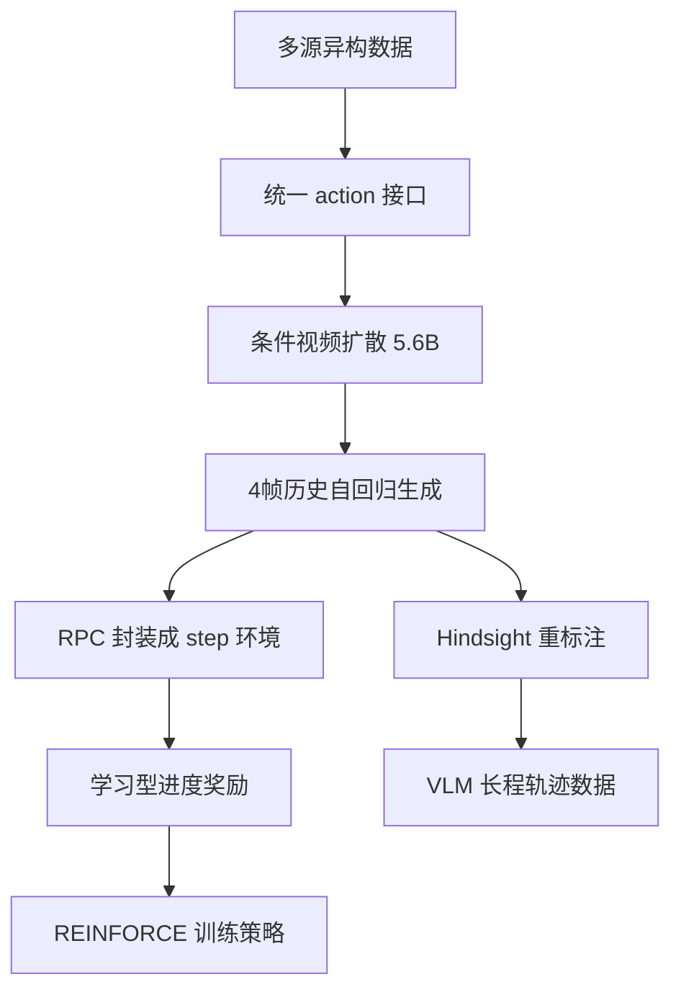

# Day 05 — UniSim：Learning Interactive Real-World Simulators

> 📖 阅读版：https://papa-panda.github.io/post-training/physical-ai/day-05-2023-unisim/

> Day 05 of physical-ai track, following Day04 Genie. Focus on action-conditioned video diffusion as a learned simulator for real-world interaction and policy training.

## 元信息
- Title: Learning Interactive Real-World Simulators
- Authors / Org: Sherry Yang, Yilun Du, Seyed Kamyar Seyed Ghasemipour, Jonathan Tompson, Leslie Kaelbling, Dale Schuurmans, Pieter Abbeel / UC Berkeley, Google DeepMind, MIT, University of Alberta
- Link / arXiv / Project: https://arxiv.org/abs/2310.06114 / https://universal-simulator.github.io
- First submitted: 2023-10-09
- Date read: 2026-08-26
- Tags: [physical-ai, world-model, unisim, video-diffusion, sim2real, vla, model-based-rl]
- Thread: physical-ai
- Folder: day-05-2023-unisim
- GitHub: https://github.com/Papa-Panda/post-training/tree/master/physical-ai/day-05-2023-unisim

## 一句话总结
UniSim 把互联网图像/视频、人类活动、全景扫描、仿真和真实机器人数据统一成 `action in → video out`：用 5.6B action-conditioned video diffusion 预测下一段观察，再把生成式世界包成 RL environment；在 Language Table 上，纯模拟 rollout 的 RL 把成功率从 BC 的 0.58 提到 0.81，并展示了 zero-shot real-robot transfer。

## 大纲

- **统一接口**：互联网图像/视频、人类活动、全景扫描、仿真、真机机器人数据 → 全部压成 `action in → video out`
- **Action 归一化**：T5 语言 embedding ＋ 连续控制离散到 4096 bins ＋ 相机位姿，三种粒度压进同一条件向量
- **条件视频扩散**：5.6B 3D video U-Net，三级时空分辨率 `[16,24,40]` → `[48,80]` → `[192,320]`，4 帧历史条件 ＋ classifier-free guidance
- **学成环境**：自回归 rollout ＋ RPC/DM Env API 封装成 `step()`，64 actor 进程，learned steps-to-success 进度奖励，REINFORCE 训策略
- **三类下游**：VLM hindsight 长程轨迹数据、simulator RL（0.81 vs BC 0.58）、captioning 数据增强（达真实数据 84%）
- **证据边界**：纯视觉无接触力、256 步扩散太慢、真机成功率只有定性展示、mixture 权重未精调

## 流程图

## 和之前工作的关系

- **接了哪条线：** 接 Day04 Genie 的 learned world model 路线，但从“无标签视频中发现 latent action”转向“显式把语言、机器人控制、相机运动统一成 action condition”，更直接服务 policy training。
- **补了哪个短板：** Genie 擅长开放式、可交互世界生成，但 action grounding 偏隐式；UniSim 把 high-level instruction 和 low-level control 都纳入统一接口，并展示 VLM hindsight data、model-based RL、real-robot zero-shot transfer 三种下游用途。
- **替代 / 分叉 / 改进：** 相对 Day02 MuJoCo / Day03 Isaac Lab，UniSim 不显式求解接触和刚体动力学，而从像素经验学习视觉后果；它能吸收真实世界长尾外观，却失去精确 state、force/contact observability 和 hard physical constraints。
- **对之前 Day X 的直接对比：** Day03 的 transition 是 PhysX solver，Day04 的 action 是 learned latent code，Day05 的 transition 是 video diffusion，action 是 T5 language embedding + discretized controls。三者分别代表显式物理、隐式交互和显式条件生成三种 simulator abstraction。

## 为什么今天读它

Day05 路线图指定 UniSim。它把 world model 从“好看的交互视频”推进到“可被 agent 反复 step、可接 reward、可做 policy optimization 的环境”，与 Agentic RL Infra 的 rollout server / actor-learner / learned verifier 结构高度同构。

## 今天的 3 问
1. **异构数据怎样进入同一个 action space？** 文本指令、连续机器人控制、相机位姿和静态图像分别如何对齐到可条件化的视频 transition？
2. **生成模型怎样成为 RL environment？** `p(o_t | h_{t-1}, a_{t-1})` 如何 autoregressive rollout，reward 从哪里来，simulator bias 又会怎样被 policy exploit？
3. **“视觉逼真”是否足够支撑 sim2real？** UniSim 的 zero-shot 展示证明了什么，又没有证明什么；如何加入 contact、force、uncertainty 和真实闭环校准？

## 核心

1. **Motivation：世界数据各自只覆盖一条轴**
   - 互联网图像覆盖丰富对象/场景但缺动作；human activity video 有高层动作但少机械控制；robotics data 有稠密 control 却规模小；panorama 有空间变化但无真实交互。
   - 单一数据集无法同时学到 object diversity、action granularity、embodiment 和 navigation。UniSim 的核心命题不是“一个数据集包打天下”，而是把互补数据编排进统一 `action-in-video-out` 接口。
   - 真正目标是可交互 observation prediction，而非一次性 text-to-video：给定近期观察与动作，生成动作的视觉后果，并跨 video segment 自回归展开。

2. **System / Method：统一 action-conditioned observation prediction**
   - 定义 transition：`p(o_t | h_{t-1}, a_{t-1})`。`o_t` 是下一段可变长度视频，`h_{t-1}` 是有限近期帧，`a_{t-1}` 可为语言、相机运动或低层 motor control。
   - 文本先经 T5 得到连续 embedding；连续 control 先 normalize，再离散到 4096 bins，并与 language embedding 拼接。静态 text-image 被视为 single-frame video；panorama 由 camera pose 构造 turn/move action。
   - 生成器是 5.6B 3D video U-Net：base model 在 `[16,24,40]` 时空分辨率预测，两个 spatial super-resolution stages 依次放大到 `[48,80]` 与 `[192,320]`；时空 attention / convolution 交错。
   - 历史条件取上一 segment 的 4 帧，沿 channel 维与未来帧 noise 拼接；action 通过 classifier-free guidance 注入。下一 segment 再条件于刚生成的帧，形成 autoregressive rollout。
   - 训练规模：512 TPU-v3、20 天、1M steps、batch 256、256 diffusion sampling steps。模型规模从 500M → 1.6B → 5.6B 时 FVD 277.85 → 224.61 → 211.30，但作者指出收益开始平台化。

3. **Training / Data Details：多源 mixture + 生成式 rollout + learned reward**
   - **数据组成：** Habitat HM3D 710、Language Table sim 160k、Bridge Data 2k、RT-1 70k、Language Table real 440k、Ego4D 3.5M、Something-Something V2 160k、EPIC-KITCHENS 25k、Matterport R2R scans 3.5M、LAION-400M 400M、ALIGN 400M、互联网视频 13M，外加未公开的 robot/human video collections。
   - **Mixture：** 各域权重仅用 0.05 或 0.1，未精调。低数据域可在 action 前加 dataset identifier 提升 in-domain generation，但会伤害 out-of-domain generalization。
   - **长程 VLM data：** 在 simulator 中每条轨迹 rollout 3–5 次 scripted instruction，合成 10k long-horizon trajectories；以最终帧为 goal 做 hindsight relabeling，再训练 image-goal-conditioned PaLM-E policy。
   - **RL loop：** PaLI 3B 先做 BC、steps-to-success prediction、instruction prediction；把 video generation 暴露为 RPC，并用 DM Env API 包成 `step()`。64 actor processes 在 UniSim 中 rollout，冻结的 steps-to-success model 产生 progress reward，REINFORCE 更新 policy。
   - **Reward：** `r_t = -[d(o_{t+1},g)-d(o_t,g)]·C`，其中 `d` 预测距离成功还剩多少步，`C=5e-2`。这是 learned visual progress verifier，不是 simulator 自带 ground-truth state reward。

4. **Key Tricks：最值得抄的细节**
   - **Trick 1 — Action-space normalization, not raw dataset merging：** 先把不同数据集统一成 temporally extended action + video segment，再做 mixture；数据 schema 比“多收数据”更关键。
   - **Trick 2 — Finite recent history as practical state：** 4 个 recent frames 把 Ego4D FVD 从 315.69 降到 211.30，优于单帧和 distant history；不是记忆越长越好，而是要找足够 Markov 的最小窗口。
   - **Trick 3 — Hindsight relabeling turns stochastic generation into supervision：** 先 rollout，再把真正到达的末帧当 goal，避免要求生成器严格命中预设目标；相当于把 model error 吸收进 label construction。
   - **Trick 4 — Simulator 与 reward 解耦：** transition model 只预测观察，reward 单独学习；同一 simulator 可以复用到多任务，但也必须防 reward model 与 simulator 共同偏差被 policy exploit。
   - **Trick 5 — RPC environment boundary：** 把昂贵 video generation 包在远端 environment service 后面，actor-learner 不依赖模型内部实现；这正是可横向扩容、限流、版本化和 shadow evaluation 的 infra seam。

5. **Results：有效，但证据边界要说清**
   - **视频预测：** Ego4D 上 4 recent-frame conditioning 达到 FID 34.63、FVD 211.30、IS 3.52、CLIP 22.63；单帧条件为 FID 59.47、FVD 315.69。
   - **长程 policy：** 10k UniSim hindsight trajectories 训练的 VLM，在 5 次模拟评估中 RDG(moved/all) 为 0.34/0.34；短程 BC 为 0.11/0.07，约 3–4× 提升。
   - **RL：** Language Table 的 48 个模拟任务中，Simulator-RL overall success 0.81 vs VLA-BC 0.58；pointing tasks 为 0.71 vs 0.12。
   - **Real robot：** 论文给出 simulator-only training 后的 zero-shot Language Table 成功案例，但主要是定性展示，没有报告与表 3 同等级的大样本真实机器人成功率；不能把 0.81 当作真实机器人 success rate。
   - **跨任务生成数据：** PaLI-X 仅用 UniSim 生成视频微调后，ActivityNet CIDEr 从 15.2 升到 46.23，达到真实数据微调 54.90 的约 84%；并在 MSR-VTT / VATEX / SMIT 上超过只用 ActivityNet 真实数据微调。

## 可迁移 / Transfer

- **方法在 held-out 上是否 transfer？模型 vs 框架哪个贡献更大？**
  - UniSim 展示了跨数据类型与少量 real-robot zero-shot transfer，但作者明确指出：训练主要覆盖 4 种 robot morphology，未见 embodiment 上泛化有限。这里的贡献更像“统一数据接口 + 足够大的条件视频模型”，不是一个已解决通用物理规律的 simulator。
  - 数据 ablation 中，internet-only FVD 219.62、without-internet 307.80、完整 mixture 211.30，说明 broad prior 与 action-rich domain data 缺一不可；不是单纯扩大模型就能替代数据编排。

- **对 Infra → Post-training → Physical AI 迁移的直接启发：**
  1. **World-model rollout server ≈ RL rollout engine：** model version、environment seed、action schema、history window、sampling config、reward version都必须进入 trajectory metadata，否则无法复现和定位 reward hacking。
  2. **Learned simulator 需要 uncertainty-aware routing：** 高置信常规段走生成 simulator，contact-heavy / OOD 段回退显式物理或真机数据；像 cascade evaluator，而不是让单一模型裁决全部 rollout。

- **Infra 视角：可扩展性 / 成本 / 评测自动化 / 可复现性：**
  - **可扩展性：** 256-step diffusion 极慢，actor 会被 environment latency 主导；需要 batching、异步 actor、rate limiting、cache，未来更适合 latent video model / consistency distillation。
  - **成本：** 512 TPU-v3 × 20 天约 245,760 chip-hours，只是 simulator pretraining；policy rollout 还持续支付生成成本。
  - **评测自动化：** FVD/CLIP 只能测感知质量，必须加 action compliance、object permanence、contact consistency、counterfactual consistency、closed-loop policy regret 和 real-robot calibration。
  - **可复现性：** 记录 dataset mixture、domain identifiers、CFG strength、history frames、diffusion seed、simulator checkpoint、reward checkpoint 与 RPC version；否则同一 action 的 stochastic outcome 无法审计。

## 疑问 / 下一步

- **想深挖：** 如何定义 `model exploitation gap`：同一 policy 在 UniSim、显式 simulator、real robot 三个环境中的 return / state visitation divergence？仅比较生成视频质量会漏掉最危险的 policy-induced distribution shift。
- **限制提醒：** unrealistic action 会触发 hallucination；近期 4 帧无法保存长期 object permanence；未见 morphology 泛化弱；只模拟视觉，不适合 force/contact 变化但像素近似不变的任务。
- **第一个小实验：** 不复现 5.6B 训练，先实现一个 toy RPC Gym env：用小型 action-conditioned video predictor 作为 `step()`，另训 progress reward；比较 BC 与 model-based rollout fine-tuning，并用 held-out ground-truth env 统计 exploit gap。
- **下一步：** Day06 DreamerV3——从像素级 diffusion simulator 切到 compact latent dynamics，比较 rollout throughput、reward grounding、uncertainty 与真实世界可迁移性。

## 原文金句 (1-2句)

> “We define a simulator of the real world as a model that, given some state of the world (e.g., an image frame), can take in some action as input, and produce the visual consequence of the action (in the form of a video) as output.”

> “We formulate the action-in-video-out framework as an observation prediction model conditioned on finite history and parametrized by a video diffusion model.”

## 今晚产出

- [ ] 画一页 `actor → RPC video env → learned reward → replay/learner` 数据流图，标清版本与 trajectory metadata
- [ ] 用表格对比 Isaac Lab / Genie / UniSim：state、action、transition、reward、throughput、可验证性、主要 failure mode
- [ ] 写出 5 个 learned-simulator eval：action compliance、object permanence、contact consistency、OOD detection、policy exploit gap
- [ ] 用 10 行伪代码写 UniSim 的 autoregressive `step()` 与 progress reward

## 连接
- 上一篇: Day04 — Genie: Generative Interactive Environments
- 下一篇预告: Day06 — DreamerV3: Mastering Diverse Domains through World Models
- 相关: Day02 MuJoCo（显式 dynamics）；Day03 Isaac Lab（GPU physics + sim2real）；后续 VLA / RL for Robotics

## 参考链接
- Paper (arXiv): https://arxiv.org/abs/2310.06114
- Project / demos: https://universal-simulator.github.io

<!-- viz:stats: 512 TPU-v3 20 天 1M steps | FVD 277.85→224.61→211.30 收益平台化 -->
<!-- viz:bars: Simulator-RL 0.81 | VLA-BC 0.58 -->
<!-- viz:stats: 15.2→46.23 ActivityNet CIDEr | 54.90 真实数据的约 84% -->
<!-- viz:vs: UniSim 显式条件动作 | 真实标注、粒度不一、可审计 || Genie 隐式 latent 动作 | 无标注可 scale、语义不可审计 -->

## 第二轮复习（2026-09-30）

> 本轮做一处 venue 考证（ICLR 2024 Outstanding Paper）＋一处作者表版本差异说明；无新论文发表，技术事实无硬伤。核心收获：把 UniSim 从"视频扩散模型"重读为"RL 环境即服务"的接口发明——它的 0.81 vs 0.58 是在自家模拟器里量的，这是它的创新，也是它从未被测量的原罪（simulator exploit gap）。

### 元信息修正

- **Venue 补记**：NOTES 初读未记录发表 venue——UniSim 发表于 **ICLR 2024**，并获 **Outstanding Paper Award**（第三方整理口径：world-models-hub 标注 "ICLR 2024 (Outstanding Paper)"，writing-best-practices 同样标注；arXiv 页本身不直接列奖项）。
- **作者表版本差异**：arXiv v1 作者表无 Leslie Kaelbling，v3 / ICLR 正式版加入 **Leslie Kaelbling（MIT）**；NOTES 初读的 7 人作者表与 v3/正式版一致，无需改动。
- **提交日期**：2023-10-09（arXiv ID 2310.06114 吻合），project 页 `universal-simulator.github.io` 仍可访问。

### 一句话总结

35 天后回看，UniSim 的本质不是"5.6B 视频扩散模型"，而是把 world model 从"可交互的视频"升级成"可被 RL 反复 step 的环境"的接口发明：action-space normalization ＋ 多源数据编排 ＋ RPC env boundary ＋ learned reward 解耦。它证明了 learned simulator 可以做 RL 训练场（0.81 vs 0.58），但这个数字是在被测 policy 可以 exploit 的环境里量的——simulator exploit gap 从论文到今天都没人量过，这是整条生成式路线欠下的一笔债。

### 和之前工作的关系

- **vs Day04（直接对比：显式 vs 隐式 action）**：Day04 从无标注视频"偷" latent action（VQ codebook，可 scale、语义不可审计），Day05 要求真实 action 标注并做统一归一化（贵、可审计）。UniSim 的 mixture 里其实也吃无标注数据（LAION/ALIGN 静态图视为 single-frame video），所以它是混合路线——代价是三种不同粒度（语言 instruction / 相机位姿 / motor control）的 action 被压进同一个 diffusion 条件空间，它们的"可组合性"论文从未证明。
- **vs Day02 / Day03（三层栈再确认）**：Day02 公理层（接触怎么算对）、Day03 规模层（一次跑 16,384 个世界）、Day05 是 Day04 生成层之下的"环境层"——把生成式世界包成可 step 的 RL 环境。Day24 的系统辨识在这里断裂：UniSim 没有可辨识的物理参数，calibration 对象从"物理参数"变成"生成分布"。
- **vs Day09/10（总览脚手架）**：RT-2 / OpenVLA（Day09）的 generalist agent 需要"无限环境"，UniSim 是"环境供应商"的原型；Habitat 3.0（Day10）是 authoring 出来的世界，UniSim 是"从数据里长出来的世界"——"仿真从哪来"的两种答案。
- **vs Day11–18（分专题：VLA 与数据）**：UniSim 吃的是 Day15–17 的数据（Bridge / RT-1 / Language Table / OXE 一系），吐出合成轨迹喂给 Day11–14 的 policy——它把数据飞轮的前半圈（数据→环境）和后半圈（环境→数据）闭环了。Dataset identifier 的 trick（加 identifier 提升 in-domain 生成、伤害 OOD）与 LLM 的 domain tag / 指令格式控制是同一现象。
- **vs Day19–24（RL / sim2real）**：UniSim 是 Day19 PPO rollout 的 learned-env 版本；Day20 RLPD 选"真机 in-the-loop"躲 exploit，UniSim 选"生成器 in-the-loop"赌覆盖度——两种对抗 exploitation 的答案。Day21 的 domain randomization 随机化物理参数，UniSim 的"随机化"就是数据 mixture 本身；Day23 residual RL 修的是显式 sim 的残差，UniSim 没有显式 sim 可修——residual 对象变成 diffusion artifacts。
- **vs Day25–30（physical AGI / eval / safety）**：Day27 Cosmos 是 UniSim 这条线的 infra 化（开源、可下载的视频世界模型）。Day28 四轴下：UniSim 的 FVD/CLIP 只答了感知质量，action compliance / contact consistency / closed-loop policy regret 全缺。Day29 的 CBF 安全证书需要显式动力学——UniSim 给不了。Day30 飞轮里：UniSim 的 hindsight relabeling 就是"用生成器做数据增强"的早期形态，是"失败场景的语义放大器"的前身。
- **vs Day31–34（最新进展）**：Day31 Atlas 的 real-to-sim（手机 24 帧视频建世界）是 UniSim"静态图像→可交互"的升级版；Day34 π₀.₇ 的 BAGEL 是"装在 policy 里的世界模型"，UniSim 是"装在环境里的世界模型"——记忆应该住在哪，见思考题 (c)。

### 核心

1. **Motivation 深挖**：为什么不用 Isaac / MuJoCo 直接做 RL？因为显式建模的瓶颈是人力——每个新场景都要建模。UniSim 把"建模"换成"数据编排"：transition 的正确性从"求解器保证"降级为"统计保证"，换来覆盖度。深层 trade：Day02 的公理可验证（contact solver 收敛），Day05 的公理是"像素看起来对"——这决定了它只能做 policy 的"预训练场"，做不了安全证书。初读说"吸收长尾外观、失去 hard constraints"，复习补一句：失去的不是 feature，是"可证伪性"。
2. **机制 = 数据接口 ＋ 条件生成 ＋ 环境封装的因果链**：(a) 数据编排——各域沿"动作丰富度"互补：internet 给外观、Ego4D 给人类动作、robotics 给稠密控制、panorama 给空间移动；(b) action 归一化——T5 embedding（语言）＋ 4096-bin 离散化（连续控制）＋ camera pose（导航），三种粒度压进同一条件向量，这是全文最关键也最脆弱的设计决策；(c) 环境封装——RPC ＋ DM Env API 把 256-step diffusion 的慢推理藏在 env 服务后面，actor-learner 不感知模型内部：这是可 scale 的 infra seam，但也意味着 policy 永远看不到 simulator 的 uncertainty。
3. **Reward 解耦的深意**： $r_t = -[d(o_{t+1}, g) - d(o_t, g)] \cdot C$ ，其中 $d$ 是 learned steps-to-success， $C = 5 \times 10^{-2}$ 。reward 和 transition 是两个独立学习的模型——policy 可以同时 exploit 两者。初读 Trick 4 说"防共同偏差"，复习补一句：论文没有任何 exploit 测量，0.81 是在可被 exploit 的环境里量的。这是整个 model-based RL 文献的通病，Day20 RLPD 选真机正是为了躲开这个问题。
4. **Scale 的数学**：5.6B 参数、512 TPU-v3 × 20 天 ≈ 245,760 chip-hours；FVD 277.85 → 224.61 → 211.30 收益平台化。对比 LLM 的 scale 曲线：world model 的收益平台化来得更早——瓶颈不在模型容量，在 action 标注数据的覆盖度。Mixture 权重只用 0.05/0.1 未精调——这是 2023 年的"大力出奇迹"阶段，类比 LLM 数据混合定律（DoReMi）的工作还没人做。

### 边界

1. **纯视觉，无接触力**：只模拟像素，不模拟 force/contact；像素近似不变但接触力变化的任务（grasp stability、插拔）完全不可用——Day02 的"准的是求解器"在这里反过来：UniSim 连求解器都没有。
2. **256-step diffusion 太慢**：actor 被 env latency 主导；论文的 64 actor 是实验室规模，真正的 RL 需要百万级 rollout——吞吐是这条路线的硬天花板（Day27 Cosmos 的 tokenizer 路线正是在回答这个问题）。
3. **真机证据只有定性展示**：0.81 是 simulator 内的数字；论文没有报告与表 3 同等级的大样本真机成功率——不能把 0.81 引用为 sim2real 证据。
4. **Morphology 泛化弱**：主要覆盖 4 种 robot morphology；unseen embodiment 无证据。
5. **4 帧历史的记忆天花板**：长期 object permanence 无保证；hindsight relabeling 把"没到达预设目标"吸收进 label——这掩盖了生成器的不服从（non-compliance），而不是修复它。

### 迁移到 post-training / Agentic RL Infra

- **可执行的映射**：把 UniSim 的"RPC env boundary ＋ 版本化 trajectory metadata"搬进你的 agentic RL rollout infra，做一次 **simulator 税测量实验**。具体三步：(1) 为 coding agent 训一个 action-conditioned next-observation predictor（输入：当前文件状态摘要 ＋ tool call，输出：tool 执行后的 observation 摘要）做 cheap simulator，action 先做 schema 归一化（read / edit / run / test / commit）；(2) 学一个 progress reward，类比 steps-to-success：预测"离任务完成还剩几步"；(3) 在 cheap sim 里做 RL，然后在真 exec 环境（Day30 飞轮的 exec-filter）里测 exploit gap： $\text{exploit gap} = R_{sim} - R_{real}$ 。这个差值就是"simulator 税"——直接回答"生成式 rollout 能否替代真机 rollout"，和你 coding data 的 exec-filter 同构：exec 是真环境 verifier，cheap sim 是生成近似。

### 思考题（综合 Day04 / Day05 / Day06 / Day19 / Day20 / Day24 / Day28 / Day33 / Day34）

- **(a) Exploit gap 的测量设计**：同一个 policy 在 UniSim、Isaac Lab（Day03）、真机三个环境测 return，定义 $\text{exploit gap} = R_{sim} - R_{real}$ 。Day19 PPO 的 rollout 假设环境可信；Day20 RLPD 用真机数据躲 exploit；Day24 SimOpt 假设偏差可参数化辨识——但 UniSim 的偏差是 diffusion artifacts，不可参数化。设计一个"adversarial probe"任务集，专门诱发 policy 利用视频生成伪影（比如利用某类纹理闪烁判断抓取成功），用它给 learned simulator 打分。这对 Day28 的 eval 四轴意味着什么——需要新增第几轴（提示：现有四轴是 state / action / latency / safety，exploitability 落在哪）？
- **(b) 数据混合定律**：UniSim 的 mixture 权重 0.05/0.1 未精调；internet-only FVD 219.62 vs without-internet 307.80 vs 完整 211.30。类比 LLM 的 DoReMi：为 world model 设计一个"数据价值"实验——固定总 compute，sweep 某域权重，测 downstream policy success（不是 FVD）。Day15–17 的 teleop 数据贵但因果保真，LAION 便宜但只有外观：单位美元的边际 policy 提升是多少？这和你 post-training 的数据 curation（coding data 混合配比）是同一个问题——UniSim 的答案是"先定性互补、权重拍脑袋"，你的管线能比它多走一步吗？
- **(c) 世界模型应该住在哪**：UniSim 把世界模型做成环境（policy 之外），Day06 DreamerV3 把世界模型做成 RSSM 隐状态（policy 的一部分），Day34 π₀.₇ 把 BAGEL 内化进 policy 产 subgoal 图。遮挡物移开需要"重现"时：UniSim 的 4 帧历史是暴力上下文（和 Genie 同类问题，窗口外即忘），Dreamer 的隐状态可探查，BAGEL 的 subgoal 图可可视化——哪种记忆可审计？如果让你为 Day33 Figure Helix 2.5 的 30 家庭泛化选一种记忆架构，你选哪个？进一步：为什么"环境里的世界模型"在需要组合泛化（Day34 做没教过的任务）时会撞上 action 语义不对齐——Day05 的三种粒度 action 条件还记得吗？

参考链接（本轮复习）：
- arXiv 2310.06114v3（ICLR 2024；作者表 v3 含 Kaelbling）：https://arxiv.org/abs/2310.06114v3
- ICLR 2024 Outstanding Paper 标注（第三方整理）：https://github.com/utk7arsh/world-models-hub/blob/HEAD/vault/Papers/unisim.md

相关讨论（Gemini网页版，2026-09-30）：https://gemini.google.com/app/69c4007d4e66b962

GitHub NOTES：https://github.com/Papa-Panda/post-training/blob/master/physical-ai/day-05-2023-unisim/NOTES.md
