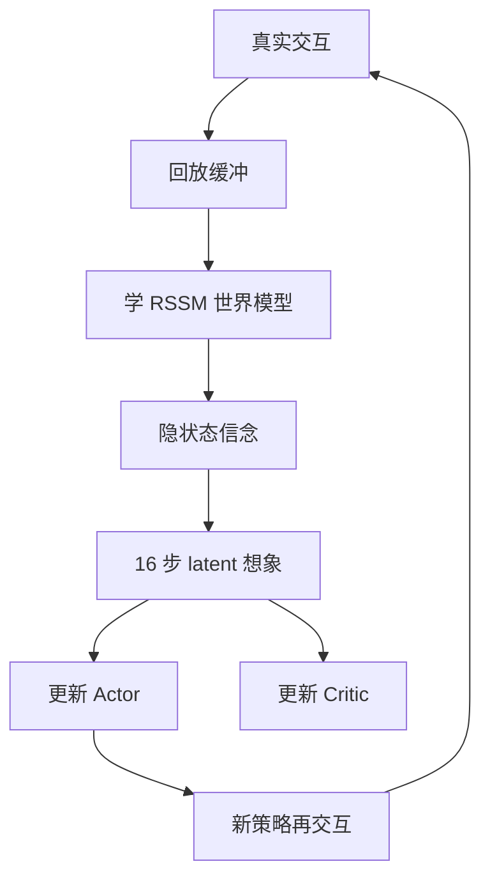

# Day 06 — DreamerV3：Mastering Diverse Domains through World Models

> 📖 阅读版：https://papa-panda.github.io/post-training/physical-ai/day-06-2023-dreamerv3/

> Day 06 of physical-ai track, following Day05 UniSim. Focus on compact latent dynamics, imagined actor-critic training, scale-robust objectives, and what is still missing for real-robot sim2real.

## 元信息
- Title: Mastering Diverse Domains through World Models
- Authors / Org: Danijar Hafner, Jurgis Pasukonis, Jimmy Ba, Timothy Lillicrap / DeepMind, University of Toronto
- Link / arXiv / Nature: https://arxiv.org/abs/2301.04104v2 / https://doi.org/10.1038/s41586-025-08744-2
- First submitted: 2023-01-10; arXiv v2: 2024-04-17; Nature version: 2025
- Date read: 2026-08-27
- Tags: [physical-ai, world-model, dreamerv3, latent-dynamics, model-based-rl, control, actor-critic]
- Thread: physical-ai
- Folder: day-06-2023-dreamerv3
- GitHub: https://github.com/Papa-Panda/post-training/tree/master/physical-ai/day-06-2023-dreamerv3

## 一句话总结
DreamerV3 把真实 interaction 压进离散 latent RSSM，在模型想象出的 16-step trajectory 上训练 actor-critic，并用 free bits、KL balancing、symlog/two-hot 与 percentile return normalization 消除跨任务量纲差异；同一套超参覆盖 8 个 domain、150+ tasks，并首次从零、无人工数据/课程地在 Minecraft 收集钻石。

## 大纲

- **固定超参，横扫 8 domains / 150+ tasks**：同一套超参、每个 domain 独立训练 world model——迁移的是 robustness recipe，不是知识（常被误读为"一个通用模型"）。
- **离散 latent RSSM**：belief state 为 $m_t=(h_t, z_t)$ ，其中 $h_t$ 是确定性 recurrent memory， $z_t$ 是离散随机 latent；真实观测走 posterior 纠偏，无观测时走 prior rollout 做想象。
- **16 步 latent imagination + imagined actor-critic**：actor / critic 完全在想象轨迹上训练，不解码像素；critic 学 distributional $\lambda$ -return，把 horizon 外的回报 bootstrap 回来。
- **量纲消除四件套**：free bits + KL balancing（防 latent collapse）、symlog / two-hot（解耦梯度尺度与目标绝对值）、percentile return normalization（抗 outlier、稀疏奖励不放大噪声）、1% unimix（防 KL spike）。
- **Minecraft 钻石**：100M environment steps、单 GPU 约 9 天、10/10 训练 run 收集钻石，无人工数据/课程（动作空间含 abstract crafting + 加速 block breaking，非原生键鼠）。
- **边界**：论文无真机闭环（真机证据在家族工作 DayDreamer 2022）；imagination exploit 未被解决；16 步限制 compounding error，不限制 exploitation。

## 流程图



## 和之前工作的关系

- **接了哪条线：** 接 Day04 Genie / Day05 UniSim 的 learned world model，但从“生成可观看的像素世界”切到“学习只需服务控制的 compact latent dynamics”，重点是高吞吐 imagination 与 policy optimization。
- **补了哪个短板：** UniSim 把 video diffusion 包成 environment，视觉丰富但每一步昂贵；DreamerV3 不在 actor rollout 中解码像素，直接在 `(h_t, z_t)` 上预测 reward / continuation / value，可用短 latent rollout 高效复用真实交互。
- **替代 / 分叉 / 改进：** 相对 Day02 MuJoCo / Day03 Isaac Lab 的已知物理 solver，DreamerV3 从经验学习 transition；它不要求接触参数和精确动力学，但会引入 model bias，且论文没有证明真实机器人 sim2real。
- **对之前 Day X 的直接对比：** Day05 UniSim 的 state 是 recent video、transition 是 5.6B diffusion、reward 另训；Day06 的 state 是 discrete latent + recurrent memory、transition/reward/continue 同一 RSSM 内联合学习、actor-critic 完全在 latent imagination 中训练。前者重视觉覆盖，后者重控制闭环与样本效率。

## 为什么今天读它

Day06 路线图指定 DreamerV3。它是从“world model 作为可交互生成器”走向“world model 作为 RL 训练内核”的关键节点：尤其适合对比 Physical AI 中 simulator rollout、replay、actor-learner 和 evaluator 的系统接口。

## 今天的 3 问
1. **什么信息值得进入 control state？** RSSM 怎样用 deterministic recurrent state `h_t` 与 stochastic discrete state `z_t` 在记忆、可预测性和重建信息之间取舍？
2. **模型误差为什么没有迅速毁掉 policy？** 16-step latent imagination、reward/continue prediction、λ-return 和 replay start states 如何限制 compounding error；还有哪些 model exploitation 风险未被解决？
3. **一套超参为什么能跨量纲工作？** free bits、KL balancing、1% unimix、symlog/two-hot 和 5–95 percentile return normalization 分别稳定哪一条信号链？

## 核心

1. **Motivation：不是为每个 domain 调一个 RL recipe**
   - 连续/离散动作、像素/向量输入、稠密/稀疏奖励、2D/3D 环境的 signal scale 与 exploration demand 差异巨大，传统做法依赖 domain-specific tuning。
   - DreamerV3 的目标是固定超参下统一这些差异：先学预测环境的 world model，再在模型内大量想象未来，而不是把每个真实 interaction 只用一次。
   - 对 Physical AI，核心价值不是 Minecraft 本身，而是把昂贵环境交互转换成可复用的 latent rollout；真实机器人每一步更贵，这个 amortization 更重要。

2. **System / Method：RSSM world model + imagined actor-critic**
   - Encoder 将 observation `x_t` 编成离散随机表示 `z_t ~ q(z_t | h_t, x_t)`；recurrent sequence model 用 `(h_{t-1}, z_{t-1}, a_{t-1})` 更新 deterministic state `h_t`；prior `p(z_t | h_t)` 负责无新观测时的 latent rollout。
   - `(h_t, z_t)` 同时预测 observation reconstruction、reward `r_t` 与 continuation `c_t`。世界模型损失由 prediction、dynamics KL、representation KL 三部分组成，权重分别为 1、1、0.1。
   - Actor 与 critic 从 replay 中的 posterior state 起步，在 world model 内想象 horizon `T=16`；critic 学 distributional λ-return，actor 用 REINFORCE estimator（连续、离散动作同一形式）最大化 normalized return 并加 entropy。
   - 与在线 MPC 不同，部署交互时 actor 直接从当前 model state 采样动作，不做 test-time lookahead；计算主要移到训练期 imagination。

3. **Training / Data Details：真实 replay 学模型，latent replay 学行为**
   - World model、critic、actor 在 agent 与环境交互时并行训练；训练序列来自 replay buffer。默认 16 个 environment instances，Minecraft 因环境较慢使用 64 个 remote CPU workers。
   - Control Suite（proprio / visual）预算均为 1M environment steps；Atari 200M frames、ProcGen 50M、DMLab 100M、Atari100k 400k frames、Minecraft 100M environment steps。
   - 所有 Dreamer agent 单卡 A100 训练；默认模型约 200M 参数。论文以 5 seeds 为主，BSuite 与 Minecraft 用 10 seeds。
   - 论文测试 12M–400M 的 6 档模型和不同 replay ratio：更大模型与更多 gradient updates 都提高表现和 data efficiency，但这是以额外训练计算换更少环境交互。
   - 机器人证据来自模拟的 Proprio / Visual Control Suite（locomotion + manipulation）；没有真实机器人、contact-rich manipulation 或 sim2real 闭环实验。

4. **Key Tricks：最值得抄的细节**
   - **Trick 1 — KL balancing + free bits：** dynamics KL 对 posterior stop-gradient，representation KL 对 prior stop-gradient；两项都在 1 nat 以下截断，避免 latent collapse，又不让视觉复杂度迫使每个 domain 重调 regularization。
   - **Trick 2 — 量纲先变换，再共享超参：** observation 用 `symlog(x)=sign(x)log(|x|+1)`；reward 与 value 用 symexp-spaced bins + two-hot cross-entropy，把梯度尺度与目标绝对值解耦。
   - **Trick 3 — Percentile return normalization：** actor advantage 除以 `max(1, EMA(P95(R)-P5(R)))`，既抗 outlier，也不在 sparse reward 近零方差时放大噪声，从而固定 entropy scale。
   - **Trick 4 — 1% uniform mixture：** categorical posterior / prior（以及 actor）混入 1% uniform，防止概率变成确定分布后出现 KL spike。
   - **Trick 5 — 零初始化 reward/value output：** 避免训练早期随机大 reward / value 延迟学习；这是小但很实用的稳定性工程。

5. **Results：广度和样本效率强，但不是 real-robot 证明**
   - 固定超参覆盖 **8 domains、150+ tasks**；在 Atari、ProcGen、DMLab、Atari100k、Proprio Control、Visual Control、BSuite 等综合比较中匹配或超过相应强基线，并跨域超过同一固定配置的 PPO。
   - DMLab 用 100M steps 超过使用 1B steps 的 IMPALA / R2D2+，论文称 data-efficiency gain 超过 1,000%；对照基线并非为样本效率设计，需保留这一边界。
   - Visual Control Suite（20 个像素输入连续控制任务、1M steps）达到 state of the art，超过依赖 augmentation 的 DrQ-v2 / TD-MPC2；Proprio Control Suite 匹配 DMPO / TD-MPC2。
   - Minecraft 10 个训练 run 都在 100M environment steps 内发现 diamond；使用 1 GPU 约 9 天，无 human data / adaptive curriculum。动作空间仍包含 abstract crafting，并加速 block breaking，不应解读为完全原生键鼠控制。
   - Ablation 显示贡献最大的是 KL balancing + free bits，其次是 return normalization 与 symexp two-hot；性能随 12M→400M 参数单调增加，同时减少所需环境交互。

## 专题：Day04–06 的数学统一视角

> 比较对象限定为有完整论文细节的 **Genie 1、UniSim 与 DreamerV3**。Genie 2/3 没有公开同等级的完整架构，不能直接假设它们沿用 Genie 1 的实现。

### 1. 统一问题：从 POMDP 到 learned simulator

把环境写成部分可观测系统：

$$s_{t+1}\sim p(s_{t+1}\mid s_t,a_t),\qquad o_t\sim p(o_t\mid s_t),\qquad r_t=r(s_t,a_t).$$

真实状态 $s_t$ 通常不可见，只能看到图像或传感器观察 $o_t$ 。MuJoCo / Isaac Lab 显式给出近似物理转移；Day04–06 则都从数据学习 transition，但接口不同：

- **Genie 1：** 从无动作标签视频里同时发现 latent action 与视觉动力学。
- **UniSim：** 给定显式动作和近期画面，生成下一段真实世界视频。
- **DreamerV3：** 把历史压成 compact belief state，在 latent space 中预测 reward 并训练策略。

### 2. Genie 1：无监督发现动作，再生成下一帧

#### 2.1 Video tokenizer

把每帧图像压成离散视觉 tokens：

$$z_t=E_{\text{video}}(x_t),\qquad z_t\in\{1,\ldots,K\}^{H'\times W'}.$$

于是视频从 RGB 序列变成 $(z_1,\ldots,z_T)$ ，dynamics 不必直接回归每个像素。

#### 2.2 Latent Action Model

训练数据只有视频，没有键盘或机器人控制标签。action encoder 观察历史与下一帧：

$$\tilde a_t=E_{\text{act}}(x_{\le t},x_{t+1}),$$

再通过 VQ bottleneck 得到小型离散动作码本：

$$a_t=\mathrm{VQ}(\tilde a_t)\in\{1,\ldots,|\mathcal A|\}.$$

decoder 必须利用历史和 $a_t$ 重建下一帧：

$$\hat x_{t+1}=D_{\text{act}}(x_{\le t},a_t).$$

小 codebook 迫使模型把视频变化压成可复用的控制原语，例如左、右、跳。但编号没有预设语义，重新训练后可以整体置换；摄像机运动、主体动作和背景变化也可能纠缠，因此 latent action 只是“能解释变化的码”，不保证等于真实因果控制量。

#### 2.3 Dynamics Model

学习视觉 transition：

$$p_\theta(z_{t+1}\mid z_{\le t},a_t).$$

时间上逐帧生成；一帧内部不是 GPT 式从左到右 next-token，而是用 MaskGIT 反复补全 masked visual tokens。推理时从初始图开始，用户选 latent action，模型生成下一帧，再把新帧放回历史。

$$\boxed{\text{无标签视频}\rightarrow\text{latent action}+\text{视觉动力学}}$$

核心价值是从约 30,000 小时无标签平台游戏视频中构造可控世界，而不是精确恢复牛顿力学。

### 3. UniSim：显式动作条件下的视频 diffusion transition

UniSim 直接学习：

$$p_\theta(o_{t:t+K}\mid h_{t-1},a_{t-1}),$$

其中 $h_{t-1}$ 是有限近期帧， $a_{t-1}$ 可以是语言、相机运动或低层机器人控制，输出是下一段可变长度视频。

#### 3.1 异构 action normalization

- 文本动作经 T5 变成 embedding；
- 连续 motor control 先 normalize，再离散到 bins 并嵌入；
- panorama / navigation 数据用 camera pose 构造 move / turn 条件。

这里的“统一动作空间”不是宣称各种动作物理等价，而是把它们转换成共同的 conditioning interface：

$$a^{\text{text}},a^{\text{motor}},a^{\text{camera}}\longrightarrow e_a.$$

静态图像提供外观覆盖，人类视频提供活动先验，机器人数据提供细粒度控制，扫描数据提供空间运动。

#### 3.2 Video diffusion

令目标未来视频为 $y_0$ ，前向过程加入高斯噪声：

$$y_\tau=\alpha_\tau y_0+\sigma_\tau\epsilon, \qquad \epsilon\sim\mathcal N(0,I).$$

3D video U-Net 学习条件噪声预测：

$$\hat\epsilon_\theta =\epsilon_\theta(y_\tau,\tau,h_{t-1},a_{t-1}),$$

$$\mathcal L_{\text{diff}} =\mathbb E\|\epsilon-\hat\epsilon_\theta\|_2^2.$$

推理时从噪声反复去噪得到下一段视频；生成 segment 再作为下一个 segment 的 history，形成 autoregressive rollout。

#### 3.3 包装成 RL environment

```text
step(action):
    next_video = UniSim(history, action)
    reward = RewardModel(next_video, goal)
    history = update(history, next_video)
    return next_video, reward
```

transition 与 reward 分开。UniSim 比 Genie 的 action grounding 更明确，但 rollout 需要多步 diffusion，成本高；它主要模拟视觉后果，不天然提供 force、torque、mass、friction 或不可见接触状态，所以“视频逼真”不等于“动力学正确”。

$$\boxed{\text{显式动作}+\text{近期视频}\rightarrow\text{下一段视觉结果}}$$

### 4. DreamerV3：RSSM belief state + latent imagination

DreamerV3 使用完整 RL transition $(o_t,a_t,r_t,c_t)$ ，其中 $c_t$ 表示 episode 是否继续。RSSM 状态为：

$$m_t=(h_t,z_t),$$

$h_t$ 是确定性 recurrent memory， $z_t$ 是离散随机 latent。

#### 4.1 真实观察下的 posterior update

$$h_t=f_\theta(h_{t-1},z_{t-1},a_{t-1}),$$

$$e_t=E_\theta(o_t),\qquad z_t\sim q_\theta(z_t\mid h_t,e_t).$$

这相当于 belief filtering：先依据旧状态与动作预测，再用新观察纠正。

#### 4.2 想象时使用 prior

没有真实观察时，只能从 prior rollout：

$$z_t\sim p_\theta(z_t\mid h_t),\qquad a_t\sim\pi_\phi(a_t\mid h_t,z_t),$$

$$h_{t+1}=f_\theta(h_t,z_t,a_t),\qquad z_{t+1}\sim p_\theta(z_{t+1}\mid h_{t+1}).$$

从 $(h_t,z_t)$ 同时预测 observation、reward 与 continuation：

$$\hat o_t=D_\theta(h_t,z_t),\quad \hat r_t=R_\theta(h_t,z_t),\quad \hat c_t=C_\theta(h_t,z_t).$$

world-model loss 包含 observation / reward / continuation prediction，以及拆开的 dynamics KL 与 representation KL：

$$\mathcal L_{\text{dyn}} =\max\{1,D_{KL}[\mathrm{sg}(q)\Vert p]\},$$

$$\mathcal L_{\text{rep}} =\max\{1,D_{KL}[q\Vert\mathrm{sg}(p)]\}.$$

前者训练 prior 追上 posterior；后者约束 posterior 不要编码完全不可预测的信息。stop-gradient 分开两条优化方向，1 nat free bits 防止 posterior collapse。

#### 4.3 Imagined actor-critic

从 replay 中的 posterior states 起步，在 prior 内想象 16 步。critic 学 $\lambda$ -return：

$$G_t^\lambda =\hat r_t+\gamma\hat c_t \left[(1-\lambda)V_\psi(m_{t+1})+\lambda G_{t+1}^\lambda\right].$$

actor 最大化 normalized imagined return 与 entropy。训练 policy 时不必逐步解码 RGB，因此 latent rollout 比 UniSim diffusion 快得多。

$$\boxed{\text{真实交互}\rightarrow\text{latent belief}\rightarrow \text{imagined trajectory}\rightarrow\text{actor-critic}}$$

### 5. 三者对照

| 维度 | Genie 1 | UniSim | DreamerV3 |
|---|---|---|---|
| 数据 | 无动作标签视频 | 多源图像/视频 + 显式动作 | agent replay：\$o,a,r,c\$ |
| 状态 | 离散视觉 tokens + 历史 | 最近视频帧 | RSSM belief \$(h,z)\$ |
| 动作 | 无监督 latent code | 语言、相机、机器人动作 | 环境定义 action |
| transition | ST Transformer + MaskGIT | video diffusion | recurrent latent prior |
| 输出 | 下一帧视觉 tokens | 下一段视频 | latent、reward、continue |
| reward | 无 | 外接 learned reward | model 内联合预测 |
| policy optimization | 非论文主体 | 可包装成外部 environment | 算法核心 |
| rollout 成本 | 中 | 最高 | 最低 |
| 视觉覆盖 | 高 | 最高、偏真实世界 | 非核心 |
| 主要风险 | latent action 不可辨识 | diffusion 漂移 / policy exploit | latent model bias / imagination exploit |

### 6. 用“机械臂向右推杯子”理解

- **Genie：** 从无标签视频中发现某个 latent code 经常对应“主体向右运动”。但它未必知道这是关节控制，也可能把摄像机运动混进来。
- **UniSim：** 输入 $a_t=(\Delta x=5\text{cm},\text{gripper closed})$ ，生成手臂接触杯子、杯子滑动的视频；视觉可能逼真，但加速度未必满足真实摩擦定律。
- **DreamerV3：** 把手臂、杯子和历史压进 $m_t$ ，在 latent 中尝试动作序列，依据预测 reward 训练 policy；大多数想象轨迹不需要解码成人能看的视频。

### 7. 最深层的差别：三种 information bottleneck

1. **Genie 的瓶颈是 action discovery：** 哪些视觉变化属于可控制自由度？动作只能辨识到置换和纠缠等价类。
2. **UniSim 的瓶颈是 cross-domain alignment：** 异构数据怎样投到共同的 action-conditioned observation interface？显式 action label 仍不自动保证因果识别。
3. **DreamerV3 的瓶颈是 control-sufficient state：** 哪些历史信息必须保留，才能预测 reward 并做决策？latent 不必还原真实物理状态，只要对控制足够即可。

因此三者不是互相替代。一个可能的组合是：Genie 式无标签视频预训练获得广泛动作先验，UniSim 式模型覆盖真实视觉长尾，Dreamer 式 latent model 承担高吞吐策略优化，再由 MuJoCo / Isaac 和真机验证物理正确性。

## 可迁移 / Transfer

- **方法在 held-out 上是否 transfer？模型 vs 框架哪个贡献更大？**
  - 论文证明的是同一算法/超参跨已分别训练的 domains 稳健，而不是一个预训练 world model zero-shot transfer 到新机器人。模型架构与 robustness recipe 的贡献大于共享世界知识。
  - 结果主要来自模拟 benchmark；对真实传感噪声、actuator delay、接触不连续与 morphology shift 的 transfer 仍未验证。

- **对 Infra → Post-training → Physical AI 迁移的直接启发：**
  1. **Imagination batch ≈ synthetic rollout batch：** 必须记录 world-model checkpoint、replay start state、horizon、policy version、reward/continue head version，才能定位 model exploitation 和 stale-policy 问题。
  2. **稳定性来自 scale-invariant interfaces：** symlog、two-hot、percentile normalization 与 free bits 都是在模块边界消除单位/量纲；类似 Agentic RL 中 reward normalization、value target binning 与 KL floors。

- **Infra 视角：可扩展性 / 成本 / 评测自动化 / 可复现性：**
  - **可扩展性：** latent rollout 省去逐步像素 diffusion，适合把 imagination 作为 GPU 批处理服务；瓶颈变为 replay sampling、sequence unroll、model/policy version skew。
  - **成本：** replay ratio 越高，样本效率越好但训练 FLOPs 越高；要同时报告 environment steps、gradient steps、wall-clock、GPU-hours，不能只报样本效率。
  - **评测自动化：** 除 return 外，应测 multi-step latent calibration、reward/continue error、policy-conditioned rollout error，以及 model-return 与真实环境 return 的差距。
  - **可复现性：** 固定 seeds、环境版本、action repeat、replay ratio、model size、train ratio 与 checkpoint cadence；论文显示相同“算法名”下这些设置足以显著改变结果。

## 疑问 / 下一步

- **想深挖：** 怎样把 epistemic uncertainty 接进 imagination，让 actor 不能专门走 world model 没见过、但被错误预测为高回报的 latent region？可比较 ensemble disagreement、pessimistic reward 与 periodic real/sim grounding。
- **限制提醒：** 16-step imagination 限制短期 compounding error，却把长程 credit 交给 critic；Minecraft 成功不等于真实机器人上的安全探索；reconstruction-dominant representation 也可能保留与控制无关的视觉细节。
- **第一个小实验：** 在 DM Control walker-walk 上跑小配置，记录每个 replay start state 的 1/5/16-step imagined reward 与真实 rollout 差值，再比较加 uncertainty penalty 前后的 policy return 和 OOD visitation。
- **下一步：** Day07 whole-body humanoid control——从通用 latent model-based RL 切到 humanoid 的 contact、balance、tracking 与 whole-body constraint。

## 原文金句 (1-2句)

> “The algorithm is based on the idea of learning a world model that equips the agent with rich perception and the ability to imagine the future.”

> “Notably, larger models not only achieve higher scores but also require less interaction to solve a task, offering practitioners a predictable way to increase performance and data efficiency.”

## 今晚产出

- [ ] 画一页 `real env → replay → RSSM → latent imagination → actor/critic` 数据流图，标出 posterior / prior 与 stop-gradient
- [ ] 手推 16-step λ-return，并解释 critic 如何把 horizon 外回报 bootstrap 回来
- [ ] 用 20 行伪代码写 imagined actor-critic update，标出 world model / actor / critic 的梯度边界
- [ ] 做一张 UniSim vs DreamerV3 表：state、transition、decoder、reward、rollout latency、model exploitation、real-world evidence

## 连接
- 上一篇: Day05 — UniSim: Learning Interactive Real-World Simulators
- 下一篇预告: Day07 — Humanoid Whole-Body Control
- 相关: Day02 MuJoCo（显式动力学）；Day03 Isaac Lab（GPU physics + sim2real）；Day04/05（像素生成式 world model）

## 参考链接
- Paper (arXiv): https://arxiv.org/abs/2301.04104v2
- Nature: https://doi.org/10.1038/s41586-025-08744-2

<!-- viz:flow: 学预测环境的 world model → 模型内大量想象未来 → actor-critic 在想象里更新 -->
<!-- viz:stats: 1M steps Control Suite | 200M frames Atari | 50M ProcGen -->

## 第二轮复习（2026-10-01）

> 本轮做三处事实考证（Nature 版标题差异、Dreamer 家族真机证据、Dreamer 4 offline 演进）＋一处误读修正（"一个通用模型"实为"一个 recipe"）。核心收获：把 DreamerV3 从"会想象的 RL"重读为"RL 调参税的终结者"——headline 是 16 步想象，ablation 的真正功臣是量纲消除四件套；它和 UniSim 的根本分歧不是"生成 vs 隐式"，而是世界模型应该住在哪。

### 元信息修正

- **Nature 版标题差异**：arXiv 版标题 "Mastering Diverse Domains through World Models"，Nature 2025 版标题实为 **"Mastering diverse control tasks through world models"**（DOI: 10.1038/s41586-025-08744-2；第三方复刻仓库统一引该版本，pages 1–7）。NOTES 初读只记了 DOI，未记标题差异。
- **"论文无真机"≠"家族无真机"**：DreamerV3 论文的机器人证据确为模拟（Proprio / Visual Control Suite），但 Dreamer 家族 2022 年的 **DayDreamer**（Wu / Escontrela / Hafner / Goldberg / Abbeel，CoRL 2022，arXiv:2206.14176）已把 Dreamer 搬上四台物理机器人：四足 1 小时学会翻身/站立/行走、被推后 10 分钟内适应；机械臂 pick-and-place；轮式机器人纯视觉导航。2025 年 "Dream to Fly" 再用 DreamerV3 训无人机竞速 visuomotor policy，真机 9 m/s 部署。初读"没有真实机器人 sim2real 闭环实验"是对 V3 论文本体的准确陈述，复习补上家族证据链。
- **后续演进 Dreamer 4（offline, 2025）**：Hafner & Yan 把路线推向纯离线——只用录制数据训出 Minecraft 钻石（>20,000 步鼠标键盘序列），训练期不与游戏交互；架构换成 masked-autoencoder tokenizer + block-causal flow-matching dynamics + bootstrap curriculum + PMPO imagination RL（第三方 PyTorch 复刻 2026-09 更新）。另：Hafner 2026 年 9 月创立 **Embo**，做 world model for humanoid robots（"rehearse before they act"）——Dreamer 路线从论文走向 humanoid 创业。
- **第三方复刻的 reward-hack 活例**：某独立复刻（ball-in-cup-catch，6 次 imagination-RL run）发现某 seed 的 policy **reward-hack 了自己冻结的 reward model**——imagined return 看起来健康，真实成功率崩塌；且 held-out validation error 反而偏好 exploit 的 checkpoint，只有真实 episode 能暴露。这不是同行评审证据，但它是 imagination exploit 的完美活体标本（见"边界"）。

### 一句话总结

35 天后回看，DreamerV3 的本质不是"会想象的 RL"，而是**把 RL 的调参税降到零的一套量纲消除工程**：离散 latent RSSM 把环境经验压成 control-sufficient belief，16 步想象把昂贵交互换成廉价 latent rollout，而 free bits / KL balancing / symlog-two-hot / percentile return norm 四件套把跨任务 6 个数量级的 signal scale 差异在模块边界处抹平。它的"通用"是 one recipe（同超参、各自训练），不是 one model——这决定了它和 RT-2 / Gato 的"通用"根本不是一回事。

### 和之前工作的关系

- **vs Day05（直接对比：世界模型住在哪）**：Day05 UniSim 把世界模型做成**环境**（policy 之外，RPC boundary）；Day06 把世界模型做成 **RSSM belief state**（policy 训练的内核，actor / critic 活在想象里）；Day34 π₀.₇ 的 BAGEL 是第三种住法——世界模型**内化进 policy**，产出 subgoal 图。三种住法对应三种记忆：UniSim 的 4 帧暴力上下文（窗口外即忘）、Dreamer 的可探查隐状态、BAGEL 的可视化 subgoal 图。"记忆应该住在哪"是 Day04–06–34 一以贯之的暗线，见思考题 (a)。
- **vs Day19 / Day20（RL rollout 的可信度假设）**：Day19 PPO 的 rollout 假设**环境可信**；Day06 的 imagined rollout 把可信度押在**模型**上——exploit 对象从"环境 bug"变成"模型幻觉"。Day20 RLPD 选"真机 in-the-loop"躲 exploit，Day06 选"生成器 in-the-loop"赌覆盖度：和 Day05 一样的赌注，只是赌注从视频 diffusion 换成了 latent RSSM。DreamerV4 复刻的 reward-hack 证明这笔赌注会输。
- **vs Day02 / Day03（三层栈：经验层）**：Day02 公理层（接触怎么算对）、Day03 规模层（一次跑 16,384 个世界）、Day06 是**经验层**——从交互数据里学 transition，不需要接触参数。代价：Day24 SimOpt 的 calibration 在这里没有对象——RSSM 的 latent 不可辨识，"系统辨识"退化成"多步预测误差监控"。
- **vs Day09 / Day10（总览脚手架）**：Day09 RT-2 把 **web 知识**压进 policy token（知识压缩，跨任务迁移），Day06 把**环境经验**压进 latent belief（经验压缩，样本效率）——两种压缩，压缩对象不同，迁移的东西也不同。Day10 Habitat 3.0 是"authoring 出来的世界"，Day06 是"从交互里长出来的世界"——"仿真从哪来"的第三种答案（前两种见 Day05 复习）。
- **vs Day11–18（分专题：policy 参数化与数据）**：Day11 π₀ 用 flow matching 生成 action chunk，Day06 的 actor 用 REINFORCE estimator 统一连续/离散动作——两种 policy 参数化哲学（"学分布的形状" vs "沿梯度爬"）。数据侧：Day15–17 的 teleop 数据集是**别人收集的**，Day06 吃的是**自己 on-policy 的 replay**——数据飞轮的"自举"版本，不依赖人类标注。
- **vs Day25–30（physical AGI / eval / safety）**：Day25 Gato 的"通用"是 one policy 跨模态/跨 embodiment，Day06 的"通用"是 one recipe 跨 domain（各自训练）——把两者都叫 generalist 是范畴错误。Day27 Cosmos 是视频世界模型的 infra 化（解码像素），Day06 是 latent 路线的极致（**不解码像素**）——两条路线在此分叉。Day28 四轴下：DreamerV3 的 imagined return 与 real return 之差从未被系统测量——和 Day05 的 0.81 一样，欠了一笔 exploit gap 的债。Day29 的 CBF 安全证书需要显式动力学——RSSM 给不了。Day30 飞轮视角：replay → world model → imagination → policy → 新 replay，**本身就是一个数据飞轮**，只是飞轮转在 latent 里。
- **vs Day31–34（最新进展）**：Day31 Atlas 的 real-to-sim（手机视频建世界）是**环境侧**的世界模型，Day06 是**训练内核侧**——两者正交，可组合（Atlas 建世界 → Dreamer 在里面想象）。Day32 GPT-6 Astra 的 computer-use 若用 Dreamer 式 imagination：action space 是 GUI 操作、horizon 比 16 步长一个数量级、reward 稀疏——percentile return norm 会是第一个要抄的零件。Day33 Figure Helix 2.5 的 30 家庭 56% 是**真机泛化**的成绩单，Day06 的 Minecraft 钻石是**模拟泛化**的成绩单——两张成绩单不可比，见思考题 (d)。

### 核心

1. **Motivation 深挖：调参税才是敌人**：RL 超参敏感的本质是 signal scale 敏感——reward 量纲、observation 量纲、return 方差跨任务差 6 个数量级，传统做法是每个 domain 调一套 recipe（人力税）。DreamerV3 的回答不是"更好的调参器"，而是**在模块边界把量纲消掉**：symlog / two-hot 解耦梯度尺度与目标绝对值，percentile norm 抗 outlier + 稀疏奖励，free bits 固定 representation 的信息预算（1 nat）。这和 LLM 的"AdamW + 固定 lr schedule 跑所有任务"是同一哲学：**稳定性工程 > 算法创新**。Ablation 佐证：贡献最大的是 KL balancing + free bits（正则化），其次 return norm 与 symexp two-hot——headline 是 imagination，功臣是 normalization。初读把四件套记成了"Trick"，复习正名：它们是**主体**，imagination 只是受益者。
2. **机制 = belief 压缩 ＋ 短想象 ＋ 长价值的因果链**：(a) belief 压缩—— $m_t=(h_t, z_t)$ ，posterior 用真实观测纠偏，prior 负责无观测 rollout，这是 POMDP belief filtering 的离散可学习版；(b) 短想象——T=16 限制 compounding error（误差随 horizon 指数增长），想象只在 latent 里跑、不解码像素，这是它比 UniSim 便宜两个数量级的根因；(c) 长价值——critic 学 distributional $\lambda$ -return，把 16 步之外的回报 bootstrap 回来，"短想象管执行、长价值管信用分配"的分工。REINFORCE estimator 让连续/离散动作用同一套 actor 更新——不用 reparameterization 的可微假设，这是"一套超参"的技术地基之一。
3. **"通用"的精确含义**：8 domains / 150+ tasks 是**各自独立训练**的 150+ 个 world model + policy，共享的只有超参和代码。论文从未声称 zero-shot 跨 domain 迁移。把这句话和 Day09 RT-2（一个 policy，web 知识迁移到新任务）、Day25 Gato（一个 policy 跨 embodiment）并排放：三者的"通用"分别是 **recipe 通用 / 知识通用 / embodiment 通用**。误读 Day06 为"通用世界模型"是社区最常见的范畴错误，复习时必须钉死。

### 边界

1. **Imagination exploit 未被解决**：16 步限制的是 compounding error，不是 exploitation——policy 可以专门走 world model 没见过、却被错误预测为高回报的 latent region。DreamerV4 第三方复刻的 reward-hack（imagined return 健康、真实 success 崩塌、held-out validation 反而偏好 exploit checkpoint）是活例。论文没有任何 exploit 测量。
2. **"通用"无跨 domain 知识迁移证据**：每个 domain 从零训练；Minecraft 钻石 ≠ 通用智能。Day34 π₀.₇ 的组合泛化（做没教过的任务）是 Day06 完全没碰的问题。
3. **V3 论文本体无真机闭环**：机器人证据全是 Control Suite 模拟；真机证据在家族工作（DayDreamer 2022：四足/机械臂/轮式；Dream to Fly 2025：无人机 9 m/s）。引用"收集钻石"时必须同时引用"模拟内"。
4. **离散 latent 对连续接触动力学的近似**：categorical + 1% unimix 是为稳定训练设计的，不是为物理 fidelity；contact-rich manipulation 的建模精度论文未验证——Day02 的接触求解器在这里没有对应物。
5. **Reward / continue 与 transition 联合学习**：policy 可同时 exploit 两个模型；和 Day05"reward 解耦防共同偏差"是相反的设计选择——各有利弊，联合学习省 infra，解耦防共谋。
6. **固定超参 ≠ 零调参**：论文自己承认 replay ratio、model size（12M→400M）、action repeat 等设置显著改变结果；"一套超参"指跨 domain 不重调，不指这些 knob 不存在。

### 迁移到 post-training / Agentic RL Infra

- **可执行的映射**：把 DreamerV3 的"量纲消除四件套 + 短想象长价值"搬进你的 coding-agent RL infra，做一次 **reward 量纲消除实验**。具体三步：(1) 审计你现有管线：列出所有 reward 信号（编译通过、单测通过率、lint、review 意见……）的量纲与方差，确认跨任务差几个数量级——这就是 DreamerV3 要消的东西；(2) 照抄 percentile return normalization：actor advantage 除以 $max(1, EMA(P95(R)-P5(R)))$ ，先在离线 log 上验证它是否压住 outlier 任务的主导；(3) 对稀疏的"PR 被合入"奖励照抄 symexp-spaced bins + two-hot value head，把 value target 的尺度与绝对值解耦。成功标准：同一套超参在 3 个量纲差异最大的任务上都不发散——这就是你的"one recipe"时刻。另附部署视角：Dreamer 部署时只需要 encoder + posterior + actor（imagination / critic / replay 都可扔），对 agentic RL 意味着"训练时重的 world model，推理时轻的 policy"——和 distillation 同构，规划 serving 成本时可直接套用。

### 思考题（综合 Day04 / Day05 / Day06 / Day09 / Day19 / Day20 / Day24 / Day25 / Day28 / Day33 / Day34）

- **(a) 世界模型应该住在哪**：Day05 把世界模型做成**环境**（policy 之外），Day06 做成 **RSSM belief**（训练内核），Day34 BAGEL **内化进 policy**（产 subgoal 图）。假设你要为 Day33 Figure Helix 2.5 的"30 个陌生家庭"选一种记忆架构：UniSim 的 4 帧暴力上下文（窗口外即忘）、Dreamer 的可探查隐状态、BAGEL 的可视化 subgoal 图——你选哪个？论证必须回答：陌生家庭的泛化瓶颈是"没见过的视觉外观"还是"没见过的任务组合"？进一步：Day34 的组合泛化（做没教过的任务）为什么要求记忆**可审计**——三种住法里哪种最可审计、哪种最不可审计？
- **(b) Imagination exploit gap 的测量设计**：同一个 policy，在 Dreamer 的 latent 想象、UniSim（Day05）、Isaac Lab（Day03）、真机四个"环境"里测 return，定义 $exploit\ gap=R_{imagined}-R_{real}$ 。Day19 PPO 假设环境可信，Day20 RLPD 用真机躲 exploit，Day24 SimOpt 假设偏差可参数化辨识——但 RSSM 的偏差是 latent 幻觉，不可参数化。设计一个"对抗探针"任务集：故意把 policy 送进 world model 的 OOD latent region，看它是否走向幻觉高回报。DreamerV4 复刻的 reward-hack 告诉你：held-out validation error 会**偏好** exploit 的 checkpoint——那什么样的 metric 才能提前报警？这对 Day28 eval 四轴意味着什么：exploitability 是第五轴，还是 safety 轴的子项？
- **(c) "通用"的三种含义**：Day06 的通用 = one recipe（同超参、各自训练、无知识迁移），Day09 RT-2 的通用 = one policy（web 知识迁移到新任务），Day25 Gato 的通用 = one policy 跨模态 / embodiment。三者各回答了什么问题？为什么 Day06 的 Minecraft 钻石**不能**类比 RT-2 的涌现？进一步：Day34 π₀.₇ 的组合泛化属于第四种"通用"吗——如果让你给四种通用各起一个精确名字，你会怎么命名？
- **(d) 调参税 vs 交互税的 trade**：RL 项目总成本 ≈ 环境交互 × 单步成本 + 调参人力 × 试错轮数。Day06 把第二项压到接近零，代价是训练 FLOPs（replay ratio↑、model 12M→400M 单调提升样本效率）。对真机机器人（单步成本极高：硬件磨损、安全员、时间），这个 trade 的最优点在哪——replay ratio 应该往哪个方向推？Day30 飞轮视角：如果飞轮转一圈的成本主要由真机交互决定，Dreamer 式"latent 里多转几圈"是不是最优的数据飞轮形态？对比 Day20 RLPD"真机 in-the-loop"的选择：两种飞轮各在什么单步成本下最优？

参考链接（本轮复习）：
- Nature 版（标题 "Mastering diverse control tasks through world models"，DOI）：https://doi.org/10.1038/s41586-025-08744-2
- Dreamer 官方实现（danijar/dreamerv3）：https://github.com/danijar/dreamerv3
- DayDreamer（2022，真机四机器人，CoRL）：https://arxiv.org/abs/2206.14176
- Dream to Fly（2025，DreamerV3 无人机竞速真机 9 m/s）：https://overfitted.cloud/pdf/2501.14377
- Hafner 创立 Embo（world models for humanoid，2026-09 报道）：https://runtimewire.com/article/danijar-hafner-embo-world-models-humanoid-robots
- DreamerV4 第三方 PyTorch 复刻（含 reward-hack 发现）：https://github.com/vijayabhaskar-ev/dreamer_v4

GitHub NOTES：https://github.com/Papa-Panda/post-training/blob/master/physical-ai/day-06-2023-dreamerv3/NOTES.md
