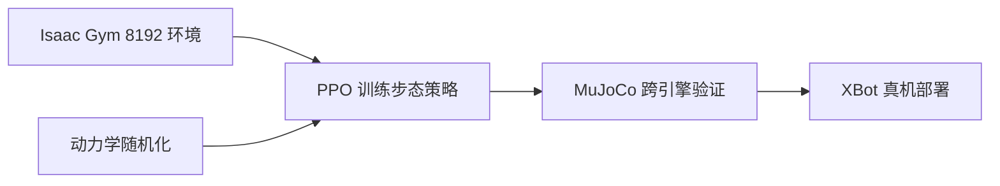

# Day 08 — Humanoid-Gym：Humanoid Locomotion 的 Zero-Shot Sim2Real

> 📖 阅读版：https://papa-panda.github.io/post-training/physical-ai/day-08-2024-humanoid-gym-locomotion/

## 元信息
- Title: Humanoid-Gym: Reinforcement Learning for Humanoid Robot with Zero-Shot Sim2Real Transfer
- Authors / Org: Xinyang Gu, Yen-Jen Wang, Jianyu Chen / RobotEra, Shanghai Qi Zhi Institute, Tsinghua University
- Link / arXiv / Blog: https://arxiv.org/abs/2404.05695
- Date read: 2026-08-29
- Tags: [physical-ai, humanoid, locomotion, reinforcement-learning, sim2sim, sim2real, isaac-gym, mujoco, domain-randomization]
- Thread: physical-ai
- Folder: day-08-2024-humanoid-gym-locomotion
- GitHub: https://github.com/Papa-Panda/post-training/tree/master/physical-ai/day-08-2024-humanoid-gym-locomotion

## 一句话总结
Humanoid-Gym 用 Isaac Gym 中的 8192 个并行环境训练 100 Hz 的 humanoid velocity-command policy，再把同一策略放进经真机轨迹校准的 MuJoCo 做 cross-simulator gate，并通过 asymmetric actor-critic、15 帧历史、周期 gait prior 和覆盖传感器/时延/动力学的 domain randomization，在 1.2 m XBot-S 与 1.65 m XBot-L 上展示 zero-shot sim-to-real 行走。

## 大纲
- 问题：full-size humanoid locomotion 的 sim2real；目标是可复现的开源最小闭环，而非新算法
- 训练：Isaac Gym 8192 并行环境 + PPO/GAE；47 维 actor 观测堆叠 15 帧，73 维特权 critic 非对称训练
- 步态：clock 相位 + stance mask + joint-reference reward，把周期先验同时写进观测与奖励
- 鲁棒：观测噪声 / 0–10 ms 时延 / 摩擦 0.1–2.0 / motor strength 95–105% / payload ±5 kg 随机化
- 验证：同一策略进经真机轨迹校准的 MuJoCo 做 sim2sim gate，再 zero-shot 上 XBot-S/L；证据以轨迹图与演示为主，无统一成功率

## 流程图

## 和之前工作的关系

- **接了哪条线：** 接 Day03 Isaac Lab / Isaac Sim 的 GPU 并行仿真与 Day07 H2O 的 deployable PPO，把关注点从“跟踪人类全身动作”收窄为最基础但必须可靠的 command-conditioned locomotion。
- **补了哪个短板：** Day07 主要解决 motion retargeting、动作可行性过滤和 whole-body imitation；本篇补上周期步态、速度命令跟踪、跨引擎验证与两种尺寸 humanoid 的 locomotion 部署链路。
- **替代 / 分叉 / 改进：** 它没有 world model，也不做 H2O 式 reference-motion tracking；策略直接从 proprioception、clock 和速度命令输出 joint-position target。核心不是更复杂模型，而是 reward / observation / randomization / simulator calibration 的系统配方。
- **对之前 Day X 的直接对比：** Day02 MuJoCo 在这里不是训练主引擎，而是 Isaac Gym 与真机之间的独立 sim2sim gate；Day03 的“GPU rollout engine”负责吞吐，Day02 的较慢 CPU simulator负责检查策略是否过拟合单一物理实现。

## 为什么今天读它

路线图 Day08 进入 humanoid locomotion。H2O 已说明“可部署 observation + domain randomization”能让全身动作上真机；Humanoid-Gym进一步给出一个开源、较小而完整的 `Isaac Gym train → MuJoCo validate → robot deploy` 基线，适合拆解 locomotion 的最小闭环，也暴露了该类论文常见的评测短板：真机展示充分，但统一量化指标不足。

## 今天的 3 问
1. 为什么 `Isaac Gym → MuJoCo` 的 sim2sim 迁移可以作为真机前 gate；什么条件下跨引擎一致仍不能预测 sim2real？
2. 周期 clock、stance mask 与 joint-reference reward 给了多少 gait prior；它们是在提高样本效率，还是限制了非周期步态与复杂地形适应？
3. 15 帧 observation history、asymmetric critic 和 domain randomization 各自覆盖 partial observability、训练稳定性与动力学偏差中的哪一部分？

## 核心

1. **Motivation：让 full-size humanoid locomotion 有一个可复现的最小 sim2real 基线**
   - 人形机器人结构更复杂、自由度耦合更强、跌倒代价更高，sim2real gap 通常大于四足机器人；当时开源的 full-size humanoid locomotion 训练与部署资源仍有限。
   - Humanoid-Gym 的主张不是提出新网络，而是公开一套 end-to-end recipe：大规模并行 PPO、humanoid-specific reward、domain randomization、sim2sim 验证和真机部署。

2. **System / Method：周期先验 + asymmetric PPO + 双模拟器 gate**
   - **控制目标**：输入期望平面速度与偏航命令，策略输出 12 维目标关节位置；内部 PD controller 将其转为 torque。
   - **步态先验**：一个 gait cycle 被分为两段 double support 与两段 single support；`[sin(2πt/CT), cos(2πt/CT)]` clock 驱动参考腿部运动，periodic stance mask 指定左右脚预期 swing / stance。
   - **Actor observation**：clock 2 维、command 3 维、joint position 12、joint velocity 12、base angular velocity 3、orientation 3、last action 12，共 47 维；堆叠 15 帧以补偿 POMDP 中看不到的状态。
   - **Asymmetric critic**：critic 额外接收 friction、body mass、base linear velocity、push force/torque、tracking difference、stance mask 和 foot contact 等 privileged state；单帧 privileged observation 为 73 维，堆叠 3 帧。
   - **运行频率与验证**：policy 100 Hz，底层 PD 1000 Hz；在 Isaac Gym 训练，再将同一 policy 放入经轨迹校准的 MuJoCo，在 flat / unseen uneven terrain 上做 sim2sim stress test，最后 zero-shot 部署。

3. **Training / Data Details：Sim 数据、Real 数据与可验证信号**
   - **Sim rollout**：8192 个并行环境；episode 2400 steps；PPO + GAE，discount 0.994、GAE factor 0.95、learning rate `1e-5`。论文表中的“Number Training Epochs = 2”是每次 update 的 epoch，而不是总训练只跑两轮。
   - **Reward**：velocity tracking、orientation / base-height stability、contact-pattern、joint-reference tracking，再加 energy、action second-difference、过大接触力等 regularization；目标 base height 为 0.7 m。
   - **Domain randomization**：关节位置/速度、角速度、姿态观测噪声；0–10 ms system delay；friction 0.1–2.0；motor strength 95%–105%；payload 加性扰动 -5–5 kg，并注入 push force / torque。
   - **Real 数据的角色**：策略训练不使用真机 trajectory 做梯度更新；真机轨迹用于校准/比较 MuJoCo 动力学，尤其检查腿部关节 sine trajectory 与 left-knee / left-ankle phase portrait。
   - **Verifiable signal**：训练中用速度、姿态、base height、接触计划与关节参考误差；部署前用 cross-simulator trajectory agreement 与 flat / unseen uneven-terrain traversal 做 gate。论文没有给出标准化真机 success rate、速度跟踪误差或跌倒率。

4. **Key Tricks：最值得抄的细节**
   - **Trick 1 — 把第二个 simulator 当独立 evaluator**：高吞吐 Isaac Gym 负责搜索策略，校准后的 MuJoCo 负责暴露对 contact solver / dynamics implementation 的过拟合；它比“同一引擎换 seed”更像真正的 held-out eval。
   - **Trick 2 — Actor / critic 信息边界分离**：actor 只看真机可得观测，critic 使用 friction、mass、push 与 contact 等 privileged state；训练时提高 value estimation，部署时不增加传感器依赖。
   - **Trick 3 — 历史窗口显式补 POMDP**：47 维 actor observation 堆叠 15 帧，让前馈 policy 从时间差分中推断速度、接触与未建模动力学，不必直接依赖复杂 recurrent / transformer 架构。
   - **Trick 4 — Gait prior 进入 observation 和 reward 两侧**：clock 告诉 policy 当前 phase，stance mask 奖励约束预期落脚；这样更容易得到稳定步态，但也可能压制非周期的恢复动作。
   - **Trick 5 — 同时 randomize sensing 与 dynamics**：不仅改 friction / payload / motor strength，也扰动 joint / IMU-like observations 和系统时延；sim2real 不是单一 physics 参数问题。

5. **Results：证据与边界**
   - 框架在 RobotEra 的 **1.2 m XBot-S** 与 **1.65 m XBot-L** 上展示 zero-shot sim-to-real locomotion，覆盖不同尺寸 embodiment。
   - 同一 policy 在 MuJoCo flat terrain 和训练外 uneven terrain 上均成功行走；作者报告经校准后 MuJoCo 的关节轨迹/phase portrait 更接近真机，而 Isaac Gym 与真机差异更大。
   - 论文的主要证据是轨迹图和视频演示，没有报告统一的 success rate、fall rate、command-tracking RMSE、训练时长/GPU budget，也没有 ablation 分离 sim2sim gate、frame stacking、gait prior 和各 randomization 项的贡献。因此应把结论理解为“可工作的开源 recipe”，而非已充分量化的 SOTA 比较。

## 可迁移 / Transfer

- **方法在 held-out 上是否 transfer？模型 vs 框架哪个贡献更大？** 跨 simulator、未见 uneven terrain、两种身高 humanoid 和真机的结果支持一定 transfer；但缺少量化与消融，不能判断哪一项贡献最大。现有证据更支持 **framework / recipe**，而不是 policy architecture 创新。
- **对你 Infra → Post-training → Physical AI 迁移的 1-2 个直接启发：**
  1. `Isaac Gym train → MuJoCo eval → real deploy` 对应 post-training 的 generator / independent verifier / online canary：优化环境和评测环境必须解耦，否则 reward 高可能只是 simulator overfitting。
  2. Asymmetric actor-critic 是“训练时富信息、推理时窄接口”的机器人版本；和 privileged judge / process supervision 类似，关键是严格定义不能泄漏到 deployment 的信号。
- **Infra 视角：可扩展性 / 成本 / 评测自动化 / 可复现性：** 把 checkpoint export、跨引擎 replay、trajectory alignment、terrain sweep 与 regression threshold 自动化；记录 simulator version、URDF、PD gains、policy / PD frequency、observation normalization、frame stack、randomization distributions，否则 zero-shot 结果难复现。

## 疑问 / 下一步

- **没看懂 / 想深挖：** MuJoCo 使用少量真机轨迹校准后还能否被称为独立 held-out evaluator？若调参反复看真机轨迹，sim2sim gate 也可能过拟合 hardware calibration set。
- **如果要复现 / 小规模试，第一个实验做什么？** 在 Humanoid-Gym 中训练 XBot baseline，固定 policy 后同时在 Isaac Gym 与 MuJoCo 扫 friction、payload、latency、uneven-terrain level；统计 command-tracking RMSE、fall rate、energy / m 和 cross-simulator rank correlation，比较 `single-frame` vs `15-frame`、`clock on/off` 两个消融。
- **下一步：** Day09 进入 RT-2 / OpenVLA，从低层 proprioceptive locomotion policy 转向视觉—语言—动作模型，明确高层任务语义如何与低层稳定控制对接。

## 原文金句 (1-2句)
> “Humanoid-Gym also integrates a sim-to-sim framework from Isaac Gym to MuJoCo that allows users to verify the trained policies in different physical simulations to ensure the robustness and generalization of the policies.”

> “Our control policy operates at a high frequency of 100Hz, providing enhanced granularity and precision beyond standard RL locomotion approaches. The internal PD controller runs at an even higher frequency of 1000Hz.”

## 今晚产出
- [ ] 画出 `Isaac Gym 8192 env → PPO → MuJoCo sim2sim gate → XBot-S/L` 四段闭环
- [ ] 把 47 维 actor observation 与 73 维 privileged state 做成 train-only / deploy-time 对照表
- [ ] 跑一个小型 cross-simulator sweep，至少记录 velocity RMSE、fall rate、energy / m
- [ ] 做 `15-frame vs 1-frame` 或 `clock on vs off` 的一个消融，并写清 gait prior 的收益与限制
- [ ] 在笔记中保留证据边界：论文未给统一真机 success rate 与完整训练 compute

## 连接
- 上一篇: Day07 — H2O（sim-to-data + whole-body teleoperation）
- 下一篇预告: Day09 — RT-2 / OpenVLA（Vision-Language-Action）
- 相关: Day02 MuJoCo；Day03 Isaac Lab / Isaac Sim

## 参考链接
- Paper: https://arxiv.org/abs/2404.05695
- Code: https://github.com/ahucc/humanoid-gym

<!-- viz:stats: policy 100 Hz | 底层 PD 1000 Hz | 8192 并行环境 | episode 2400 steps -->
<!-- viz:flow: Isaac Gym 训练吞吐 → MuJoCo sim2sim gate 查过拟合 → 真机 zero-shot -->
<!-- viz:vs: Actor 可部署观测 | 47 维 × 15 帧历史; 部署期可得 || Critic 特权状态 | 73 维 × 3 帧含摩擦/质量/外力; 仅训练可用 -->

## 第二轮复习（2026-10-03）

> 本轮做三处事实校准（发表定位、代码链接、训练引擎状态）＋一条谱系补全（同组 DWL 后续）。核心收获：把 Humanoid-Gym 从"能走的步态 demo"重读为"执行层最小闭环的工序样本"——吞吐、信息边界、先验注入、独立复核四道工序可分别审计；同时钉死它的认识论上限：当裁判（MuJoCo）先被真机轨迹校准过，sim2sim gate 排除的只是单引擎实现过拟合，不构成对 sim2real gap 本身的 held-out 估计。

### 元信息修正

1. **发表定位**：arXiv 的 journal reference 为 ICRA 2024 Workshop on Agile Robotics（v1 2024-04-08，v2 2024-05-18）；不是 ICRA 主会论文。Gu 与 Wang 为共同一作（project co-lead），Chen 为通讯。NOTES 元信息未记场地，本轮补上。
2. **代码链接修正**：NOTES「参考链接」所引 `github.com/ahucc/humanoid-gym` 是 2024-12-27 建立的 fork（0 star），不是官方仓。官方由 RobotEra 维护（README 联系 `support@robotera.com`），实现基于 legged_gym 与 rsl_rl。复现应以上游为准——fork 与上游的漂移无人负责，这是复现风险的一部分。
3. **训练引擎状态**：训练腿依赖 Isaac Gym Preview 4；NVIDIA 已将其标注 deprecated / no longer supported，Preview 4 不再更新，官方迁移路径是 Day03 的 Isaac Lab。公开仓的安装配方停在 PyTorch 1.13 + CUDA 11.7 + Python 3.8——Day08 的"规模层"实现已经冻结，复现成本随驱动与 CUDA 老化单调上升。
4. **定位校准**：初读把 sim2sim 记成"独立 evaluator"；复习校准为**经校准的 validation**——MuJoCo 先用真机 sine 轨迹与 phase portrait 对过参数（NOTES §3 自记），它与训练引擎的独立性只剩求解器实现一层（见核心第 3 点）。

### 一句话总结

三十多天后回看，Humanoid-Gym 的耐久贡献不是步态本身，而是把 locomotion 的 sim2real 拆成四道可分别审计的工序：吞吐（8192 并行环境）、信息边界（actor 的 47 维 × 15 帧 vs critic 的 73 维 × 3 帧特权）、先验注入（clock / stance 同时进观测与奖励）、独立复核（第二引擎 gate）。它给出的可迁移命题是：先把训练环境与评测环境解耦，再谈策略规模——但 gate 的裁判被校准过，这道门是 Day30 release gate 的雏形，不是 held-out 证明。

### 和之前工作的关系

- **vs Day07 H2O（直接对比）**：同为执行层 PPO + 随机化 + PD，两篇的"把关"位置正好互补。H2O 在**数据层**把关：特权策略先删掉身体做不到的动作，部署策略只学可行的；Day08 在**策略层**把关：策略先在高吞吐引擎里训完，再送第二引擎复核。一个审数据，一个审策略——仿真器在流水线里的两种坐法，后来在 Day30 飞轮里被拼成同一道门。
- **vs Day02 / Day03（地基层）**：Day02 MuJoCo 在这里不当训练引擎，当裁判：公理层给规模层（Day03 Isaac 一系）出考卷。分工成立的前提是裁判独立；而裁判被真机轨迹校准后，独立性弱于 Day28"固定测度"评测合同的理想形态——这是本篇与评测专题之间最值得记住的落差。
- **跨阶段 vs Day19 / 21 / 22 / 24（RL 与 sim2real 专题）**：Day19 打开 PPO 黑盒后回看，Day08 正是 clipped surrogate + GAE 的标准工程部署，没有算法层新意；其随机化是 Day21 的 $J_{\text{DR}}$ 在 locomotion 上的具体实例（摩擦 0.1–2.0、时延 0–10 ms、motor strength 95%–105%）。最关键的一条：15 帧历史堆叠是 Day22 RMA 适配模块的**隐式前身**——RMA 把同一件事显式化为从 50 步本体历史回归 17 维环境指纹 $\hat z_t$ ，部署期再分频执行（10 Hz 辨识 + 100 Hz 控制）；同组后续的 DWL（RSS 2024，Best Paper Award Finalist）又进一步把状态估计与系统辨识显式化。Day24 SimOpt 则把 Day08 的一次性轨迹校准升级为 REPS 外层闭环：用真机行为残差持续更新参数分布 $p_\phi(\xi)$ 。一条线排下来是：隐式历史 → 显式指纹 → 显式辨识闭环，辨识对象一级比一级清楚。
- **vs Day30（飞轮）**：sim2sim gate 是 gated deploy 的最小形态——训练分布、复核分布、上线三者分离。缺的正是 Day30 的下半环：失败样本的 triage 与回流（recollect / resimulate）。没有回流的 gate 只会拒绝，不会让系统变强。
- **vs Day09 / Day33（脚手架与最新进展）**：Day08 是 VLA 脚下最底层的 locomotion 技能层：Day09 起的高层语义再对，也要落到这类 100 Hz 步态策略上才算数。Day33 Figure Helix 进陌生家庭丢的那部分成功率，大概率就丢在这一层——这也是"gap 被压缩到执行层"判断（2026-09-29 问答）在本篇最具体的形态。

### 核心

1. **动机重读：赌"配方可复现 > 算法新颖"**：2024 年 full-size humanoid 缺的不是又一个步态算法，而是能照着跑通的开源闭环。两年后看这个赌下对了：被后来者复用的是 train → gate → deploy 的工序与配置，不是网络结构。论文的自我定位（"easy-to-use framework"）与它的实际遗产一致，这在 locomotion 论文里并不常见。
2. **信息边界即架构**：策略与价值函数看到的世界被刻意切开。Actor 单帧 $o_t \in \mathbb{R}^{47}$ （clock 2、command 3、关节位置 12、关节速度 12、base 角速度 3、姿态 3、上一动作 12），堆叠 15 帧，在 100 Hz 下约合 150 ms 的有限窗口；输出 $a_t \in \mathbb{R}^{12}$ 关节位置目标，由 $\tau = K_p (a_t - q_t) - K_d \dot{q}_t$ 在 1000 Hz 转成力矩（decimation 10）。Critic 单帧 73 维特权（多出摩擦、质量、base 线速度、外推、接触等）只堆 3 帧。这其实是 POMDP 信念估计的手工分工：actor 用有限历史近似 belief，critic 用真值降方差——与 Day06 RSSM 用学习的方式做同一件事。代价同样清楚：窗口之外的慢变量（磨损、温漂）原理上不可辨识，策略只能靠随机化硬扛。
3. **先验的双侧注入与它的价格**：相位 $\phi = 2\pi t / CT$ 的 $[\sin\phi, \cos\phi]$ clock 进观测，stance mask 同时进 critic 特权与接触奖励——先验从"告诉它现在在哪一步"和"奖励它按计划落脚"两侧夹住策略。样本效率是这样买来的，价格是策略被锁在周期步态流形上：大推搡后的非周期恢复动作会被先验惩罚，与稳定性是同一枚硬币。随机化一侧同理：

$$J_{\text{DR}}(\theta) = \mathbb{E}_{\xi \sim p(\xi)} [J(\theta; \xi)]$$

   优化的是分布上的平均表现， $\xi_{\text{real}}$ 是否落在 $p(\xi)$ 的 support 内（Day21 的判据）决定成败；support 外没有免费的鲁棒性。
4. **gate 的认识论**：两台引擎共享同一套 URDF、PD 增益与地形假设，误差并不独立；MuJoCo 这一侧又先被真机轨迹校准过。于是 sim2sim 一致性能排除的只是"对单一求解器实现的过拟合"，它不估计 sim2real gap 本身——与 Day05 的 simulator exploit gap 同构：评测器一旦被优化信号或校准信号触碰，就从 held-out 降级为 validation。这不是说 gate 没用，而是说它的结论强度必须按 validation 来引用。

### 边界

1. **证据边界**：无统一 success rate / fall rate、无速度跟踪 RMSE、无消融（gate、15 帧、clock、各随机化项的贡献不可分）、无训练时长与 GPU 预算。截至 arXiv v2 与公开仓，仍未见标准化真机指标表。结论只能按"可工作的开源 recipe"引用，不能按量化 SOTA 引用（初读已记，本轮确认未被补上）。
2. **何时失效**：非周期扰动（大推搡恢复被先验惩罚）、窗口外慢漂移（磨损 / 温漂不可辨识）、未参数化的 gap（传动柔性、齿隙不在随机化分布内）、需要视觉的地形（纯本体感知是盲走，无 perceptive 输入）。
3. **工具链边界**：Isaac Gym 已 deprecated、官方仓与 fork 分离，复现窗口随环境老化收窄；本篇的长期价值在工序与教训，不在可执行代码本身。

### 迁移到 post-training / Agentic RL Infra

可执行的同构：把"训练引擎 ≠ 评测引擎"做成 agentic RL 的发布门。Rollout 在训练沙箱里只管吞吐；候选 checkpoint 在进入真实预算（真机 / 线上）之前，必须先在一套**独立实现的评测复本**（不同工具版本、不同种子族、不同扰动集）上复测，放行指标用跨引擎成功率的排序相关（rank correlation）而不是单点分数——排序一致说明学到的是任务本身，排序翻转说明在拟合训练环境的实现细节。配套纪律直接对应本篇的教训：评测复本禁止用线上轨迹调参（对应 MuJoCo 的校准泄漏）；校准集与 gate 集分离并记录配置哈希（对应 Day30 的 sim 配置哈希）。验收照此执行：同一 checkpoint 的双引擎排序相关低于阈值时禁止放行，并把翻转样本回流做 failure triage——这一步正是 Day08 缺失、Day30 补上的下半环。

### 思考题（综合 Day02 / Day05 / Day07 / Day08 / Day19 / Day22 / Day24 / Day28 / Day30 / Day33）

- **(a) 隐式 vs 显式辨识的分界**：Day08 用 15 帧历史隐式推断状态，Day22 RMA 显式回归 17 维环境指纹 $\hat z_t$ ，Day24 SimOpt 显式更新参数分布 $p_\phi(\xi)$ 。三者辨识的对象分别是什么（瞬时后验 / 低维指纹 / 参数分布）？若 XBot 的电机随温度缓慢退化，哪一种最先失效、哪一种能在线跟上？请设计一个漂移实验把三者区分开，并写清每种方法的先失效信号。
- **(b) gate 还剩多少 held-out 含量**：MuJoCo 被真机轨迹校准后，sim2sim gate 的结论强度应按 validation 引用。若预算只够维护一个独立评测器，你选"从未校准的第二引擎"还是"校准过的同一引擎 + 严格留出的轨迹集"？请用 Day28"评测 = 固定测度下 $J(\pi)$ 的二项估计"论证，并说明 Day05 的 exploit gap 在两种选法下分别从哪条缝里进来。
- **(c) 先验赎回权**：clock / stance 把策略锁在周期流形上（Day08），H2O 用可行性过滤直接删掉不可行动作（Day07）。若 Day33 Helix 的上层 VLA 临时要求一个非周期动作（侧身挤过家具、单脚撑住探身），周期先验会在哪一层、用什么信号报警？接口合同应允许上层怎样临时"赎回"非周期自由度——改 clock、开 residual 通道，还是整段切换策略？分别论证三条路的延迟与安全代价。

参考链接（本轮复习）：
- Humanoid-Gym（arXiv；journal-ref: ICRA 2024 Workshop on Agile Robotics）：https://arxiv.org/abs/2404.05695
- 项目页：https://sites.google.com/view/humanoid-gym
- DWL 后续（RSS 2024 proceedings）：https://enriquecoronadozu.github.io/rssproceedings2024/rss20/p058.pdf
- NVIDIA Isaac Gym（deprecated 标注）：https://developer.nvidia.com/isaac-gym

GitHub NOTES：https://github.com/Papa-Panda/post-training/blob/master/physical-ai/day-08-2024-humanoid-gym-locomotion/NOTES.md
