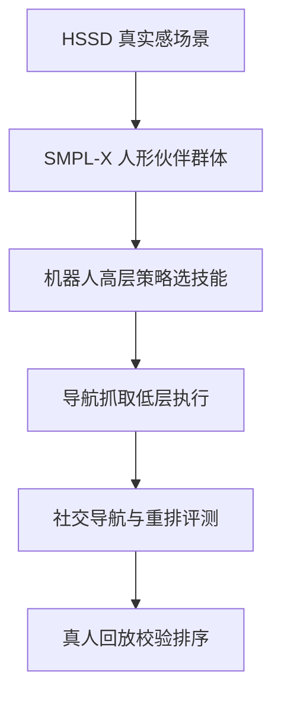

# Day 10 — Habitat 3.0：把 embodied AI 从“独居 agent”推进到人机共居

> 📖 阅读版：https://papa-panda.github.io/post-training/physical-ai/day-10-2023-habitat-3/

## 元信息
- Title: Habitat 3.0: A Co-Habitat for Humans, Avatars and Robots
- Authors / Org: Xavier Puig, Eric Undersander, Andrew Szot et al. / FAIR at Meta, Georgia Tech, Simon Fraser University, UC Berkeley, University of Washington, Stanford University, Carnegie Mellon University
- Link / arXiv / Blog: https://arxiv.org/abs/2310.13724
- Project: https://aihabitat.org/habitat3/
- Official code: https://github.com/facebookresearch/habitat-lab
- Venue: ICLR 2024
- Date read: 2026-08-31
- Tags: [physical-ai, habitat-3, habitat-lab, embodied-ai, human-robot-interaction, social-navigation, social-rearrangement, multi-agent-rl, human-in-the-loop]
- Thread: physical-ai
- Folder: day-10-2023-habitat-3
- GitHub: https://github.com/Papa-Panda/post-training/tree/master/physical-ai/day-10-2023-habitat-3

## 一句话总结
Habitat 3.0 在 Habitat-Sim / Habitat-Lab 上加入高效多样的 SMPL-X humanoid、可回放的 human-in-the-loop 工具，以及 Social Navigation / Social Rearrangement 两个标准任务，使人机协作策略能在未见家庭、未见伙伴和真实人类控制的 avatar 上训练与评测；关键不只是在模拟器里“加个人”，而是把动态伙伴、协作效率和安全距离变成闭环 RL 问题。

## 大纲
- 问题：embodied agent 长期独居仿真，人一进场，环境从静态变多体，人机协作的训练与评测 substrate 缺失
- 表示：物理 skeleton 管碰撞 + skinned mesh 管视觉，SMPL-X 参数化人体，离线缓存 12 个基础 body 换吞吐
- 任务：Social Navigation（1–2 m 跟随）与 Social Rearrangement（双物体协作搬运），伙伴行为进闭环 RL 问题
- 训练：partner population 扩行为多样性，Plan-Pop3/4 在未见伙伴上达 71.79% / 71.32%，胜过单伙伴 50.94%
- 证据：1191 FPS 高吞吐 + 30 人 HITL 排序一致；但 oracle skill 换 learned skill 后 ZSC 成功率 71.79% 跌到 21.44%

## 流程图

## 和之前工作的关系

- **接了哪条线：** Day02 MuJoCo 与 Day03 Isaac Lab 解决物理和并行模拟；Day04–06 研究可学习的世界模型；Day07–08 解决 humanoid 低层全身控制；Day09 RT-2 / OpenVLA 连接语义感知与动作。Day10 把这些能力放进多人共享、动态变化的家庭环境，转向 embodied navigation、协作和标准化评测。
- **补了哪个短板：** Day09 的 VLA 多数在单机器人、桌面 manipulation、单帧观测上评估，几乎不测人类伙伴会移动、抢占空间或改变任务状态。Habitat 3.0 明确定义 social navigation、zero-shot coordination、collision 与 relative efficiency，补上“和人一起做事”的环境与指标。
- **替代 / 分叉 / 改进：** 它不替代 VLA 或 torque controller，而是提供更高层的训练 / 评测 substrate。低层 locomotion、pick/place、VLA action proposal 都可以成为 Habitat policy 的 skill；Habitat 负责场景、多人状态、任务生成、rollout 和评测。
- **对之前 Day X 的直接对比：** Day09 用 web + robot demonstrations 扩展 semantic generalization；Day10 用伙伴 population 与未见场景扩展 interaction generalization。前者问“看懂指令后做什么”，后者问“另一位 agent 也在行动时，怎样安全、高效地配合”。

## 为什么今天读它

路线图 Day10 从 VLA 切到 Habitat。Physical AI 的可靠性不能只在静态桌面和单 agent 成功率上衡量；真实家庭是部分可观测、多人、动态且安全敏感的系统。Habitat 3.0 的价值在于把 humanoid simulation、HITL 数据 / 评测、multi-agent RL 和可复现 benchmark 接成一条 pipeline，也暴露出高层 policy 依赖 oracle skill 时会被低层误差击穿的典型分层系统问题。

## 今天的 3 问
1. 自动 humanoid population 上的 policy ranking 在多大程度上能预测真实人类协作体验；需要什么 behavior coverage 才不把 simulator partner 过拟合误当作 generalization？
2. 为什么扩大 scripted partner population 能改善 zero-shot coordination，而 8 个随机初始化的 learned partners 仍缺乏足够行为多样性；怎样用数据驱动指标而不是 population size 衡量 partner diversity？
3. 高层策略用 oracle navigation / pick / place 训练、换成 learned skills 后性能骤降，说明层间接口缺了什么：failure state、uncertainty、retry / recovery，还是端到端 joint fine-tuning？

## 核心

1. **Motivation：embodied AI 不能永远是“独居 agent”**
   - 传统 Habitat / embodied benchmarks 通常假设环境只因单个 agent 的动作而变化，但家用辅助机器人必须与会移动、会改动环境、行为偏好各异的人共享空间。
   - 真机 + 真人训练成本高、难规模化且有安全风险，也很难做标准化重复实验；因此需要同时支持 realistic humanoid、real human-in-the-loop 和机器人 policy 的高速仿真平台。
   - Habitat 3.0 的三项核心贡献是：高效 humanoid simulation、HITL 基础设施、Social Navigation / Social Rearrangement 两个协作任务及其 learned / heuristic baselines。

2. **System / Method：物理 skeleton、视觉 skin、分层行为与 HITL client-server**
   - **Humanoid representation：** 用 articulated skeleton 做碰撞与物理，用 skinned surface mesh 做视觉；SMPL-X 参数化 pose / shape。系统离线缓存 12 个基础 body（4 male、4 female、4 neutral）的 rig、mesh 和 blend-shape 结果，运行时主要做 linear blend skinning，以少量视觉保真损失换吞吐。
   - **Motion / behavior：** 高层 planner 或 learned policy 组合 navigation、pick、place 等低层 skill。行走用 AMASS motion clip 循环并沿 waypoint 投影；reach / pick / place 用 VPoser 预计算 pose library，运行时按目标手部位置插值，再以 kinematic attach / detach 处理物体。
   - **Human-in-the-loop：** server 负责仿真、agent inference 与 avatar control，client 负责平台相关的渲染和输入；支持键鼠、浏览器与 VR，并可记录 / 回放高层 action、精确 pose 与物体 trajectory，也能从不同 camera 重新渲染。
   - **Social Navigation：** Spot 在未见场景中寻找并保持距 humanoid 1–2 m，输入 depth、humanoid detector、相对位置 / 朝向，DD-PPO recurrent policy 输出局部 linear / angular velocity；指标覆盖 Finding Success、SPS、Following Rate、Collision Rate。
   - **Social Rearrangement：** robot 与 humanoid 把两个物体搬到目标位置。两层 policy 中，高层 DD-PPO 从预定义 skill library 选择 navigate / pick / place；训练 population 可由单一伙伴、1–4 个 planner partner 或 8 个 jointly learned partner 组成，评测强调未见伙伴的 zero-shot coordination。

3. **Training / Data Details：高吞吐 rollout + partner population + 可验证 reward**
   - 场景来自 HSSD，Social Navigation 使用 37 train / 12 validation / 10 test scenes；两类任务都用 Boston Dynamics Spot 与 humanoid avatar。
   - Social Navigation 用 4×A100、每卡 24 parallel environments、每次 update 收集 128 steps；ResNet-18 + 2-layer LSTM 约 8.5M 参数，DD-PPO 约 200M environment steps（约 4 天）收敛，3 seeds。
   - Navigation reward 按 geodesic distance 塑形：太近（<1 m）奖励远离，1–2 m 内给常量奖励，太远则奖励接近；保持 1–2 m 且朝向 humanoid 400 steps 得 +10，collision 终止，另有 -0.1 slack penalty。
   - Social Rearrangement 同样用 4×A100、96 parallel environments、100M steps、ResNet-18 + 2-layer LSTM；reward 为成功 +10、每个 pick / place subgoal +5、collision -5 并终止、每步 -0.005。所有结果按 3 seeds 汇报。
   - HITL 评测覆盖 30 participants，比较 human solo、Learn-Single 和 Plan-Pop3。回放机制使同一策略 / 任务可保存并重渲染，为 failure analysis 和数据闭环提供可追溯轨迹。

4. **Key Tricks：最值得抄的细节**
   - **Trick 1 — physics / appearance 解耦并缓存人体形变：** skeleton 管碰撞，skin mesh 管视觉，SMPL-X / VPoser 的昂贵部分离线缓存，动作运行时做 motion projection / pose interpolation；robot + humanoid 在单 GPU 16 environments 下达到约 1191 FPS。
   - **Trick 2 — 用 partner population 训练 coordination，而不是只做 scene randomization：** Plan-Pop3/4 的多种 scripted strategy 让 policy 学会适应“伙伴会做什么”，比单一伙伴或仅靠随机初始化得到的 learned population 更稳健。
   - **Trick 3 — 分层 action space + 可中断 skill：** 高层选择语义 skill，低层执行导航 / 抓取；当 robot 距 humanoid 小于 1.5 m 时终止当前 skill 并重规划，由简单的 safety interrupt 诱导出后退让路、改拿另一件物体等 reactive behavior。

5. **Results：仿真吞吐强、协作泛化可见，但 oracle-to-learned gap 很大**
   - **速度：** 单环境 robot 为 `245±19 FPS`、humanoid 为 `188±2 FPS`；双 agent 时 robot-robot `150±13 FPS`、robot-humanoid `136±8 FPS`；单 GPU 16 environments 时 robot-humanoid 为 `1191±3 FPS`。
   - **Social Navigation：** heuristic expert 的 Finding Success / SPS / Following Rate / Collision Rate 为 `1.00 / 0.97 / 0.51 / 0.52`；无地图 end-to-end RL 为 `0.97 / 0.65 / 0.44 / 0.51`。RL 虽路径效率较低，但学到 anticipation、backing-up 和在窄道让路。
   - **Partner generalization：** 单伙伴 Learn-Single 从 train-partner SR `98.50%` 降到 unseen-partner `50.94%`；Plan-Pop3 在 unseen partner 上达到 `71.79%`，Plan-Pop4 为 `71.32%`，说明“行为多样的伙伴集”比只优化已知搭档更重要。
   - **层间 sim-to-real 类比 gap：** Plan-Pop3 高层策略从 oracle skill 切换到 learned low-level skills、且不重训时，train-pop SR 从 `77.79%` 降到 `41.09%`，ZSC SR 从 `71.79%` 降到 `21.44%`。高层若看不到低层 uncertainty / failure，就会严重 distribution shift。
   - **真人协作：** 30 人 HITL 中，solo 平均 1253.17 steps；Learn-Single 降至 936.60（relative efficiency 133.80），Plan-Pop3 为 1015.05（123.46）。自动 humanoid evaluation 能反映相对排序，但论文并未证明它可完全替代真实用户评测。

## 可迁移 / Transfer

- **方法在 held-out 上是否 transfer？模型 vs 框架哪个贡献更大？** 论文明确在未见 HSSD 场景、未见 humanoid policies 与 30 位真实人类控制者上评测；partner-population training 改善了未见搭档 SR。不过结果依赖 Habitat 的高速 simulator、任务定义、传感器和 oracle skill 设计，因此这是“框架 + benchmark + policy”共同结果，不应归因于单一 network。
- **对你 Infra → Post-training → Physical AI 迁移的 1-2 个直接启发：**
  1. Partner diversity 对 robotics RL 很像 post-training 的 task / opponent / user distribution：不能只数样本或 partner 数，要测 behavioral coverage、held-out collaborator success、worst-bucket failure。
  2. Oracle skill → learned skill 的性能坍塌对应 agentic RL 里 planner 在完美 tool 假设下训练、上线却遭遇 latency / error / partial execution；需要把 tool failure、uncertainty 和 recovery 放进 training loop。
- **Infra 视角：可扩展性 / 成本 / 评测自动化 / 可复现性：** 把 simulator FPS、并发 env 数、environment steps、GPU-hours 与 sample efficiency 一起记；evaluation 按 scene × partner × skill backend 分桶，并强制记录 collision、interrupt、replan、subgoal completion 与 HITL replay，避免 aggregate SR 掩盖安全和协作失败。

## 疑问 / 下一步

- **没看懂 / 想深挖：** 自动 avatar population 要达到怎样的行为覆盖，才能可靠预测真实人的长尾反应？仅用 SR / RE 排序不足以识别礼貌、可预测性、个人空间与主观信任之间的差异。
- **如果要复现 / 小规模试，第一个实验做什么？** 用 Habitat-Lab v0.3.0 的 Habitat 3.0 multi-agent config 跑最小 Social Navigation evaluation：固定同一批 scenes / seeds，对比完整 sensor、去掉 humanoid GPS、去掉 arm depth 三组；记录 S / SPS / F / CR、FPS 与 collision replay。先只跑 evaluation / 短 rollout，不复现 200M-step full training。
- **下一步：** 路线图当前表只定义到 Day10；下一日应先在 README 补齐并锁定 Day11–30 映射，再按序进入 VLA / Habitat data scaling，而不是临时选题。

## 原文金句 (1-2句)
> “Today’s embodied AI agents are largely hermits – existing within and navigating through virtual worlds as solitary occupants.” — Habitat 3.0, Introduction

> “We believe it is now time to more comprehensively study and develop social embodied agents that assist and cooperate with humans.” — Habitat 3.0, Introduction

## 今晚产出
- [ ] 画 `HSSD scene → humanoid population → robot policy → SocialNav/SocialRearrange → automated/HITL eval` 数据流图
- [ ] 从 Habitat-Lab 跑通一个最小 multi-agent episode，记录环境版本、FPS、seed 与 replay 路径
- [ ] 复算 Social Navigation 的 S / SPS / F / CR，并检查 collision termination 与 1–2 m safety band
- [ ] 列一张 oracle skill vs learned skill 的 distribution-shift 表：可见状态、失败模式、恢复机制、SR drop
- [ ] 为下一次实验定义 partner-diversity 指标，至少覆盖 task allocation、yielding、no-op / waiting 与 adversarial conflict

## 连接
- 上一篇: Day09 — RT-2 / OpenVLA（语义感知到动作 token 的 VLA）
- 下一篇预告: Day11 — 待 README 路线图补齐后按顺序执行
- 相关: Day02 MuJoCo；Day03 Isaac Lab；Day07 H2O；Day08 Humanoid-Gym

## 参考链接
- Paper: https://arxiv.org/abs/2310.13724
- Project: https://aihabitat.org/habitat3/
- Official code: https://github.com/facebookresearch/habitat-lab
- ICLR 2024: https://iclr.cc/virtual/2024/poster/19442

<!-- viz:stats: 4×A100 | 每卡 24 并行 env | 每次 update 128 steps | 8.5M 参数 | 200M env steps -->
<!-- viz:flow: scripted partner population 扩多样性 → 学会适应伙伴行为 → zero-shot coordination -->

## 第二轮复习（2026-10-05）

> 本轮无重大事实错误需要推翻：ICLR 2024 与 arXiv 2310.13724 经 OpenReview 与 arXiv 原文复核无误。两处小的元信息校准见下。核心收获：把 Day10 从「仿真里加个人」重读为「把伙伴变成分布」的命题——zero-shot coordination 训的不是某个搭档，而是对伙伴策略分布 $p(\pi_h)$ 的期望；这正是 Day21 domain randomization 在社会维度的同构，也是 Day33 真机进家庭时绕不开的那一课。

### 元信息修正

1. **陈旧指针清理**：初读时「下一篇预告：Day11 — 待 README 路线图补齐后按顺序执行」已失效——34 天路线图早已锁定且 Day11–34 全部完成，本轮按现状理解，不再当待办。
2. **定位校准**：初读把 Habitat 3.0 记成「多人版 Habitat」；复习校准为**协作层**——它不产新控制算法，而是把伙伴行为、协作效率与安全距离第一次写成可训练、可复现的闭环评测对象，位置在 Day09 语义层之上、Day28/30 评测飞轮的源头。
3. **数字口径**：HITL 的 133.80 / 123.46 是 relative efficiency（相对 solo 的效率比），不是成功率百分点；初读表格未点破，本轮标清，避免与 Social Rearrangement 的 SR 混读。

### 一句话总结

三十多天后回看，Day10 的耐久贡献是把「和人一起做事」从口号变成分布问题：机器人策略 $\pi_r$ 要最大化的不是对某个固定搭档的回报，而是对伙伴策略分布的期望回报 $\mathbb{E}_{\pi_h \sim p(\pi_h)}[J(\pi_r, \pi_h)]$ ；Plan-Pop3 用行为多样的 scripted 伙伴把未见伙伴成功率从单伙伴训练的 50.94% 拉到 71.79%，而 8 个随机初始化 learned 伙伴的多样性反而不够——多样性是行为覆盖问题，不是伙伴计数问题。

### 和之前工作的关系

- **vs Day09 RT-2 / OpenVLA（直接对比，同为总览脚手架）**：Day09 问「看懂指令后做什么」，泛化轴是语义（未见物体与指令）；Day10 问「另一个 agent 也在动时怎样配合」，泛化轴是交互（未见伙伴与未见场景）。两者是同一家庭机器人的上下两问：Day09 的 VLA 可以当 Day10 高层策略的语义前端，但 Day09 的评测里没有会抢空间的伙伴，Day10 的评测里没有开放语义——合起来才是 Day33 那种真实家庭任务。
- **跨阶段 vs Day11–14（VLA 分专题）**：Day10 高层策略在 oracle skill 上训练、换 learned skill 后 ZSC 成功率从 71.79% 跌到 21.44%，是分层系统的层间 distribution shift；Day11–14 的连续动作头（flow / diffusion）正是在缩短这条层间缝——动作头越可靠，高层在 oracle 假设下学到的协调策略越不容易被低层误差击穿。
- **跨阶段 vs Day21 Domain Randomization（RL/sim2real）**：partner population 与 domain randomization 是同一个数学动作换了随机化对象：Day21 对物理参数分布 $p_\phi(\xi)$ 取期望求鲁棒，Day10 对伙伴策略分布 $p(\pi_h)$ 取期望求协作泛化。区别在伙伴会适应你—— $\pi_h$ 不是静态参数 $\xi$ ，这也是 learned 伙伴共适应后多样性塌缩、反而不如 scripted 群体的原因。
- **跨阶段 vs Day28 / Day30 与 Day33 / Day34（评测、安全与最新进展）**：Day10 的 scene × partner × skill backend 分桶评测是 Day28「固定测度下成功率估计」与 Day30 数据飞轮 triage 的早期形态；Day33 Figure Helix 2.5 进 30 个陌生家庭 56% 成功率，是 Day10 这道仿真题的真机版——丢的分大概率丢在伙伴不可预测与执行层接触上。Day34 π0.7 的组合泛化测任务组合，Day10 的 zero-shot coordination 测伙伴组合，两者是「组合」一词的两种展开。

### 核心

1. **动机重读：独居假设是 embodied 评测的系统性盲区**：Day02/03 解决物理与吞吐、Day04–06 解决世界模型、Day07/08 解决低层控制、Day09 解决语义，但全部默认环境只因单个 agent 而变。真实家庭里人会移动、抢占通道、改动物体状态，安全距离本身就是约束。Habitat 3.0 的赌注是：先在仿真里把伙伴、协作效率与碰撞写成闭环问题，再谈真机——顺序反过来，成本与安全都付不起。
2. **机制深挖：多体 POMDP 与伙伴分布**：记真实状态 $s_t$ 含机器人位姿、人形位姿与朝向、物体位姿与场景布局；机器人观测 $o_t^r$ 为 depth、humanoid detector 与相对位置/朝向（部分可观测）；Social Navigation 动作是局部线速度与角速度 $(v, \omega)$ ，Social Rearrangement 高层动作是从 skill library 选 navigate / pick / place，低层执行另有其人。伙伴策略 $\pi_h$ 不受控且不完全可观测，所以问题不是 MDP 而是带对手分布的多体 POMDP：训练即在 $p(\pi_h)$ 上采样伙伴做期望回报优化。reward 塑形把社会规范写进标量：距人 $d < 1$ m 奖励远离、 $1 \le d \le 2$ m 给常量奖励、 $d > 2$ m 奖励接近，保持区间 400 steps 得 +10，碰撞终止另加每步 -0.005 至 -0.1 的 slack penalty——礼貌被编译成了距离分段函数。
3. **为什么 scripted 群体胜过 learned 群体**：8 个 learned 伙伴与机器人共适应，策略互相拟合后行为模式收敛，多样性塌缩；scripted 的 Plan-Pop3/4 用规则写死不同策略（不同任务分配、让行与等待习惯），行为覆盖由构造保证。证据：单伙伴 Learn-Single 在未见伙伴上 98.50% → 50.94%，Plan-Pop3 达 71.79%。这与 Day21 ADR「随机化分布要覆盖真机参数支撑集」同理：覆盖靠设计，不靠数量。
4. **吞吐是方法的一部分**：skeleton 管碰撞、skin mesh 管视觉、SMPL-X 与 VPoser 离线缓存，单 GPU 16 env 达 1191 FPS，Social Navigation 200M steps 约 4 天收敛（4×A100、每卡 24 env、8.5M 参数）。没有这个吞吐，partner population 训练在样本量上不成立——Day10 再次印证 Day03 的规模层命题：很多「算法结论」其实是吞吐结论。

### 边界

1. **证据没有证明什么**：30 人 HITL 只证明自动评测的相对排序能指示真人排序（solo 1253.17 steps vs Learn-Single 936.60 vs Plan-Pop3 1015.05），没有证明自动 SR 等于真人体验；主观维度——礼貌、可预测性、个人空间、信任——不在 SR / relative efficiency 的测度内。Finding Success 0.97 的同时 Collision Rate 0.51，聚合数字会掩盖安全轴。
2. **何时失效**：伙伴行为落在训练分布支撑外（儿童奔跑、宠物、轮椅使用者、逆行冲突）时 zero-shot coordination 无保证；高层在 oracle skill 上训练、低层一换就塌（71.79% → 21.44%），说明接口没把 failure state、uncertainty 与 retry 写进合同；1–2 m 距离带是文化依赖的启发式，不是普适社会规范。
3. **系统边界**：Habitat 的人是 kinematic avatar，没有接触动力学与力反馈；Day02 的接触数学、Day07/08 的全身控制不在这个平台内验证。把 Day10 成功率外推到真机家庭，等于跳过 Day21–24 的执行层还债与 Day29 的安全层。

### 迁移到 post-training / Agentic RL Infra

可执行的同构：把 partner population 做成 agentic RL 的「协作者/工具分布」门禁。训练 coding agent 时，不要只对单一 tool backend 与单一 user simulator 优化；构造 scripted 协作者群体（不同工具延迟与报错模式、会改文件的「伙伴 agent」、会中途改需求的 user simulator），按协作者类型分桶报成功率，并设放行线：未见协作者桶成功率相对已见桶跌幅超过 20 个百分点不放行，先扩协作者行为覆盖再重训。配套抄 Day10 的教训：协作者多样性用行为覆盖度量（任务分配、让行/等待、冲突处理各至少一类），不数协作者个数；高层 planner 训练时必须接入真实 tool 的 failure 与 uncertainty 信号，禁止只在 oracle tool 上训完直接上线——对应 71.79% → 21.44% 的层间坍塌。

### 思考题（综合 Day09 / Day10 / Day21 / Day29 / Day33）

- **(a) 两种组合泛化**：Day10 的 zero-shot coordination 要求对未见伙伴 $\pi_h$ 泛化，Day34 的组合泛化要求对未见任务组合泛化。若把 Day09 的 VLA 放进 Habitat 当高层策略，哪一种泛化会先成为瓶颈：语义认错物体，还是伙伴行为出分布？请用「动作支撑集由演示决定、伙伴分布由构造决定」论证，并设计一个能把两轴分开测的 2×2 评测（已见/未见物体 × 已见/未见伙伴）。
- **(b) 距离带的合同**：Day10 用 1–2 m 分段 reward 把「礼貌」编译进标量，Day29 的安全栈要求逐点约束不可平均。若把 Social Navigation 的策略部署到 Day33 式真实家庭，1 m 内侧该由 reward 塑形管，还是该升级为 CBF 式硬约束？请写明哪一层报警、多久触发降级动作，并说明 Collision Rate 0.51 这种数字为什么不能单独充当放行证据。
- **(c) 多样性的度量**：Plan-Pop3 的 scripted 群体胜过 8 个 learned 伙伴，Day21 的 ADR 靠熵增自动扩分布支撑。给伙伴多样性写一个可计算的度量（提示：行为轨迹的占用测度或策略间距离），并预判：若用该度量做课程、自动扩伙伴分布，哪种结果会推翻「多样性靠构造保证」这一 Day10 结论？

参考链接（本轮复习）：
- Habitat 3.0（arXiv，ICLR 2024）：https://arxiv.org/abs/2310.13724
- OpenReview（ICLR 2024）：https://openreview.net/attachment?id=4znwzG92CE&name=pdf
- Meta AI 研究页：https://ai.meta.com/research/publications/habitat-3-0-a-co-habitat-for-humans-avatars-and-robots/
- Habitat-Lab 代码：https://github.com/facebookresearch/habitat-lab

GitHub NOTES：https://github.com/Papa-Panda/post-training/blob/master/physical-ai/day-10-2023-habitat-3/NOTES.md
